# HIVE — Master Plan
### The Global AI Consumption Network · April 2026

> **This document is the north star.** Every architectural decision, every feature prioritisation, every partnership conversation flows back here. If something is not in this plan, it does not get built. If something conflicts with this plan, the plan wins — or the plan gets updated explicitly with a reason.

---

## Table of Contents

1. [The Problem We Are Solving](#1-the-problem-we-are-solving)
2. [The Solution — HIVE](#2-the-solution--hive)
3. [Core Thesis](#3-core-thesis)
4. [System Architecture](#4-system-architecture)
5. [The Trust Covenant](#5-the-trust-covenant)
6. [Technical Stack](#6-technical-stack)
7. [The Connector Protocol](#7-the-connector-protocol)
8. [Identity Architecture](#8-identity-architecture)
9. [The Social Layer](#9-the-social-layer)
10. [Business Model](#10-business-model)
11. [Go-to-Market Strategy](#11-go-to-market-strategy)
12. [Build Sequence](#12-build-sequence)
13. [Success Metrics](#13-success-metrics)
14. [Risks and Mitigations](#14-risks-and-mitigations)
15. [Open Questions](#15-open-questions)
16. [Governance Blockers to Fix First](#16-governance-blockers-to-fix-first)

---

## 1. The Problem We Are Solving

Three real, compounding pain points that no product has addressed together:

### Pain 1 — The CFO Problem
An organisation uses GPT-4, Claude, Gemini, Copilot, and a rogue Mistral deployment someone spun up in AWS. Budget is scattered across six credit cards, three departments, no central visibility. There is no single pane of glass. The CFO cannot answer "how much are we spending on AI?" — not because the data doesn't exist, but because it is fragmented across every team's expense reports.

### Pain 2 — The Compliance Problem
DIFC, ADGM, UAE AI regulations, EU AI Act, US executive orders on AI accountability — all incoming. Auditors will ask "show me your AI usage." Without HIVE, the answer is "we can't." With HIVE, the answer is a signed, node-attested, tamper-evident audit trail.

### Pain 3 — The Shadow AI Problem
People in orgs use personal ChatGPT accounts, expense it, hide it, or simply don't report it. IT has no visibility. The content stays private (and should). But that it happened, which model, how much — that is operational data the org is flying blind without.

### The Synthesis
No product captures all three. Enterprise dashboards (ThoughtSpot, Grafana) are org-internal and require manual instrumentation. AI benchmarks (HuggingFace, Galileo) measure model performance, not human consumption. CIAM tools handle identity for apps, not AI identity as social standing. **The space is empty exactly where HIVE stands.**

---

## 2. The Solution — HIVE

```
Scout  →  Node  →  Hive
```

**Scout** = the lightweight agent on a machine, network, or codebase  
**Node** = the organisation's on-prem hub — aggregates, stores, controls  
**Hive** = the global constellation — benchmarks, leaderboards, identity

HIVE is three things simultaneously:

| Layer | What it is | Analogy |
|-------|-----------|---------|
| **Telemetry network** | Collects AI consumption signals globally | Nielsen ratings for AI |
| **Identity protocol** | Verified AI usage as portable career credential | LinkedIn, but machine-verified |
| **Social platform** | Gamified, public-facing AI consumption leaderboard | Strava for AI usage |

The telemetry-only constraint is not a limitation. It is the product. **You never see their content. Ever. Architecturally impossible.**

---

## 3. Core Thesis

> You are not building a dashboard. You are building **the Nielsen ratings for AI** — social, gamified, and global.

**Why it wins:**

- **Timing**: AI budgets are exploding and CFOs have zero visibility. The audit window is open now.
- **Blue ocean social angle**: Nobody is building Strava for AI. The Wrapped moment, the leaderboard, the badge — all zero competition.
- **TokenPrint as identity**: "I've processed 2B tokens" becomes a LinkedIn badge. That is a career signal employers will pay to verify.
- **Government angle**: Public sector AI accountability is a coming regulatory requirement in UAE, EU, and US. HIVE is the instrument of compliance.
- **The UAE unfair advantage**: Government entities race on AI metrics *publicly*. TDRA, Smart Dubai, MBZUAI — they will pay to host this data because it serves their AI governance mandate. One federal partnership funds three years of runway.

**The flywheel:**

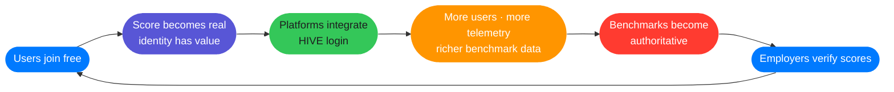

This is the LinkedIn flywheel. Except LinkedIn's data is self-reported. **HIVE's is machine-verified.**

---

## 4. System Architecture

### Three-layer topology

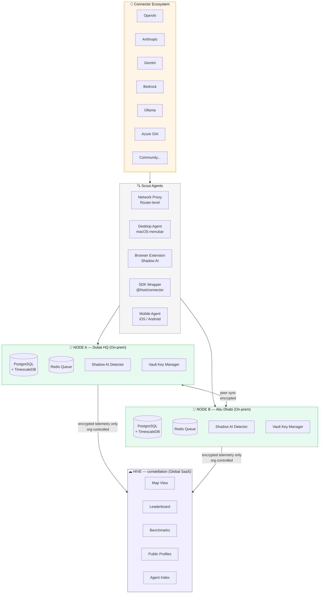

### Key architectural principles

1. **Nodes are peers, not subordinates.** No Hub reports to another Hub. They gossip-sync like blockchain nodes. There is no central point of failure below the Hive constellation.

2. **The Scout is the trust boundary.** All encryption happens at the Scout level. The Node never receives plaintext content. The Hive never receives plaintext content. The schema is the covenant.

3. **One language, one runtime.** Pure TypeScript/Node.js monorepo. One brain to hire, one toolchain to maintain, one language to own.

4. **Config, not code, determines deployment mode.** The same codebase runs solo, org, federated, or open mode. Infrastructure is configuration, not a fork.

---

## 5. The Trust Covenant

**This is not a privacy feature. This is the product's legal permission to exist.**

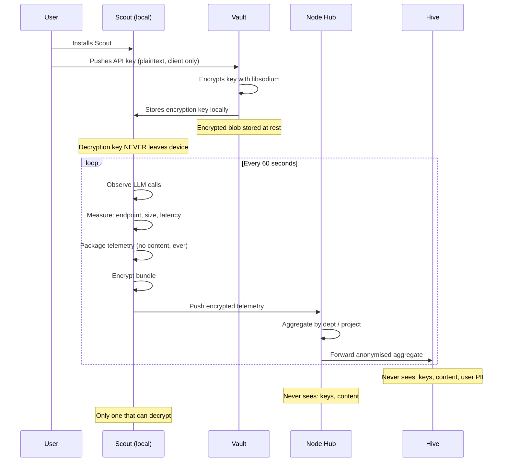

**The zero-knowledge guarantee:**
- If Scout is compromised → encrypted blob is useless without local key
- If Vault is breached → ciphertext is useless without Scout's local key
- If Hive is breached → only anonymised aggregates, no org secrets

**Technology: libsodium-wrappers** — the same cryptographic primitive that Signal uses.

**This covenant is open source from day one.** Let anyone audit it. The transparency IS the trust.

---

## 6. Technical Stack

### Monorepo structure

```mermaid
graph LR
    subgraph MONO ["hive/ (Turborepo)"]
        direction TB
        subgraph PKG ["packages/"]
            SCOUT[scout\nNode.js → pkg binary]
            NODE[node-server\nExpress + PGSQL]
            HIVE_S[hive-server\nSupabase adapter]
            DASH[dashboard\nNext.js]
            VAULT[vault\nlibsodium-wrappers]
            SDK[connector-sdk\n@hive/connector npm]
            SHARED[shared\nschema · types · utils]
        end
        subgraph CONN ["connectors/"]
            OAI[openai]
            ANT[anthropic]
            GEM[gemini]
            BED[bedrock]
            OLL[ollama]
            AZR[azure-openai]
        end
        subgraph DOCK ["docker/"]
            COMP[node-compose.yml\nfull on-prem stack]
            SOLO[scout-only.yml\njust the agent]
        end
    end

    style MONO fill:#F5F5F7,stroke:#D2D2D7,color:#1D1D1F
    style PKG fill:#E8F4FF,stroke:#007AFF,color:#1D1D1F
    style CONN fill:#FFF4E5,stroke:#FF9500,color:#1D1D1F
    style DOCK fill:#E8F9F0,stroke:#34C759,color:#1D1D1F
```

### Stack decisions

| Layer | Technology | Rationale |
|-------|-----------|-----------|
| **Scout agent** | Node.js + `pkg` | Single binary, cross-platform, same language |
| **Node Hub** | Express + PostgreSQL + TimescaleDB | TimescaleDB is purpose-built for time-series telemetry |
| **Queue** | Bull + Redis | Battle-tested job queue, handles offline Scout buffering |
| **Hive SaaS** | Same codebase + Supabase adapter | No new code — swap the DB adapter |
| **Dashboard** | Next.js | SSR for public profiles, App Router for dashboard |
| **Maps** | Deck.gl | WebGL-accelerated, handles global telemetry maps |
| **Charts** | Recharts | Composable, TypeScript-first |
| **Crypto** | libsodium-wrappers | Gold standard, same as Signal |
| **Monorepo** | Turborepo | Best-in-class for Node.js monorepos |
| **Distribution** | .exe / .pkg / .deb / Docker / npm | Every install target from one build |

### Non-negotiable constraints

1. **TypeScript strict mode everywhere** — `strict: true`, no exceptions
2. **Schema-first** — the telemetry covenant (`packages/shared`) is the source of truth
3. **Vault is client-side only** — `packages/vault` has zero server-side logic
4. **Connectors emit only `HiveConnectorEvent`** — nothing outside the protocol, ever
5. **All secrets via environment variables** — no hardcoded credentials, `.env` in `.gitignore`

---

## 7. The Connector Protocol

**Don't build connectors. Define a protocol and let connectors be community-maintained plugins.**

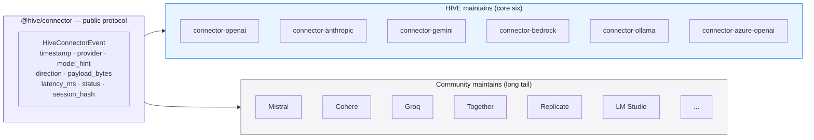

**The one-line drop-in:**

```typescript
// Before
import openai from 'openai'

// After — zero behaviour change, full telemetry
import { openai } from '@hive/connector-openai'
```

Open source the spec. Community builds connectors. You get ecosystem without hiring 20 engineers.

---

## 8. Identity Architecture

### Three identity types under one cryptographic root

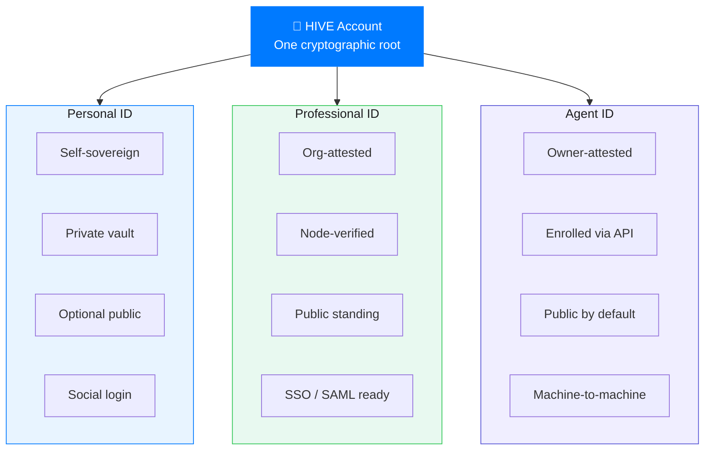

### CIAM deployment modes

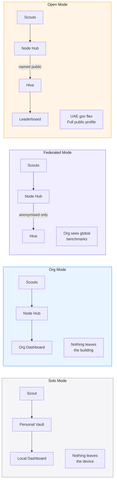

### Personal vs. professional scrubbing

The scrubbing is not just privacy — **it is the product.** User defines rules client-side. Professional bucket is node-attested. Professional score is worth more because it is verified. That is the incentive to consent.

---

## 9. The Social Layer

### TokenPrint score composition

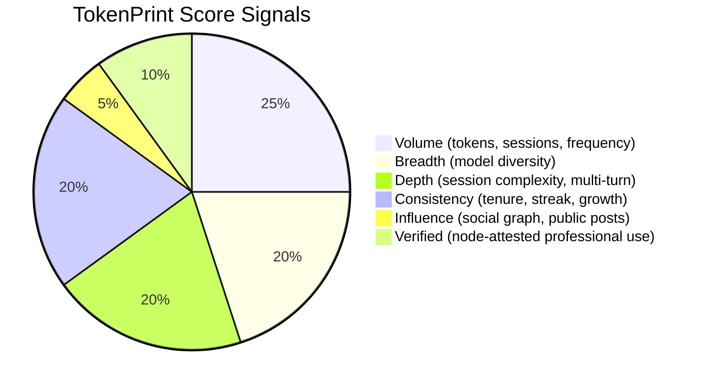

### The Wrapped Moment
Every year, January 1st, every HIVE user gets their **AI Year in Review.** Most used model. Peak week. Biggest project. Growth since last year. Shareable card. One day a year the whole network posts their card. HIVE trends globally. This is not a feature — it is the annual acquisition event.

### Six identity types in the graph

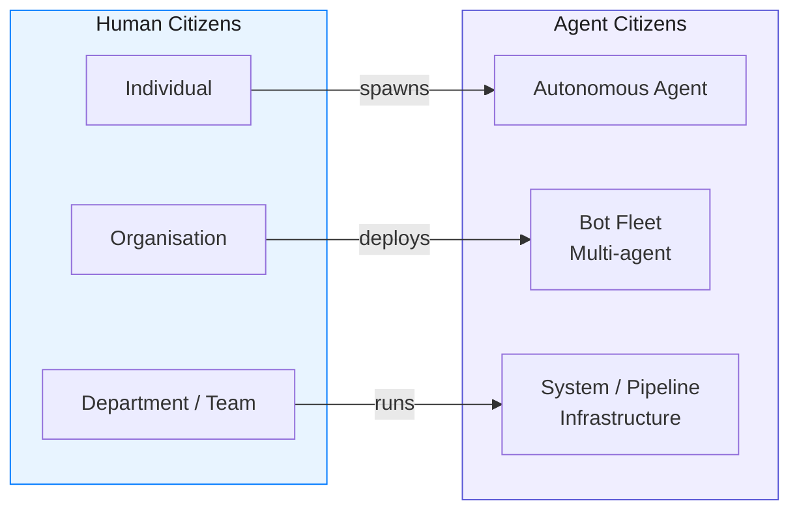

Nobody has built human + agent citizens in one verified social graph. Not OpenAI. Not Anthropic. Not Google.

---

## 10. Business Model

**Free forever is a strategy when one of these four is the real business:**

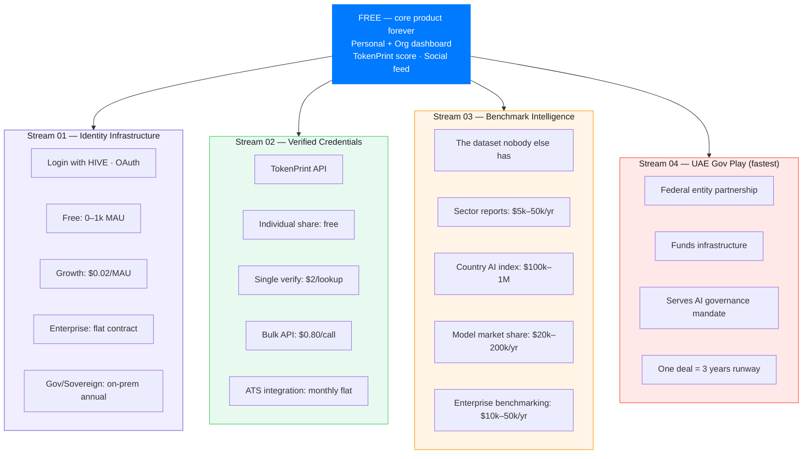

---

## 11. Go-to-Market Strategy

### Phase 0 — UAE First (Weeks 1–4, before writing code)

Talk to 5 IT managers in UAE orgs. One question: *"Do you know how much your org spends on AI APIs across all tools right now?"* Watch their face. That face is the pitch deck.

Target orgs for Phase 0 conversations:
- ADNOC
- DEWA
- RTA
- Smart Dubai / Dubai Digital Authority
- MOHRE
- MBZUAI

### The UAE unfair advantage

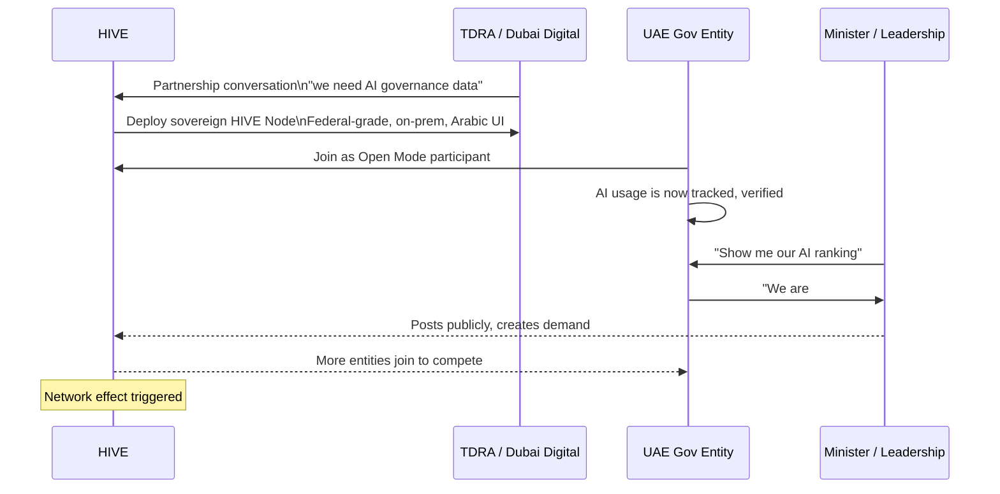

**The leaderboard is a political instrument.** A federal entity at #1 in AI consumption is a KPI they put in their annual report. This is not a feature you pitch — it is a status game they already play.

### Cold start strategy

The leaderboard is only interesting with 100 orgs. With 3 orgs it is embarrassing. The UAE gov angle is **essential, not optional.** If Dubai Municipality is on HIVE from day one, everyone wants to be on it.

---

## 12. Build Sequence

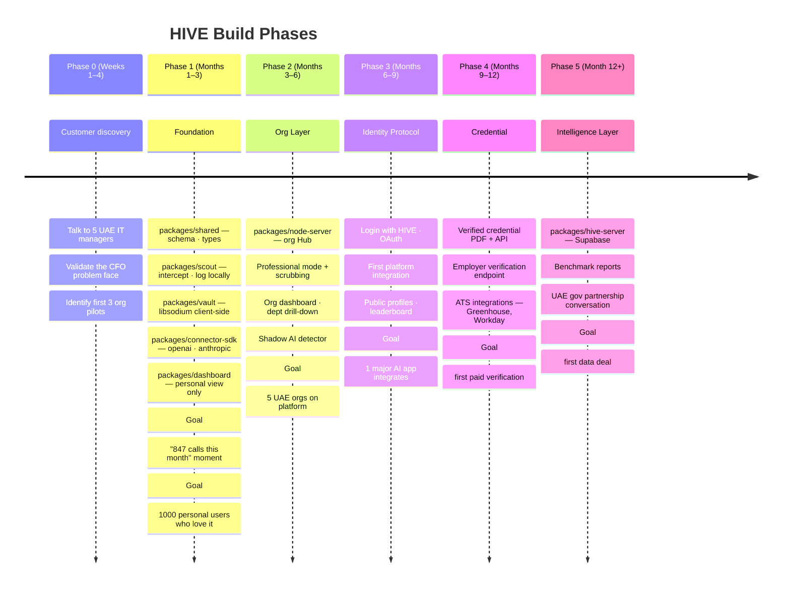

---

## 13. Success Metrics

### Phase 1 metrics (Month 3 checkpoint)

| Metric | Target | Why |
|--------|--------|-----|
| Personal users | 1,000 | Validates "847 calls" moment |
| Daily active scouts | 200 | Retention signal |
| Connectors live | 2 (OpenAI + Anthropic) | Core coverage |
| NPS | > 50 | Product love before scaling |

### Phase 2 metrics (Month 6 checkpoint)

| Metric | Target | Why |
|--------|--------|-----|
| Orgs on platform | 5 UAE orgs | Cold start solved |
| Scouts per org | > 20 | Real enterprise adoption |
| Shadow AI detected | > 0 events | Validates the problem |
| Node uptime | 99.5% | Enterprise-grade requirement |

### Phase 3 metrics (Month 9 checkpoint)

| Metric | Target | Why |
|--------|--------|-----|
| Platform integrations | 1 | Proves the protocol |
| Public profiles | 500 | Social layer live |
| Leaderboard orgs | 10 | Network effect seeded |
| Gov partnership MOU | 1 | UAE angle validated |

### Phase 4–5 metrics (Month 12+)

| Metric | Target | Why |
|--------|--------|-----|
| Paid verifications | 100 | Revenue model proven |
| Benchmark data deal | 1 | Intelligence layer live |
| Global users | 10,000 | Scale threshold |
| Annual recurring revenue | $500k | Series A ready |

---

## 14. Risks and Mitigations

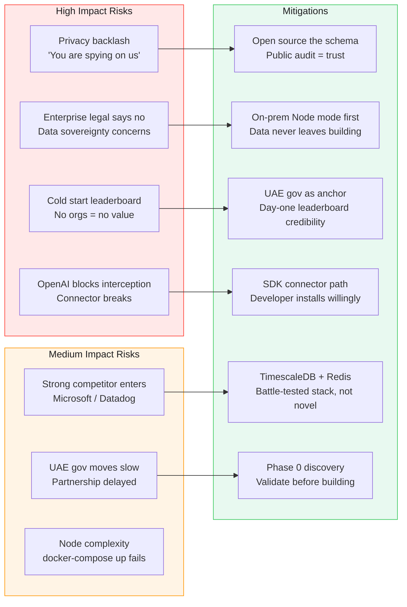

---

## 15. Open Questions

These must be resolved before Phase 2 begins. Each is a decision point that affects architecture or GTM:

| # | Question | Deadline | Owner |
|---|----------|----------|-------|
| Q1 | Which UAE entity do we approach first — TDRA or Smart Dubai? | End of Phase 0 | GTM |
| Q2 | Do we build the browser extension in Phase 1 or Phase 2? | Month 1 | Engineering |
| Q3 | How do we handle GDPR for EU users if they join before Phase 3 (no formal privacy policy)? | Month 1 | Legal |
| Q4 | Node-to-node peer sync: Gossip protocol or webhook? | Month 2 | Architecture |
| Q5 | Do we open source the full Scout codebase or just the protocol spec? | Month 2 | Product |
| Q6 | What is the Arabic localisation plan — RTL Next.js from day one? | Month 2 | Engineering |
| Q7 | TokenPrint score algorithm — publish the formula or keep it proprietary? | Month 3 | Product |
| Q8 | First platform integration target — which AI app do we approach? | Month 6 | GTM |

---

## 16. Governance Blockers to Fix First

> These are the vibe doctor blockers. Fix them before Phase 1 code ships.

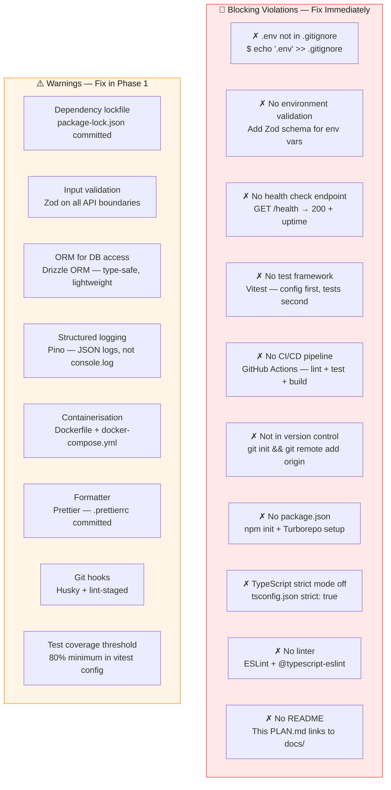

**Priority order:** B6 → B7 → B1 → B8 → B9 → B4 → B5 → B2 → B3 → B10, then warnings.

---

*Last updated: 2026-04-15*  
*Status: Pre-build · Phase 0 customer discovery*  
*Next review: End of Phase 0 (4 weeks)*
