# HIVE — Quick Start Guide

Get HIVE running in under 5 minutes. This guide covers both Docker and local development setups, with architecture diagrams, API examples, and troubleshooting.

---

## Table of Contents

- [Prerequisites](#prerequisites)
- [Architecture Overview](#architecture-overview)
- [Option A: Docker (Recommended)](#option-a-docker-recommended)
- [Option B: Local Development](#option-b-local-development)
- [Verify Everything Works](#verify-everything-works)
- [Dashboard Pages](#dashboard-pages)
- [API Reference](#api-reference)
- [Sending Your First TTP Event](#sending-your-first-ttp-event)
- [Using a Connector](#using-a-connector)
- [Intelligence Layer](#intelligence-layer)
- [Environment Configuration](#environment-configuration)
- [Docker Services](#docker-services)
- [Troubleshooting](#troubleshooting)
- [Next Steps](#next-steps)

---

## Prerequisites

| Requirement | Docker Setup | Local Setup |
|-------------|:---:|:---:|
| Node.js 20+ | - | Required |
| npm 10+ | - | Required |
| Docker Desktop | Required | - |
| PostgreSQL 16 | Included | Required |
| Redis 7 | Included | Required |
| Git | Required | Required |

---

## Architecture Overview

### System Topology

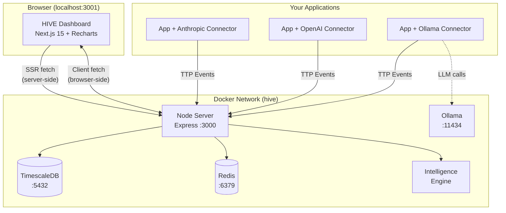

### Request Flow

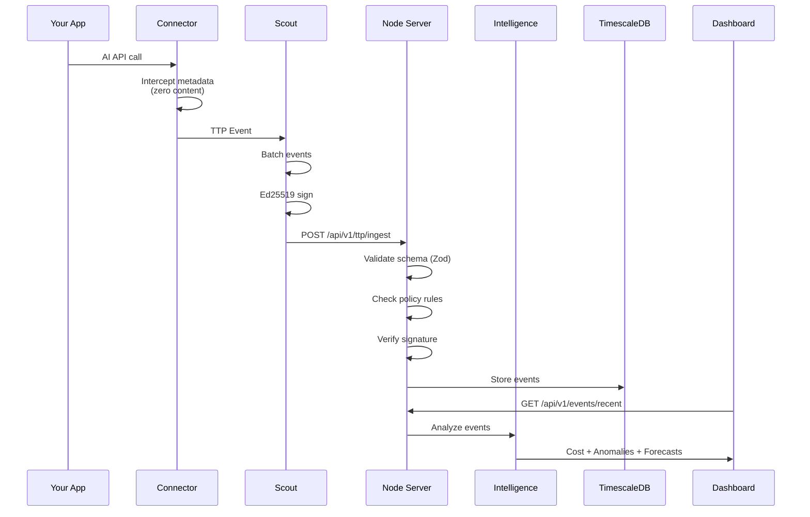

### Package Dependency Graph

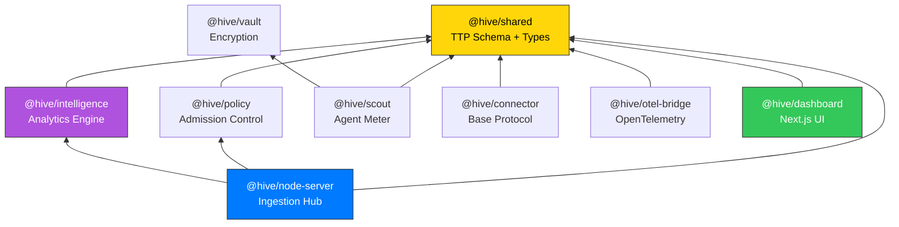

---

## Option A: Docker (Recommended)

One command brings up the entire stack.

### 1. Clone and Start

```bash
git clone https://github.com/vishalm/hivehq.git
cd hivehq
npm run docker:up
```

This runs `docker compose --env-file .env.docker up --build -d`, which builds and starts:

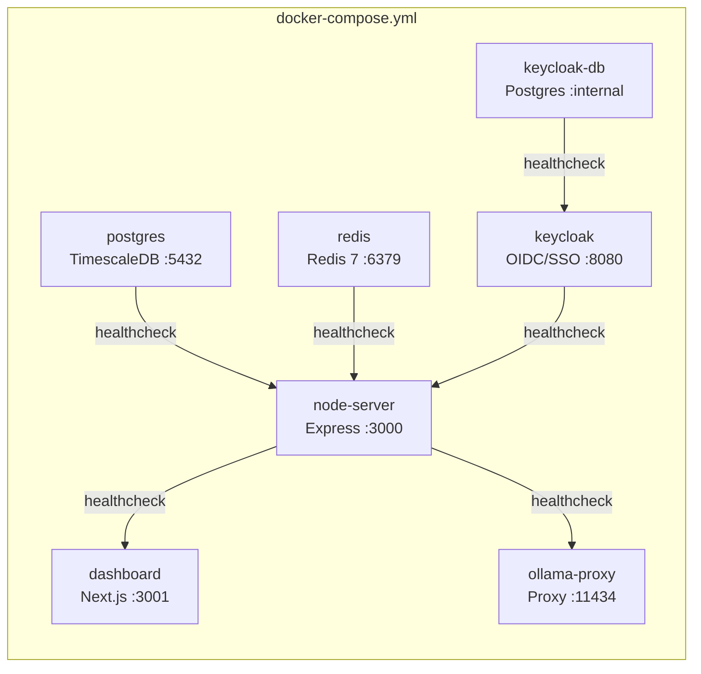

### 2. Check Status

```bash
# All services running?
docker compose ps

# Tail logs
npm run docker:logs

# Node server health
curl http://localhost:3000/health

# Keycloak health
curl -s http://localhost:8080/health/ready | jq .status
```

### 3. Open Dashboard

- Dashboard: [http://localhost:3001](http://localhost:3001)
- Login: [http://localhost:3001/login](http://localhost:3001/login)
- Keycloak Admin: [http://localhost:8080/admin](http://localhost:8080/admin) (admin / admin)
- Setup Wizard: [http://localhost:3001/setup](http://localhost:3001/setup)
- Intelligence: [http://localhost:3001/intelligence](http://localhost:3001/intelligence)
- Node API: [http://localhost:3000/health](http://localhost:3000/health)
- Prometheus Metrics: [http://localhost:3000/metrics](http://localhost:3000/metrics)

**Default login credentials** (auto-provisioned in Keycloak):

| Email | Password | Role |
|-------|----------|------|
| `admin@hive.local` | `admin` | Admin (full access) |
| `operator@hive.local` | `operator` | Operator (setup, connectors) |
| `viewer@hive.local` | `viewer` | Viewer (read-only dashboards) |

### 4. Stop

```bash
npm run docker:down
```

### Docker Commands Reference

| Command | Action |
|---------|--------|
| `npm run docker:up` | Build and start all services |
| `npm run docker:down` | Stop all services |
| `npm run docker:logs` | Tail all logs |
| `docker compose --env-file .env.docker up --build -d node-server` | Rebuild single service |
| `docker compose exec node-server sh` | Shell into container |
| `docker volume rm hivehq_pgdata` | Reset database |

---

## Option B: Local Development

For active development with hot reload on all packages.

### 1. Install Dependencies

```bash
git clone https://github.com/vishalm/hivehq.git
cd hivehq
npm install
```

### 2. Start Infrastructure

You need PostgreSQL and Redis running locally. Using Homebrew (macOS):

```bash
brew install postgresql@16 redis
brew services start postgresql@16
brew services start redis

# Create the hive database
createdb hive
psql hive -c "CREATE USER hive WITH PASSWORD 'hive_dev_password';"
psql hive -c "GRANT ALL PRIVILEGES ON DATABASE hive TO hive;"
```

Or use Docker for just the infrastructure:

```bash
docker run -d --name hive-pg -p 5432:5432 \
  -e POSTGRES_DB=hive -e POSTGRES_USER=hive -e POSTGRES_PASSWORD=hive_dev_password \
  timescale/timescaledb:latest-pg16

docker run -d --name hive-redis -p 6379:6379 redis:7-alpine
```

### 3. Configure Environment

```bash
npm run local:setup    # copies .env.local -> .env
```

This creates a `.env` file with localhost URLs and debug log level.

### 4. Start Development

```bash
npm run dev
```

Turborepo starts all packages in watch mode. The node-server runs on `:3000` and the dashboard on `:3001`.

### 5. Run Tests

```bash
npm test              # all packages
npx vitest run        # single run
npx vitest --watch    # watch mode
```

---

## Verify Everything Works

### Health Check

```bash
curl http://localhost:3000/health
```

Expected response:

```json
{
  "status": "ok",
  "uptime_ms": 12345,
  "region": "AE",
  "node_id": "hive-node-01",
  "events_ingested": 0,
  "policy": null,
  "trust_kids": []
}
```

### Version

```bash
curl http://localhost:3000/version
```

```json
{
  "name": "@hive/node-server",
  "version": "0.1.0",
  "TTP": "0.1"
}
```

### Prometheus Metrics

```bash
curl http://localhost:3000/metrics
```

Returns Prometheus text format with `hive_ingest_total`, `hive_errors_total`, and `hive_covenant_violations_total` counters.

---

## Dashboard Pages

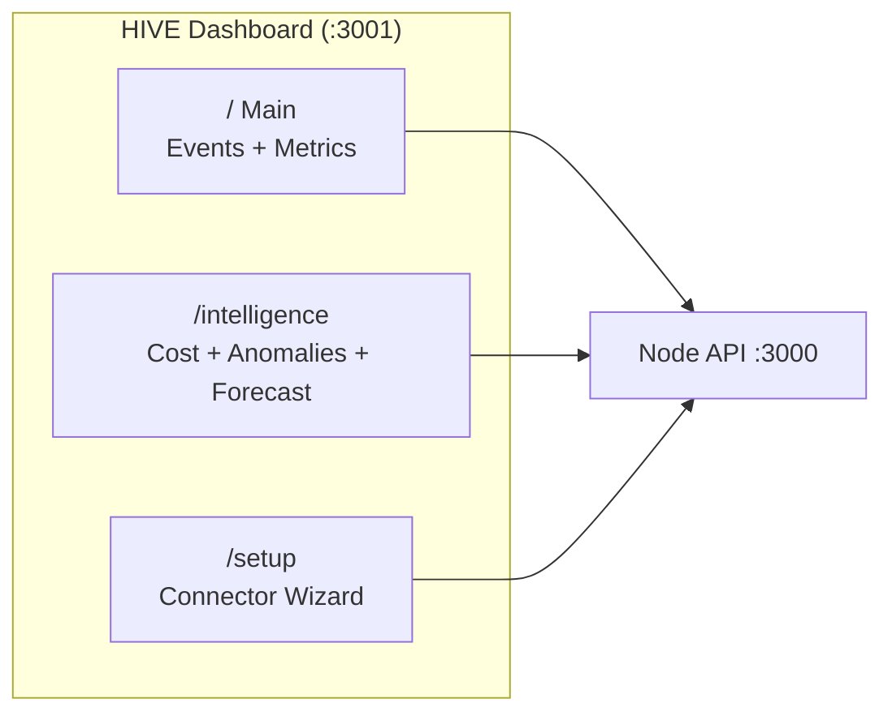

| Page | URL | Shows |
|------|-----|-------|
| **Dashboard** | `/` | Recent events, top providers, dept/project breakdown |
| **Intelligence** | `/intelligence` | 7 tabs: Overview, Cost, Anomalies, Forecast, Clusters, Flows, Fingerprints |
| **Setup** | `/setup` | 3-step wizard: Connectors, Configuration, Activate |

---

## API Reference

### Ingestion (authenticated)

```bash
# Send a batch of TTP events
curl -X POST http://localhost:3000/api/v1/ttp/ingest \
  -H "Content-Type: application/json" \
  -H "Authorization: Bearer hive-dev-token-2026" \
  -d '{
    "batch_id": "batch-001",
    "events": [
      {
        "TTP_version": "0.1",
        "event_id": "evt-001",
        "schema_hash": "sha256:abc123",
        "timestamp": 1713254400000,
        "observed_at": 1713254400000,
        "emitter_id": "scout-01",
        "emitter_type": "scout",
        "provider": "anthropic",
        "endpoint": "/v1/messages",
        "model_hint": "claude-sonnet-4-20250514",
        "model_family": "claude",
        "direction": "response",
        "status_code": 200,
        "payload_bytes": 2048,
        "latency_ms": 450,
        "estimated_tokens": 500,
        "token_breakdown": { "prompt": 200, "completion": 300, "total": 500 },
        "deployment": "node",
        "node_region": "AE",
        "dept_tag": "engineering",
        "project_tag": "copilot",
        "governance": {
          "consent_basis": "org_policy",
          "data_residency": "AE",
          "retention_days": 90,
          "regulation_tags": ["UAE_AI_LAW", "GDPR"],
          "pii_asserted": false,
          "content_asserted": false
        }
      }
    ]
  }'
```

Response:

```json
{
  "accepted": 1,
  "rejected": 0,
  "errors": [],
  "batch_id": "batch-001",
  "ingested_at": 1713254400123
}
```

### Reading Data

```bash
# Recent events
curl http://localhost:3000/api/v1/events/recent?limit=10

# Aggregated rollups
curl http://localhost:3000/api/v1/rollups/aggregate

# Available connectors
curl http://localhost:3000/api/v1/connectors
```

### Intelligence Endpoints

```bash
# Cost breakdown
curl http://localhost:3000/api/v1/intelligence/cost?limit=500

# Anomaly detection
curl http://localhost:3000/api/v1/intelligence/anomalies?limit=500

# Spend forecast (90-day horizon)
curl http://localhost:3000/api/v1/intelligence/forecast?limit=1000&horizon=90

# Behavioral clusters + flow analysis
curl http://localhost:3000/api/v1/intelligence/clusters?limit=500

# Usage fingerprints by department
curl http://localhost:3000/api/v1/intelligence/fingerprints?limit=500&groupBy=dept

# Usage fingerprints by project
curl http://localhost:3000/api/v1/intelligence/fingerprints?limit=500&groupBy=project
```

### Configuration

```bash
# Read current config
curl http://localhost:3000/api/v1/config

# Update config
curl -X PUT http://localhost:3000/api/v1/config \
  -H "Content-Type: application/json" \
  -d '{"scout": {"deployment": "node", "connectors": ["anthropic", "ollama"]}}'

# Default values
curl http://localhost:3000/api/v1/config/defaults
```

---

## Sending Your First TTP Event

After setup, send a test event to see data flow through the system:

```bash
curl -X POST http://localhost:3000/api/v1/ttp/ingest \
  -H "Content-Type: application/json" \
  -H "Authorization: Bearer hive-dev-token-2026" \
  -d '{
    "batch_id": "test-batch-001",
    "events": [{
      "TTP_version": "0.1",
      "event_id": "test-evt-001",
      "schema_hash": "sha256:test",
      "timestamp": '"$(date +%s000)"',
      "observed_at": '"$(date +%s000)"',
      "emitter_id": "manual-test",
      "emitter_type": "sdk",
      "provider": "anthropic",
      "endpoint": "/v1/messages",
      "model_hint": "claude-sonnet-4-20250514",
      "model_family": "claude",
      "direction": "response",
      "status_code": 200,
      "payload_bytes": 4096,
      "latency_ms": 320,
      "estimated_tokens": 750,
      "token_breakdown": {"prompt": 250, "completion": 500, "total": 750},
      "deployment": "solo",
      "node_region": "AE",
      "dept_tag": "engineering",
      "project_tag": "hive-dev",
      "governance": {
        "consent_basis": "org_policy",
        "data_residency": "AE",
        "retention_days": 90,
        "regulation_tags": ["UAE_AI_LAW"],
        "pii_asserted": false,
        "content_asserted": false
      }
    }]
  }'
```

Then open the dashboard at [http://localhost:3001](http://localhost:3001) to see the event.

---

## Using a Connector

Connectors are drop-in replacements for AI provider SDKs. They intercept API calls and emit TTP events automatically.

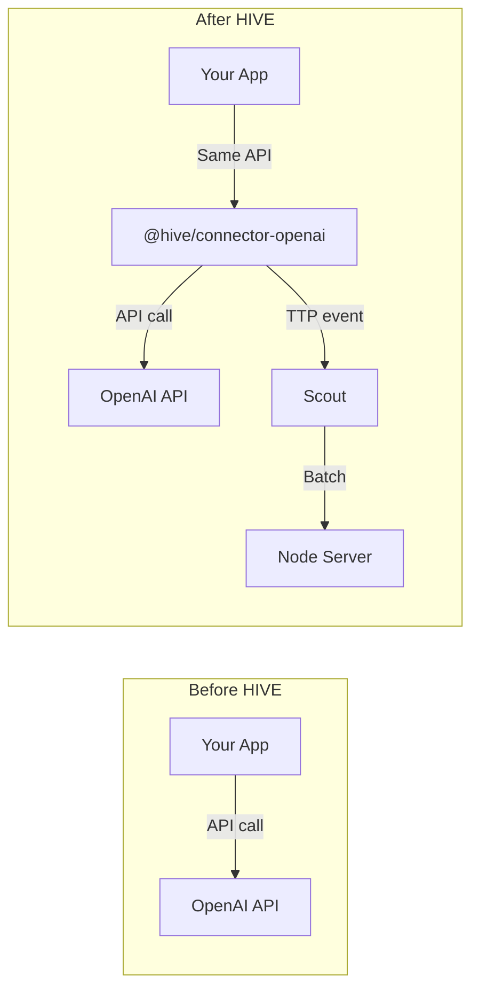

### Install

```bash
npm install @hive/connector-openai
# or
npm install @hive/connector-anthropic
```

### Use

```typescript
// One-line change — import from the connector instead of the provider
import { openai } from '@hive/connector-openai'

// Your existing code works unchanged
const response = await openai.chat.completions.create({
  model: 'gpt-4',
  messages: [{ role: 'user', content: 'Hello' }],
})

// Telemetry is emitted automatically — zero content captured
```

### Available Connectors

| Package | Provider | Detection |
|---------|----------|-----------|
| `@hive/connector-anthropic` | Claude | fetch intercept |
| `@hive/connector-openai` | GPT-4, GPT-3.5, Embeddings | fetch intercept |
| `@hive/connector-ollama` | Llama, Mistral, Gemma (local) | fetch intercept |
| `@hive/connector-google` | Gemini, Vertex AI | fetch intercept |
| `@hive/connector-mistral` | Mistral AI | fetch intercept |
| `@hive/connector-azure-openai` | Azure OpenAI | fetch intercept |
| `@hive/connector-bedrock` | AWS Bedrock | fetch intercept |

---

## Intelligence Layer

The intelligence engine runs six analytical models on stored TTP events:

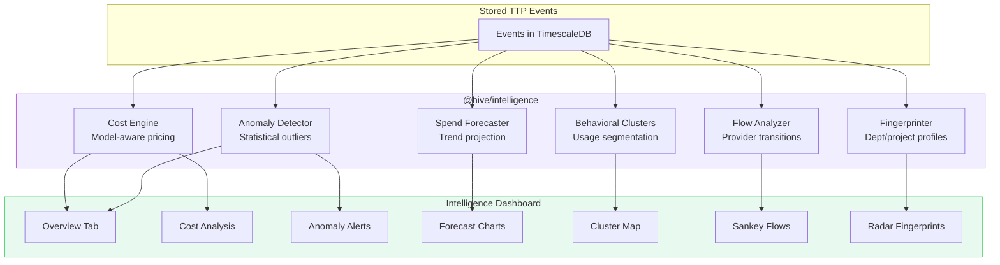

| Feature | What it does | Min data needed |
|---------|-------------|-----------------|
| **Cost Engine** | Per-event and batch cost estimates using model pricing tables | 1 event |
| **Anomaly Detector** | Flags latency spikes, token surges, error rate changes | 10+ events |
| **Spend Forecaster** | Daily/monthly spend projections | 3+ days of data |
| **Behavioral Clusters** | Groups usage patterns by provider, model, time-of-day | 20+ events |
| **Flow Analyzer** | Maps provider/model transitions over time | 10+ events |
| **Fingerprinter** | Aggregate profiles per department or project | 5+ events |

---

## Environment Configuration

HIVE ships with two ready-made configs. Never edit `.env.example` directly.

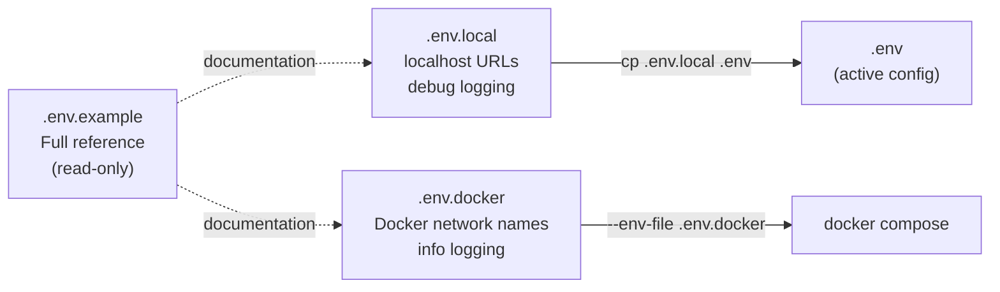

### Key Differences

| Variable | `.env.local` | `.env.docker` |
|----------|:---:|:---:|
| `NODE_DATABASE_URL` | `localhost:5432` | Set in compose (`postgres:5432`) |
| `NODE_REDIS_URL` | `localhost:6379` | Set in compose (`redis:6379`) |
| `DASHBOARD_NODE_URL` | `http://localhost:3000` | `http://node-server:3000` (SSR) |
| `LOG_LEVEL` | `debug` | `info` |
| `HIVE_DEPLOYMENT` | `solo` | `node` |

### All Variables

| Variable | Default | Description |
|----------|---------|-------------|
| `NODE_PORT` | `3000` | Express listen port |
| `NODE_REGION` | `AE` | ISO 3166-1 alpha-2 data residency |
| `NODE_ID` | `hive-node-01` | Unique node identifier |
| `NODE_INGEST_TOKEN` | - | 16+ char Bearer token for `/ingest` |
| `NODE_DATABASE_URL` | - | PostgreSQL connection string |
| `NODE_REDIS_URL` | - | Redis connection string |
| `LOG_LEVEL` | `info` | `debug`, `info`, `warn`, `error` |
| `DASHBOARD_PORT` | `3001` | Next.js listen port |
| `DASHBOARD_NODE_URL` | `http://localhost:3000` | Server-side (SSR) node URL |
| `NEXT_PUBLIC_NODE_URL` | `http://localhost:3000` | Client-side (browser) node URL |
| `POSTGRES_PASSWORD` | `hive_dev_password` | PostgreSQL password |
| `HIVE_DEPLOYMENT` | `solo` | `solo`, `node`, `federated`, `open` |
| `HIVE_CONNECTORS` | `anthropic,ollama` | Comma-separated connector IDs |
| `HIVE_DATA_RESIDENCY` | `AE` | ISO 3166-1 alpha-2 |
| `HIVE_RETENTION_DAYS` | `90` | Event retention period |
| `HIVE_REGULATION_TAGS` | `UAE_AI_LAW,GDPR` | Compliance tags |

---

## Docker Services

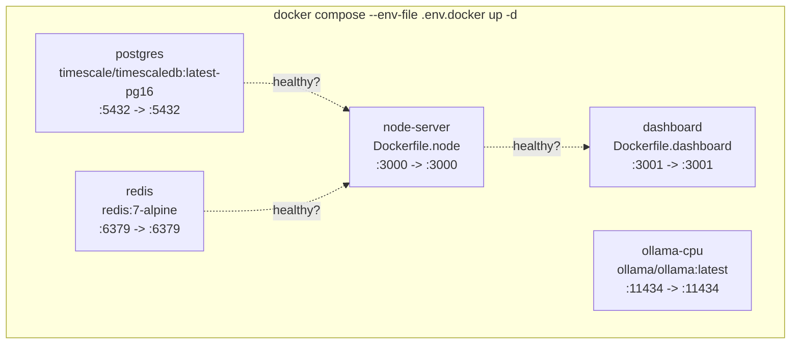

| Service | Image | Port | Health Check | Depends On |
|---------|-------|------|-------------|------------|
| `postgres` | `timescale/timescaledb:latest-pg16` | 5432 | `pg_isready -U hive` | - |
| `redis` | `redis:7-alpine` | 6379 | `redis-cli ping` | - |
| `node-server` | `Dockerfile.node` (node:22-alpine) | 3000 | Node.js `fetch(/health)` | postgres, redis |
| `dashboard` | `Dockerfile.dashboard` (node:22-alpine) | 3001 | - | node-server |
| `ollama-cpu` | `ollama/ollama:latest` | 11434 | `wget /api/tags` | - (profile: cpu) |
| `ollama` | `ollama/ollama:latest` | 11434 | `wget /api/tags` | - (profile: gpu) |

### Build Stages (Dockerfile.node)

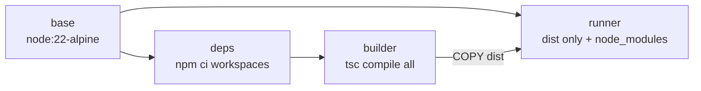

Packages built in order: `shared` -> `policy` -> `intelligence` -> `node-server`

### Build Stages (Dockerfile.dashboard)

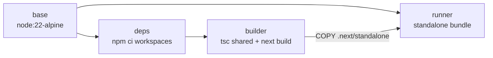

---

## Troubleshooting

### "Node server offline" in Dashboard

**Cause:** The browser at `:3001` cannot reach the Node API at `:3000`.

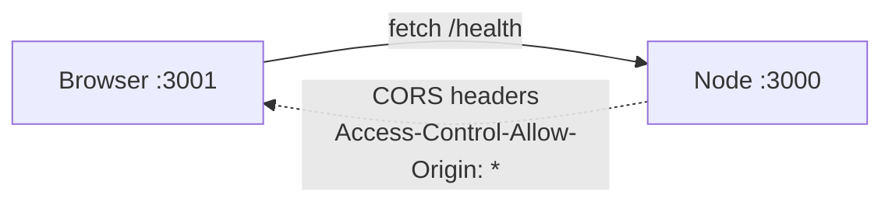

**Fixes:**
1. Check the node-server is running: `docker compose ps` or `curl http://localhost:3000/health`
2. If the container is restarting, check logs: `docker compose logs node-server --tail 50`
3. Make sure port 3000 is not used by another process: `lsof -i :3000`

### "NODE_INGEST_TOKEN: String must contain at least 16 characters"

**Cause:** The token env var is empty or too short. In `.env.docker` it defaults to `hive-dev-token-2026`.

**Fix:** Ensure `.env.docker` has `NODE_INGEST_TOKEN=hive-dev-token-2026` (or any 16+ char string).

### Docker health check failing

**Cause:** The node-server takes a few seconds to boot. The health check has a 15-second start period.

**Fix:** Wait for health checks to pass: `docker compose ps` and watch for `healthy` status. If it stays `unhealthy`, check logs.

### "Cannot find module '@hive/intelligence'"

**Cause:** The intelligence package isn't included in the Docker build.

**Fix:** Ensure `Dockerfile.node` includes intelligence in all stages (deps, builder, runner). This has been fixed in the current version.

### Dashboard build fails — "standalone not found"

**Cause:** `next.config.js` is missing `output: 'standalone'`.

**Fix:** Ensure `packages/dashboard/next.config.js` has:
```js
const nextConfig = {
  output: 'standalone',
  // ...
}
```

### Port conflicts

```bash
# Check what's using a port
lsof -i :3000
lsof -i :3001
lsof -i :5432

# Kill a process on a port
kill -9 $(lsof -ti :3000)
```

### Reset everything

```bash
# Stop and remove all containers + volumes
docker compose down -v

# Rebuild from scratch
npm run docker:up
```

### Git lock files

If you see `Unable to create '...lock': File exists`:

```bash
find .git -name "*.lock" -delete
```

---

## Next Steps

1. **Ingest real data** — Install a [connector](#using-a-connector) in your application
2. **Explore Intelligence** — Open [/intelligence](http://localhost:3001/intelligence) after ingesting 10+ events
3. **Configure governance** — Set data residency, retention, and regulation tags in [/setup](http://localhost:3001/setup)
4. **Add policy rules** — Use `@hive/policy` to enforce admission control on events
5. **Enable batch signing** — Configure Ed25519 keys in Scout for tamper-evident audit trails
6. **Read the TTP spec** — [`docs/TTP_SPEC.md`](./docs/TTP_SPEC.md) for the full protocol definition

---

*Built in UAE. Pre-alpha. Phase 2.*
