# HIVE — Quick Start Guide

Get HIVE running in under 5 minutes. This guide covers both Docker and local development setups, with architecture diagrams, API examples, authentication, and troubleshooting.

---

## Table of Contents

- [Prerequisites](#prerequisites)
- [Architecture Overview](#architecture-overview)
- [Option A: Docker (Recommended)](#option-a-docker-recommended)
- [Option B: Local Development](#option-b-local-development)
- [Authentication](#authentication)
- [Verify Everything Works](#verify-everything-works)
- [Dashboard Pages](#dashboard-pages)
- [API Reference](#api-reference)
- [Sending Your First TTP Event](#sending-your-first-ttp-event)
- [Using a Connector](#using-a-connector)
- [Intelligence Layer](#intelligence-layer)
- [Environment Configuration](#environment-configuration)
- [Docker Services](#docker-services)
- [Troubleshooting](#troubleshooting)
- [Next Steps](#next-steps)

---

## Prerequisites

| Requirement | Docker Setup | Local Setup |
|-------------|:---:|:---:|
| Node.js 20+ | — | Required |
| npm 10+ | — | Required |
| Docker Desktop | Required | — |
| PostgreSQL 16 | Included | Required |
| Redis 7 | Included | Required |
| Keycloak 26 | Included | Optional (set `HIVE_AUTH_MODE=none`) |
| Git | Required | Required |

---

## Architecture Overview

### System Topology

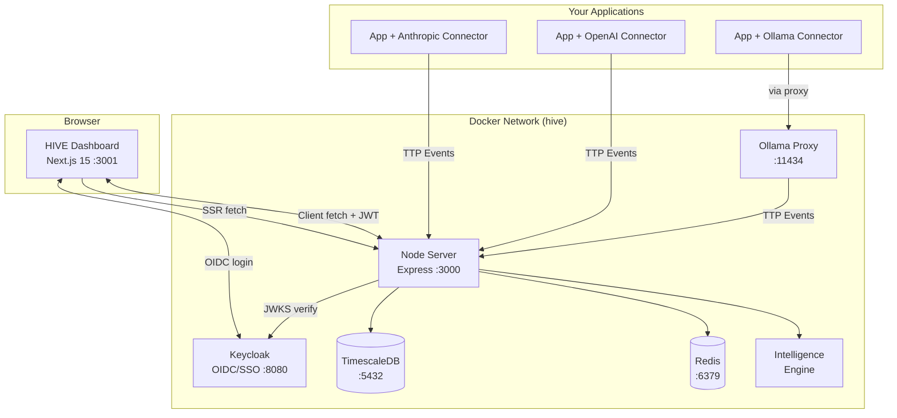

### Request Flow

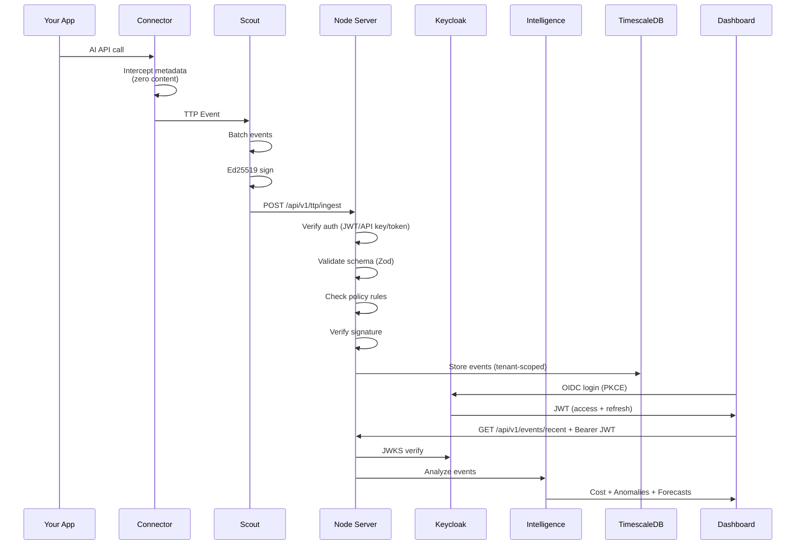

### Package Dependency Graph

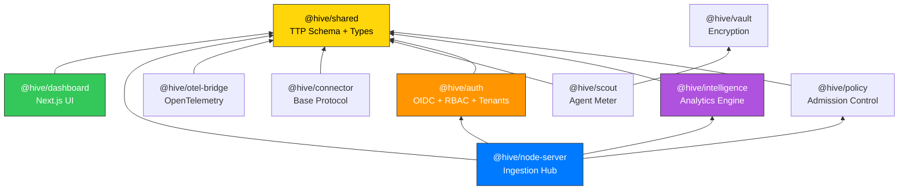

---

## Option A: Docker (Recommended)

One command brings up the entire stack.

### 1. Clone and Start

```bash
git clone https://github.com/vishalm/hivehq.git
cd hivehq
docker compose --env-file .env.docker up --build -d
```

This builds and starts the core stack:

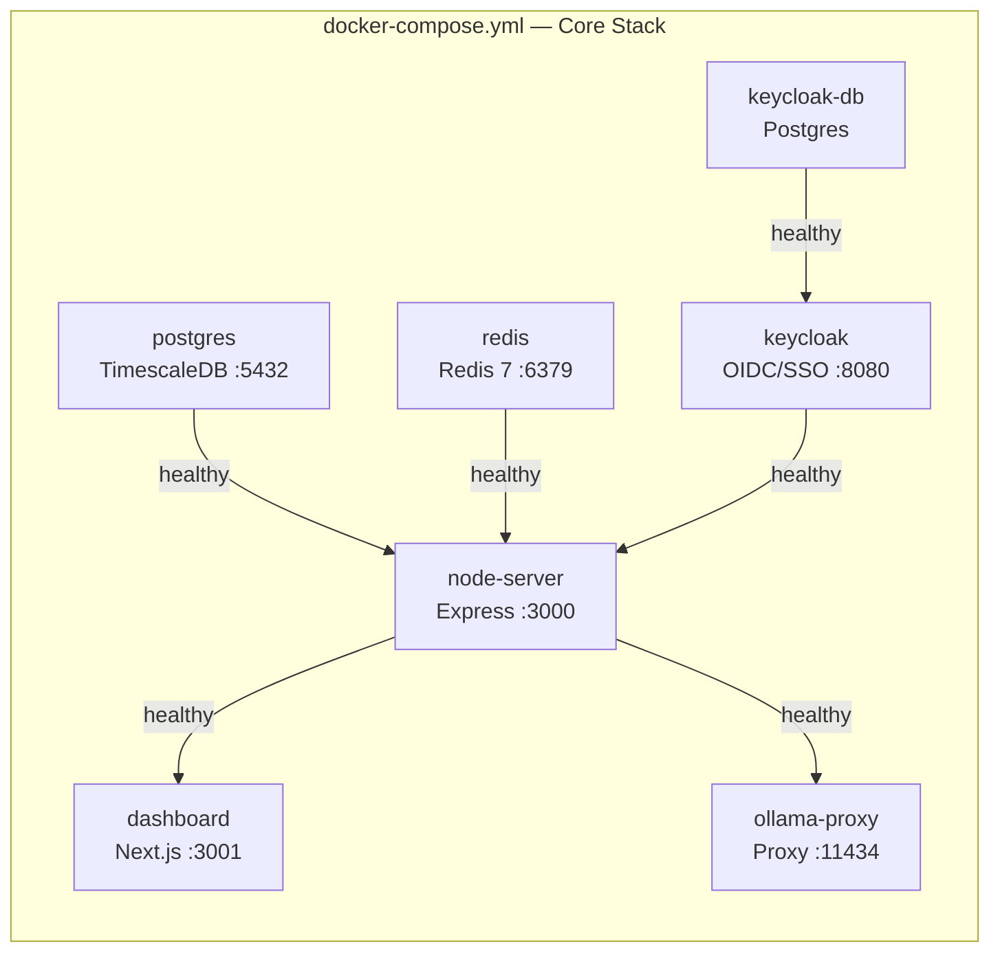

### 2. Profiles (Optional Services)

```bash
# With CPU Ollama (local LLM)
docker compose --profile cpu --env-file .env.docker up --build -d

# With GPU Ollama (NVIDIA)
docker compose --profile gpu --env-file .env.docker up --build -d

# With documentation site (:3002)
docker compose --profile docs --env-file .env.docker up --build -d

# With Scout connector agent
docker compose --profile scout --env-file .env.docker up --build -d

# Everything at once
docker compose --profile full --env-file .env.docker up --build -d
```

### 3. Check Status

```bash
# All services running?
docker compose ps

# Tail logs
docker compose logs -f

# Individual service health
curl http://localhost:3000/health                         # Node server
curl -s http://localhost:8080/health/ready | jq .status   # Keycloak
curl -I http://localhost:3001                              # Dashboard
```

### 4. Open Dashboard

| URL | What |
|-----|------|
| [http://localhost:3001](http://localhost:3001) | HIVE Dashboard |
| [http://localhost:3001/login](http://localhost:3001/login) | Login page |
| [http://localhost:3001/intelligence](http://localhost:3001/intelligence) | Intelligence (7 tabs) |
| [http://localhost:3001/setup](http://localhost:3001/setup) | Connector Setup Wizard |
| [http://localhost:3000/health](http://localhost:3000/health) | Node API health |
| [http://localhost:3000/metrics](http://localhost:3000/metrics) | Prometheus metrics |
| [http://localhost:3000/api-docs](http://localhost:3000/api-docs) | Swagger API docs |
| [http://localhost:8080/admin](http://localhost:8080/admin) | Keycloak Admin Console |
| [http://localhost:3002](http://localhost:3002) | Docs site (profile: docs) |

### 5. Stop

```bash
docker compose down          # Stop (keep data)
docker compose down -v       # Stop + remove named volumes
```

### Docker Commands Reference

| Command | Action |
|---------|--------|
| `docker compose --env-file .env.docker up --build -d` | Build and start core stack |
| `docker compose --profile full --env-file .env.docker up --build -d` | Start everything |
| `docker compose down` | Stop all services |
| `docker compose logs -f` | Tail all logs |
| `docker compose logs -f node-server` | Tail specific service |
| `docker compose ps` | Check service status |
| `docker compose --env-file .env.docker up --build -d node-server` | Rebuild single service |
| `docker compose exec node-server sh` | Shell into container |
| `docker compose exec postgres psql -U hive -d hive` | Connect to database |

---

## Option B: Local Development

For active development with hot reload on all packages.

### 1. Install Dependencies

```bash
git clone https://github.com/vishalm/hivehq.git
cd hivehq
npm install
```

### 2. Start Infrastructure

You need PostgreSQL and Redis running locally. Using Homebrew (macOS):

```bash
brew install postgresql@16 redis
brew services start postgresql@16
brew services start redis

# Create the hive database
createdb hive
psql hive -c "CREATE USER hive WITH PASSWORD 'hive_dev_password';"
psql hive -c "GRANT ALL PRIVILEGES ON DATABASE hive TO hive;"
```

Or use Docker for just the infrastructure:

```bash
docker run -d --name hive-pg -p 5432:5432 \
  -e POSTGRES_DB=hive -e POSTGRES_USER=hive -e POSTGRES_PASSWORD=hive_dev_password \
  timescale/timescaledb:latest-pg16

docker run -d --name hive-redis -p 6379:6379 redis:7-alpine
```

### 3. Configure Environment

```bash
npm run local:setup    # copies .env.local -> .env
```

This creates a `.env` file with localhost URLs and debug log level. By default, `HIVE_AUTH_MODE=none` is set for local development, which bypasses Keycloak and gives you admin-level access automatically.

### 4. Start Development

```bash
npm run dev
```

Turborepo starts all packages in watch mode. The node-server runs on `:3000` and the dashboard on `:3001`.

### 5. Run Tests

```bash
npm test              # all packages
npx vitest run        # single run
npx vitest --watch    # watch mode
```

---

## Authentication

HIVE uses Keycloak for OIDC/SSO authentication with role-based access control (RBAC) and multi-tenant isolation.

### Default Login Credentials

These users are auto-provisioned in the Keycloak `hive` realm on first boot:

| Email | Password | Role | Access |
|-------|----------|------|--------|
| `admin@hive.local` | `admin` | Admin | Full access: users, API keys, settings, config |
| `operator@hive.local` | `operator` | Operator | Setup wizard, connectors, config reads |
| `viewer@hive.local` | `viewer` | Viewer | Read-only dashboards and events |

Keycloak Admin Console: [http://localhost:8080/admin](http://localhost:8080/admin) (admin / admin)

### Roles

HIVE defines five roles with composite hierarchy:

```
super_admin  →  admin  →  operator  →  viewer
gov_auditor  (separate — cross-tenant audit read access)
```

| Role | Dashboards | Intelligence | Setup | Config | Admin | Tenants |
|------|:---:|:---:|:---:|:---:|:---:|:---:|
| `viewer` | Read | Read | — | — | — | — |
| `operator` | Read | Read | Read | Read | — | — |
| `admin` | Full | Full | Full | Full | Full | — |
| `super_admin` | Full | Full | Full | Full | Full | Full |
| `gov_auditor` | Read | Read | — | — | Audit Log | Cross-tenant |

### Auth Modes

| Mode | Environment | Description |
|------|-------------|-------------|
| `keycloak` | Docker / Production | Full OIDC with Keycloak. JWT verification via JWKS. |
| `none` | Local dev | Bypasses auth entirely. All requests get admin-level context. |

Set via `HIVE_AUTH_MODE` environment variable.

### Authentication Methods (Node Server)

The Node server accepts three auth methods in priority order:

1. **API Key** — `Authorization: Bearer hive_ak_...` (machine-to-machine)
2. **Legacy Token** — `Authorization: Bearer <token>` (backward compat with `NODE_INGEST_TOKEN`)
3. **OIDC JWT** — `Authorization: Bearer <jwt>` (browser sessions from Keycloak)

### Multi-Tenant Hierarchy

```
Country  →  Government  →  Group  →  Enterprise  →  Company  →  Individual
```

Each tenant is isolated at the database level. Users, events, and API keys are scoped to their tenant tree. Deployment modes:

| Mode | Variable | Description |
|------|----------|-------------|
| Bespoke | `HIVE_DEPLOYMENT_MODE=bespoke` | Single root tenant (on-premises) |
| SaaS | `HIVE_DEPLOYMENT_MODE=saas` | Multiple root tenants with strict isolation |

### Admin Pages

Accessible to `admin+` role via the user menu dropdown:

| Page | URL | Purpose |
|------|-----|---------|
| User Management | `/admin/users` | View users, roles, invite |
| API Keys | `/admin/api-keys` | Generate, view prefix, revoke |
| Audit Log | `/admin/audit` | Immutable event log with filters |
| Tenants | `/admin/tenants` | Hierarchy tree (`super_admin` only) |

---

## Verify Everything Works

### Health Check

```bash
curl http://localhost:3000/health
```

Expected response:

```json
{
  "status": "ok",
  "uptime_ms": 12345,
  "region": "AE",
  "node_id": "hive-node-01",
  "events_ingested": 0,
  "policy": null,
  "trust_kids": []
}
```

### Version

```bash
curl http://localhost:3000/version
```

```json
{
  "name": "@hive/node-server",
  "version": "0.1.0",
  "TTP": "0.1"
}
```

### Prometheus Metrics

```bash
curl http://localhost:3000/metrics
```

Returns Prometheus text format with `hive_ingest_total`, `hive_errors_total`, and `hive_covenant_violations_total` counters.

### Keycloak Health

```bash
curl -s http://localhost:8080/health/ready | jq .
```

```json
{
  "status": "UP",
  "checks": []
}
```

---

## Dashboard Pages

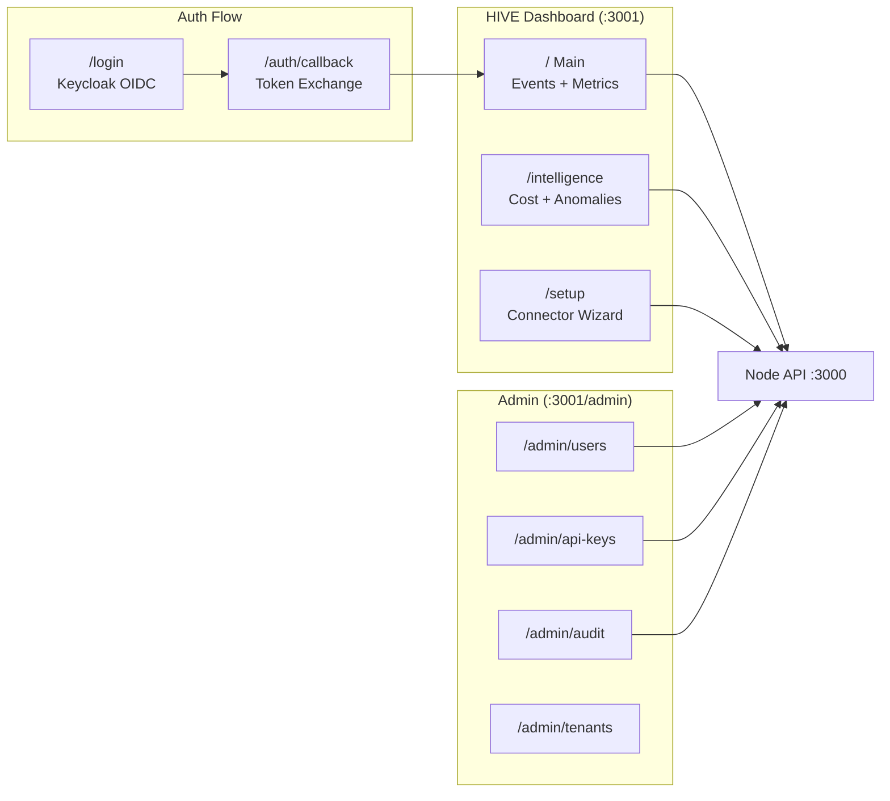

| Page | URL | Auth | Shows |
|------|-----|------|-------|
| **Landing** | `/landing` | Public | Product overview, pricing |
| **Login** | `/login` | Public | Keycloak SSO login |
| **Dashboard** | `/` | viewer+ | Recent events, top providers, dept/project breakdown |
| **Intelligence** | `/intelligence` | viewer+ | 7 tabs: Overview, Cost, Anomalies, Forecast, Clusters, Flows, Fingerprints |
| **Graphs** | `/graphs` | viewer+ | Timeline, Sankey, heatmaps |
| **Governance** | `/governance` | viewer+ | Compliance overview, regulation tags |
| **Setup** | `/setup` | operator+ | 3-step wizard: Connectors, Configuration, Activate |
| **Settings** | `/settings` | admin+ | System configuration |
| **Admin: Users** | `/admin/users` | admin+ | User management, roles |
| **Admin: API Keys** | `/admin/api-keys` | admin+ | Generate, revoke API keys |
| **Admin: Audit** | `/admin/audit` | admin+ | Immutable audit log |
| **Admin: Tenants** | `/admin/tenants` | super_admin | Tenant hierarchy tree |

---

## API Reference

### Ingestion (authenticated)

```bash
# Send a batch of TTP events (using legacy token auth)
curl -X POST http://localhost:3000/api/v1/ttp/ingest \
  -H "Content-Type: application/json" \
  -H "Authorization: Bearer hive-dev-token-2026" \
  -d '{
    "batch_id": "batch-001",
    "events": [
      {
        "TTP_version": "0.1",
        "event_id": "evt-001",
        "schema_hash": "sha256:abc123",
        "timestamp": 1713254400000,
        "observed_at": 1713254400000,
        "emitter_id": "scout-01",
        "emitter_type": "scout",
        "provider": "anthropic",
        "endpoint": "/v1/messages",
        "model_hint": "claude-sonnet-4-20250514",
        "model_family": "claude",
        "direction": "response",
        "status_code": 200,
        "payload_bytes": 2048,
        "latency_ms": 450,
        "estimated_tokens": 500,
        "token_breakdown": { "prompt": 200, "completion": 300, "total": 500 },
        "deployment": "node",
        "node_region": "AE",
        "dept_tag": "engineering",
        "project_tag": "copilot",
        "governance": {
          "consent_basis": "org_policy",
          "data_residency": "AE",
          "retention_days": 90,
          "regulation_tags": ["UAE_AI_LAW", "GDPR"],
          "pii_asserted": false,
          "content_asserted": false
        }
      }
    ]
  }'
```

Response:

```json
{
  "accepted": 1,
  "rejected": 0,
  "errors": [],
  "batch_id": "batch-001",
  "ingested_at": 1713254400123
}
```

### Reading Data (viewer+ role required)

```bash
# Recent events
curl http://localhost:3000/api/v1/events/recent?limit=10 \
  -H "Authorization: Bearer <jwt-or-api-key>"

# Aggregated rollups
curl http://localhost:3000/api/v1/rollups/aggregate \
  -H "Authorization: Bearer <jwt-or-api-key>"

# Available connectors
curl http://localhost:3000/api/v1/connectors \
  -H "Authorization: Bearer <jwt-or-api-key>"
```

### Intelligence Endpoints (viewer+ role required)

```bash
# Cost breakdown
curl http://localhost:3000/api/v1/intelligence/cost?limit=500 \
  -H "Authorization: Bearer <jwt-or-api-key>"

# Anomaly detection
curl http://localhost:3000/api/v1/intelligence/anomalies?limit=500 \
  -H "Authorization: Bearer <jwt-or-api-key>"

# Spend forecast (90-day horizon)
curl http://localhost:3000/api/v1/intelligence/forecast?limit=1000&horizon=90 \
  -H "Authorization: Bearer <jwt-or-api-key>"

# Behavioral clusters + flow analysis
curl http://localhost:3000/api/v1/intelligence/clusters?limit=500 \
  -H "Authorization: Bearer <jwt-or-api-key>"

# Usage fingerprints by department
curl http://localhost:3000/api/v1/intelligence/fingerprints?limit=500&groupBy=dept \
  -H "Authorization: Bearer <jwt-or-api-key>"
```

### Configuration (operator+ read, admin+ write)

```bash
# Read current config (operator+)
curl http://localhost:3000/api/v1/config \
  -H "Authorization: Bearer <jwt-or-api-key>"

# Update config (admin+)
curl -X PUT http://localhost:3000/api/v1/config \
  -H "Content-Type: application/json" \
  -H "Authorization: Bearer <admin-jwt>" \
  -d '{"scout": {"deployment": "node", "connectors": ["anthropic", "ollama"]}}'

# Default values
curl http://localhost:3000/api/v1/config/defaults \
  -H "Authorization: Bearer <jwt-or-api-key>"
```

### Auth Info (viewer+)

```bash
# Get current user info
curl http://localhost:3000/api/v1/admin/auth-info \
  -H "Authorization: Bearer <jwt>"
```

---

## Sending Your First TTP Event

After setup, send a test event to see data flow through the system:

```bash
curl -X POST http://localhost:3000/api/v1/ttp/ingest \
  -H "Content-Type: application/json" \
  -H "Authorization: Bearer hive-dev-token-2026" \
  -d '{
    "batch_id": "test-batch-001",
    "events": [{
      "TTP_version": "0.1",
      "event_id": "test-evt-001",
      "schema_hash": "sha256:test",
      "timestamp": '"$(date +%s000)"',
      "observed_at": '"$(date +%s000)"',
      "emitter_id": "manual-test",
      "emitter_type": "sdk",
      "provider": "anthropic",
      "endpoint": "/v1/messages",
      "model_hint": "claude-sonnet-4-20250514",
      "model_family": "claude",
      "direction": "response",
      "status_code": 200,
      "payload_bytes": 4096,
      "latency_ms": 320,
      "estimated_tokens": 750,
      "token_breakdown": {"prompt": 250, "completion": 500, "total": 750},
      "deployment": "solo",
      "node_region": "AE",
      "dept_tag": "engineering",
      "project_tag": "hive-dev",
      "governance": {
        "consent_basis": "org_policy",
        "data_residency": "AE",
        "retention_days": 90,
        "regulation_tags": ["UAE_AI_LAW"],
        "pii_asserted": false,
        "content_asserted": false
      }
    }]
  }'
```

Then open the dashboard at [http://localhost:3001](http://localhost:3001) to see the event.

---

## Using a Connector

Connectors are drop-in replacements for AI provider SDKs. They intercept API calls and emit TTP events automatically.

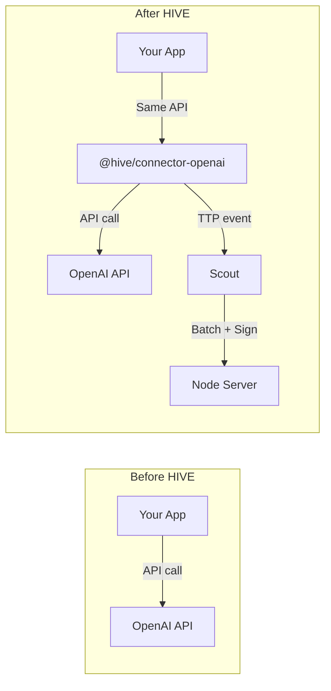

### Install

```bash
npm install @hive/connector-openai
# or
npm install @hive/connector-anthropic
```

### Use

```typescript
// One-line change — import from the connector instead of the provider
import { openai } from '@hive/connector-openai'

// Your existing code works unchanged
const response = await openai.chat.completions.create({
  model: 'gpt-4',
  messages: [{ role: 'user', content: 'Hello' }],
})

// Telemetry is emitted automatically — zero content captured
```

### Available Connectors

| Package | Provider | Detection |
|---------|----------|-----------|
| `@hive/connector-anthropic` | Claude | fetch intercept |
| `@hive/connector-openai` | GPT-4, GPT-3.5, Embeddings | fetch intercept |
| `@hive/connector-ollama` | Llama, Mistral, Gemma (local) | fetch intercept |
| `@hive/connector-google` | Gemini, Vertex AI | fetch intercept |
| `@hive/connector-mistral` | Mistral AI | fetch intercept |
| `@hive/connector-azure-openai` | Azure OpenAI | fetch intercept |
| `@hive/connector-bedrock` | AWS Bedrock | fetch intercept |

---

## Intelligence Layer

The intelligence engine runs six analytical models on stored TTP events:

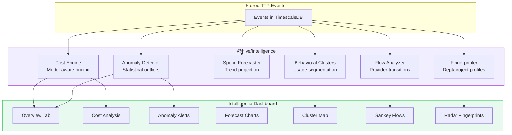

| Feature | What it does | Min data needed |
|---------|-------------|-----------------|
| **Cost Engine** | Per-event and batch cost estimates using model pricing tables | 1 event |
| **Anomaly Detector** | Flags latency spikes, token surges, error rate changes | 10+ events |
| **Spend Forecaster** | Daily/monthly spend projections | 3+ days of data |
| **Behavioral Clusters** | Groups usage patterns by provider, model, time-of-day | 20+ events |
| **Flow Analyzer** | Maps provider/model transitions over time | 10+ events |
| **Fingerprinter** | Aggregate profiles per department or project | 5+ events |

---

## Environment Configuration

HIVE ships with two ready-made configs. Never edit `.env.example` directly.

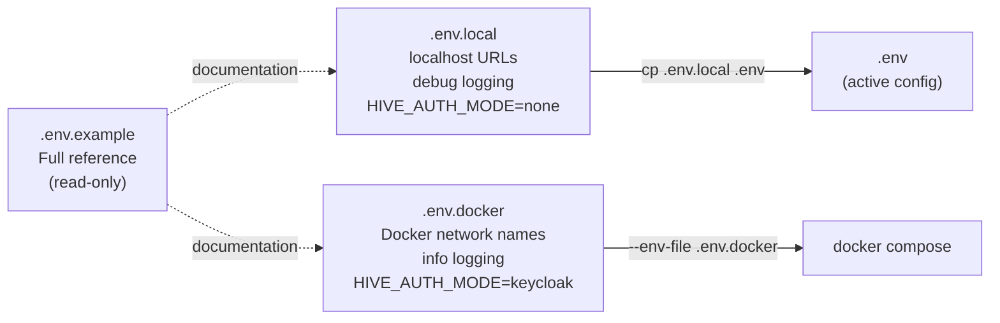

### Key Differences

| Variable | `.env.local` | `.env.docker` |
|----------|:---:|:---:|
| `NODE_DATABASE_URL` | `localhost:5432` | `postgres:5432` (compose) |
| `NODE_REDIS_URL` | `localhost:6379` | `redis:6379` (compose) |
| `DASHBOARD_NODE_URL` | `http://localhost:3000` | `http://node-server:3000` (SSR) |
| `HIVE_AUTH_MODE` | `none` | `keycloak` |
| `KEYCLOAK_URL` | — | `http://keycloak:8080` |
| `LOG_LEVEL` | `debug` | `info` |

### All Variables

#### Core

| Variable | Default | Description |
|----------|---------|-------------|
| `NODE_PORT` | `3000` | Express listen port |
| `NODE_REGION` | `AE` | ISO 3166-1 alpha-2 data residency |
| `NODE_ID` | `hive-node-01` | Unique node identifier |
| `NODE_INGEST_TOKEN` | — | 16+ char Bearer token for `/ingest` |
| `NODE_DATABASE_URL` | — | PostgreSQL connection string |
| `NODE_REDIS_URL` | — | Redis connection string |
| `LOG_LEVEL` | `info` | `debug`, `info`, `warn`, `error` |
| `DASHBOARD_PORT` | `3001` | Next.js listen port |
| `DASHBOARD_NODE_URL` | `http://localhost:3000` | Server-side (SSR) node URL |
| `NEXT_PUBLIC_NODE_URL` | `http://localhost:3000` | Client-side (browser) node URL |
| `POSTGRES_PASSWORD` | `hive_dev_password` | PostgreSQL password |

#### Authentication

| Variable | Default | Description |
|----------|---------|-------------|
| `HIVE_AUTH_MODE` | `keycloak` | `keycloak` (production) or `none` (dev bypass) |
| `HIVE_DEPLOYMENT_MODE` | `bespoke` | `bespoke` (single-tenant) or `saas` (multi-tenant) |
| `HIVE_DEFAULT_TENANT_ID` | `00000000-...-000001` | Default root tenant UUID |
| `KEYCLOAK_URL` | — | Keycloak internal URL |
| `KEYCLOAK_REALM` | `hive` | Keycloak realm name |
| `KEYCLOAK_CLIENT_ID` | `hive-api` | Confidential client (server) |
| `KEYCLOAK_CLIENT_SECRET` | `hive-api-secret` | Client secret for service account |
| `NEXT_PUBLIC_KEYCLOAK_URL` | — | Keycloak URL accessible from browser |
| `NEXT_PUBLIC_KEYCLOAK_REALM` | `hive` | Realm (browser) |
| `NEXT_PUBLIC_KEYCLOAK_CLIENT_ID` | `hive-dashboard` | Public OIDC client (browser) |
| `KEYCLOAK_ADMIN` | `admin` | Keycloak admin console username |
| `KEYCLOAK_ADMIN_PASSWORD` | `admin` | Keycloak admin console password |
| `KEYCLOAK_DB_PASSWORD` | `keycloak_dev` | Keycloak database password |

#### Governance

| Variable | Default | Description |
|----------|---------|-------------|
| `HIVE_DEPLOYMENT` | `solo` | `solo`, `node`, `federated`, `open` |
| `HIVE_CONNECTORS` | `anthropic,ollama` | Comma-separated connector IDs |
| `HIVE_DATA_RESIDENCY` | `AE` | ISO 3166-1 alpha-2 |
| `HIVE_RETENTION_DAYS` | `90` | Event retention period |
| `HIVE_REGULATION_TAGS` | `UAE_AI_LAW,GDPR` | Compliance tags |

---

## Docker Services

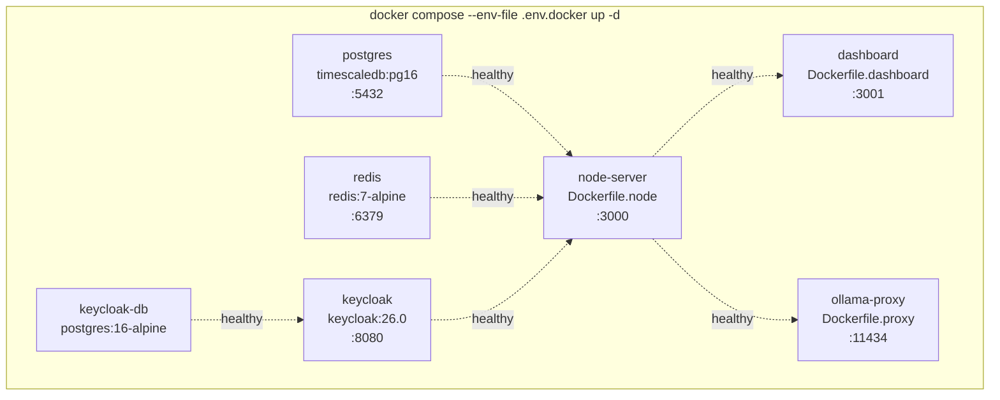

### Core Services (always start)

| Service | Image | Port | Health Check | Depends On |
|---------|-------|------|-------------|------------|
| `postgres` | `timescale/timescaledb:latest-pg16` | 5432 | `pg_isready -U hive` | — |
| `redis` | `redis:7-alpine` | 6379 | `redis-cli ping` | — |
| `keycloak-db` | `postgres:16-alpine` | — | `pg_isready -U keycloak` | — |
| `keycloak` | `quay.io/keycloak/keycloak:26.0` | 8080 | HTTP `/health/ready` | keycloak-db |
| `node-server` | `Dockerfile.node` (node:22-alpine) | 3000 | `fetch(/health)` | postgres, redis, keycloak |
| `dashboard` | `Dockerfile.dashboard` (node:22-alpine) | 3001 | — | node-server |
| `ollama-proxy` | `Dockerfile.proxy` (node:22-alpine) | 11434, 11435 | `wget /` | node-server |

### Profile Services (opt-in)

| Service | Profile | Image | Port | Purpose |
|---------|---------|-------|------|---------|
| `ollama-cpu` | `cpu`, `full` | `ollama/ollama` | — | CPU-only LLM runtime |
| `ollama` | `gpu`, `full` | `ollama/ollama` | — | GPU LLM runtime (NVIDIA) |
| `ollama-pull` | `cpu`, `gpu`, `full` | `ollama/ollama` | — | Auto-pulls default model |
| `docs` | `docs`, `full` | `Dockerfile.docs` | 3002 | Docusaurus documentation |
| `scout` | `scout`, `full` | `Dockerfile.scout` | — | Connector agent |

### Build Stages (Dockerfile.node)

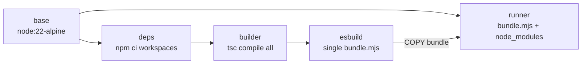

Packages built in order: `shared` -> `policy` -> `intelligence` -> `auth` -> `node-server`

### Build Stages (Dockerfile.dashboard)

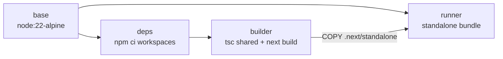

### Volumes

| Volume | Type | Location | Survives `down` | Survives `down -v` |
|--------|------|----------|:---:|:---:|
| postgres data | Bind mount | `.hive/data/postgres` | Yes | Yes (manual rm) |
| redis data | Bind mount | `.hive/data/redis` | Yes | Yes (manual rm) |
| `hive-keycloak-data` | Named volume | Docker-managed | Yes | No |
| `hive-ollama-models` | Named volume | Docker-managed | Yes | No |

---

## Troubleshooting

### "Node server offline" in Dashboard

**Cause:** The browser at `:3001` cannot reach the Node API at `:3000`.

**Fixes:**
1. Check the node-server is running: `docker compose ps` or `curl http://localhost:3000/health`
2. If the container is restarting, check logs: `docker compose logs node-server --tail 50`
3. Make sure port 3000 is not used by another process: `lsof -i :3000`

### Keycloak takes a long time to start

**Cause:** Keycloak needs 20-40 seconds on first boot to import the realm and compile themes.

**Fix:** The health check has a 30-second start period. Watch progress:
```bash
docker compose logs -f keycloak
```

### 401 Unauthorized on all API calls

**Cause:** `HIVE_AUTH_MODE=keycloak` but Keycloak isn't running or configured.

**Fixes:**
- Docker: Wait for Keycloak health check to pass (`docker compose ps` shows `healthy`)
- Local dev: Set `HIVE_AUTH_MODE=none` in `.env` to bypass authentication

### "NODE_INGEST_TOKEN: String must contain at least 16 characters"

**Cause:** The token env var is empty or too short. In `.env.docker` it defaults to `hive-dev-token-2026`.

**Fix:** Ensure `.env.docker` has `NODE_INGEST_TOKEN=hive-dev-token-2026` (or any 16+ char string).

### Dashboard login redirects in a loop

**Cause:** `NEXT_PUBLIC_KEYCLOAK_URL` is set to a Docker-internal URL that the browser can't reach.

**Fix:** Ensure the browser-facing variable points to `http://localhost:8080`, not `http://keycloak:8080`.

### "Cannot find module '@hive/auth'"

**Cause:** The auth package isn't included in the Docker build or workspace install.

**Fix:** Ensure `Dockerfile.node` includes auth in all stages (deps, builder). Run:
```bash
docker compose --env-file .env.docker up --build -d node-server
```

### Dashboard build fails — "standalone not found"

**Cause:** `next.config.js` is missing `output: 'standalone'`.

**Fix:** Ensure `packages/dashboard/next.config.js` has:
```js
const nextConfig = {
  output: 'standalone',
  // ...
}
```

### Port conflicts

```bash
# Check what's using a port
lsof -i :3000    # Node
lsof -i :3001    # Dashboard
lsof -i :5432    # Postgres
lsof -i :8080    # Keycloak

# Kill a process on a port
kill -9 $(lsof -ti :3000)
```

### Reset everything

```bash
# Stop and remove all containers + volumes
docker compose down -v

# Remove bind-mounted data
rm -rf .hive/data

# Rebuild from scratch
docker compose --env-file .env.docker up --build -d
```

### Git lock files

If you see `Unable to create '...lock': File exists`:

```bash
find .git -name "*.lock" -delete
```

---

## Next Steps

1. **Login** — Open [http://localhost:3001/login](http://localhost:3001/login) and sign in with `admin@hive.local` / `admin`
2. **Ingest real data** — Install a [connector](#using-a-connector) in your application
3. **Explore Intelligence** — Open [/intelligence](http://localhost:3001/intelligence) after ingesting 10+ events
4. **Manage users** — Open [/admin/users](http://localhost:3001/admin/users) to invite team members
5. **Generate API keys** — Open [/admin/api-keys](http://localhost:3001/admin/api-keys) for machine-to-machine auth
6. **Configure governance** — Set data residency, retention, and regulation tags in [/setup](http://localhost:3001/setup)
7. **Review audit log** — Open [/admin/audit](http://localhost:3001/admin/audit) for the immutable event trail
8. **Add policy rules** — Use `@hive/policy` to enforce admission control on events
9. **Enable batch signing** — Configure Ed25519 keys in Scout for tamper-evident audit trails
10. **Read the TTP spec** — [`docs/TTP_SPEC.md`](./docs/TTP_SPEC.md) for the full protocol definition

---

*HIVE — Token Economy. Token Governance. Zero content. Full visibility.*
