<div align="center">


<br/>

# HIVE

**The Global AI Consumption Network**

*Scout · Node · Hive — Know exactly how your org uses AI.*

<br/>

[](https://github.com/vishalm/hivehq)
[](./docs/build-sequence.md)
[](LICENSE)
[](./docs/architecture.md)
[](./PLAN.md)

<br/>

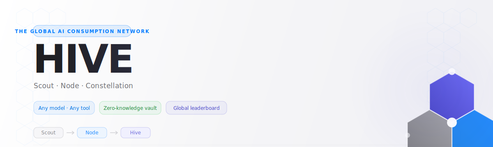

</div>

---

## The Problem Nobody Has Solved

```
Your org uses GPT-4, Claude, Gemini, Copilot, and a rogue
Mistral deployment someone spun up in AWS.

Budget: scattered across 6 credit cards, 3 departments, zero visibility.
Compliance: auditors ask "show me your AI usage" — you can't.
Shadow AI: 3 employees using personal ChatGPT, expensing it.

There is no single pane of glass.
```

<table>
<tr>
<td align="center" width="33%">

###  The CFO Problem
AI spend scattered across every team's expense reports. Nobody can answer "how much do we spend on AI?"

</td>
<td align="center" width="33%">

###  The Compliance Problem
DIFC, ADGM, EU AI Act, UAE AI regulations — all incoming. You need an audit trail. You don't have one.

</td>
<td align="center" width="33%">

###  The Shadow AI Problem
Personal ChatGPT. Expensed API keys. Rogue Mistral deployments. IT is flying blind.

</td>
</tr>
</table>

---

## TTP — The Open Wire Protocol

> **TTP (Token Telemetry Protocol)** is to AI consumption what OpenTelemetry is to infrastructure observability. One canonical event schema. Any provider. Governance baked into every packet. MIT-licensed open standard — governed by HIVE.

```mermaid
graph LR
    subgraph PROVIDERS ["Any AI Provider"]
        P1["OpenAI"]
        P2["Anthropic"]
        P3["Gemini · Mistral · ..."]
        P4["custom:your-llm"]
    end

    subgraph TTP_LAYER ["TTP Protocol Layer"]
        direction TB
        L5["Layer 5 · Governance — consent · residency · retention"]
        L4["Layer 4 · Identity — signed events · org attestation"]
        L3["Layer 3 · Registry — provider namespace · model fingerprints"]
        L2["Layer 2 · Transport — HTTPS/2 · batch flush · msgpack"]
        L1["Layer 1 · Schema — TTPEvent · canonical JSON · semver"]
    end

    subgraph NETWORK ["HIVE Network"]
        SC["Scout\nReference impl"]
        ND["Node Hub\nOn-prem ingest"]
        HV["Hive\nConstellation"]
    end

    PROVIDERS -->|"@TTP/sdk wrap()"| TTP_LAYER
    TTP_LAYER --> NETWORK

    style TTP_LAYER fill:#F0EEFF,stroke:#5856D6,stroke-width:2px,color:#1D1D1F
    style PROVIDERS fill:#F5F5F7,stroke:#86868B,color:#1D1D1F
    style NETWORK fill:#E8F4FF,stroke:#007AFF,color:#1D1D1F
```

**Key design principle:** `pii_asserted: false` and `content_asserted: false` are protocol-enforced constants. They cannot be set to true. Compliance is structural.

```typescript
// The TTP GovernanceBlock — required on every event, no exceptions
governance: {
  consent_basis:   'org_policy',
  data_residency:  'AE',           // ISO 3166-1 · enforced at Node Hub
  retention_days:  90,
  regulation_tags: ['UAE_AI_LAW', 'GDPR'],
  pii_asserted:    false,          // always false — schema enforced
  content_asserted: false,         // always false — schema enforced
}
```

---

## The Solution — Scout → Node → Hive

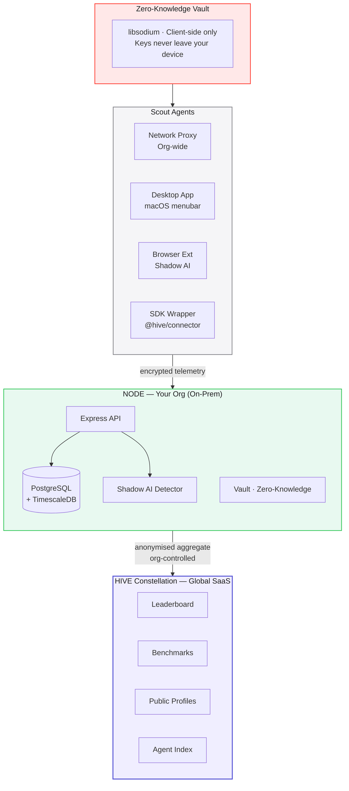

> **HIVE captures:** who · which model · when · how much · which department  
> **HIVE never captures:** what you asked · what the AI answered · your API keys

---

## The Trust Covenant

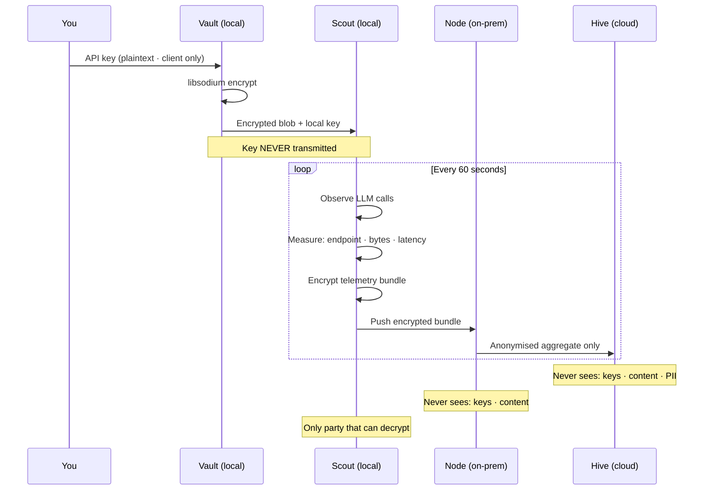

**You never see their keys. Ever. Architecturally impossible.** This covenant is open source from day one.

---

## The Telemetry Schema — The Public Contract

```typescript
// packages/shared/src/telemetry.ts — open sourced day one
// This is the covenant. Nothing outside this. Ever.

interface HiveTelemetryEvent {
  // Identity — always hashed, never personal
  scout_id:      string   // hash · rotates monthly
  node_id:       string   // org hub identifier
  session_hash:  string   // links req+res · not the user

  // Time
  timestamp:     number   // unix ms

  // Provider fingerprint
  provider:      Provider // 'openai' | 'anthropic' | 'gemini' | ...
  endpoint:      string   // '/v1/chat/completions'
  model_hint:    string   // fingerprinted from response headers

  // Signal — no content, ever
  direction:       'request' | 'response'
  payload_bytes:   number   // size proxy · never content
  latency_ms:      number
  status_code:     number
  estimated_tokens: number  // derived from bytes · not content

  // Classification — org-defined, optional
  dept_tag?:     string   // 'engineering' | 'finance' | IT-set
  project_tag?:  string   // org-defined cost centre

  // Mode
  deployment: 'solo' | 'node' | 'federated' | 'open'
}

// Nothing else. Ever.
```

---

## Four Deployment Modes

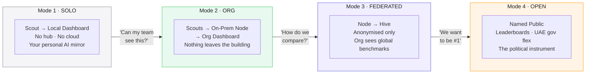

---

## Identity Architecture

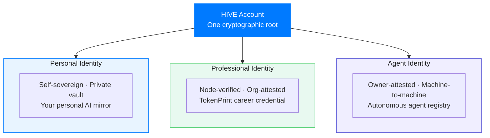

### The TokenPrint Score — Your AI Identity Signal

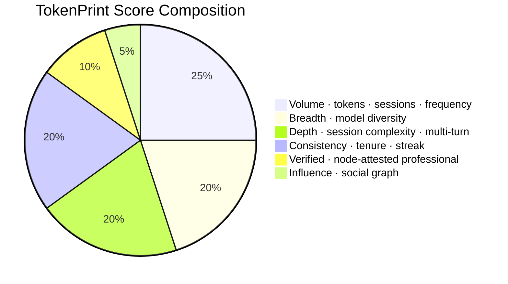

---

## Business Model

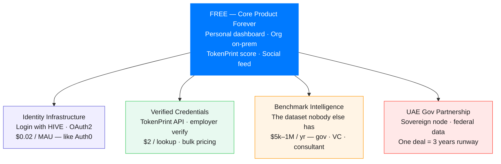

### The Flywheel

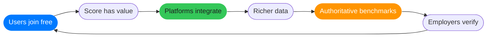

> This is the LinkedIn flywheel. Except LinkedIn's data is self-reported. **HIVE's is machine-verified.**

---

## Build Sequence

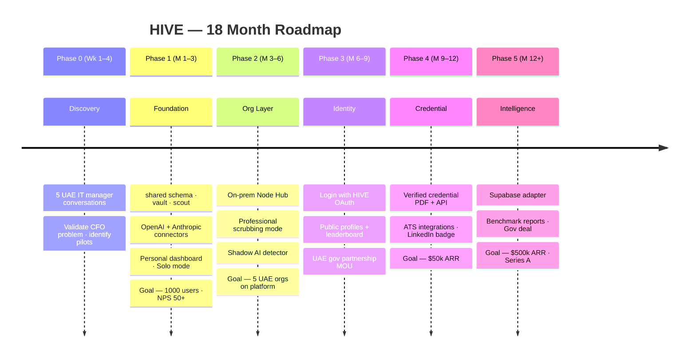

---

## The Connector Ecosystem

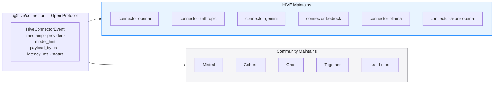

**One-line SDK drop-in:**

```typescript
// Before
import openai from 'openai'

// After — zero behaviour change, full telemetry
import { openai } from '@hive/connector-openai'
```

---

## Monorepo Structure

```
hive/
├── packages/
│   ├── shared/             ← TTP schema, signatures, audit chain, canonical JSON
│   ├── intelligence/       ← Cost modeling, anomaly detection, forecasting, clustering
│   ├── vault/              ← libsodium-wrappers client-side encryption
│   ├── connector/          ← @hive/connector — TTPCollector + FetchHook base
│   ├── auth/               ← @hive/auth — Keycloak OIDC, RBAC middleware, tenants, API keys, audit
│   ├── policy/             ← @hive/policy — ABAC engine + built-in residency/retention rules
│   ├── otel-bridge/        ← @hive/otel-bridge — OpenTelemetry gen-AI spans → TTP
│   ├── scout/              ← Node.js agent (batch + sign + ship)
│   ├── node-server/        ← Express + Postgres/Timescale + Auth + Prometheus /metrics
│   └── dashboard/          ← Next.js + Recharts + OIDC login + Admin UI
├── connectors/
│   ├── anthropic/          ← @hive/connector-anthropic
│   ├── openai/             ← @hive/connector-openai
│   ├── google/             ← @hive/connector-google (Gemini + Vertex)
│   ├── azure-openai/       ← @hive/connector-azure-openai
│   ├── bedrock/            ← @hive/connector-bedrock
│   ├── mistral/            ← @hive/connector-mistral
│   └── ollama/             ← @hive/connector-ollama (local LLM)
├── docs/
│   └── TTP_SPEC.md         ← Protocol spec v0.1 (MIT, no CLA)
├── .env.local               ← Local dev config (localhost URLs)
├── .env.docker              ← Docker Compose config (network names)
├── .env.example             ← Full reference of all variables
├── keycloak/realms/         ← Keycloak realm config (auto-imported on first boot)
├── docker-compose.yml       ← Full stack: Node + Dashboard + Postgres + Redis + Keycloak + Ollama
├── Dockerfile.node          ← Multi-stage Node server image (includes @hive/auth)
├── Dockerfile.dashboard     ← Multi-stage Next.js standalone image
├── QUICKSTART.md            ← Setup guide with diagrams
└── package.json             ← Turborepo · npm workspaces · 9 packages + 7 connectors
```

### What ships today

- **TTP v0.1** — [`docs/TTP_SPEC.md`](./docs/TTP_SPEC.md). Open wire protocol with Ed25519 batch signatures, canonical JSON, hash-chained audit log, daily Merkle anchors.
- **Connectors** — OpenAI, Anthropic, Google (Gemini + Vertex), Azure OpenAI, Bedrock, Mistral, plus `@hive/otel-bridge` for teams already on OpenTelemetry gen-AI conventions.
- **Policy engine** — `@hive/policy` with ABAC predicates, first-match-wins ordering, and built-in recipes: UAE residency, shadow-AI routing, retention caps, composition.
- **Node server** — Express app with ingest, signature verification, policy admission control, residency enforcement, `/metrics` Prometheus endpoint, Postgres/Timescale store with continuous aggregates.
- **Authentication** — Keycloak OIDC/SSO with PKCE, RBAC (5 roles), multi-tenant isolation (6-level hierarchy), API key management, immutable audit log. Supports bespoke (on-prem) and SaaS deployment modes.
- **Dashboard** — Next.js with recharts: activity timeline, top providers, dept/project split, shadow-AI panel, regulation-tag roll-ups. Admin UI for users, API keys, audit log, and tenant hierarchy.


---

## Why HIVE Is Different

<table>
<tr>
<th>What exists</th>
<th>What they do</th>
<th>Why it's different</th>
</tr>
<tr>
<td>Galileo · HuggingFace · Scale</td>
<td>Benchmark LLM <em>performance</em> on tasks</td>
<td>HIVE measures human + agent <em>consumption identity</em></td>
</tr>
<tr>
<td>ThoughtSpot · Grafana</td>
<td>Org-internal BI, manual instrumentation</td>
<td>HIVE is cross-platform, social, and zero-config</td>
</tr>
<tr>
<td>Auth0 · Okta · CIAM tools</td>
<td>Identity for apps</td>
<td>HIVE is AI identity <em>as social standing</em></td>
</tr>
<tr>
<td>LinkedIn</td>
<td>Self-reported professional identity</td>
<td>HIVE is machine-verified AI fluency</td>
</tr>
</table>

**Nobody has built:** cross-platform AI consumption telemetry as social identity, with human + agent citizens in one verified graph, as a portable career credential.

**The space is empty exactly where HIVE stands.**

---

## Quick Start

Two ways to run HIVE — pick one:

### Docker (recommended)

```bash
git clone https://github.com/vishalm/hivehq.git && cd hivehq
docker compose --env-file .env.docker up --build -d
```

Opens: Dashboard at `http://localhost:3001`, Node API at `http://localhost:3000`, Keycloak at `http://localhost:8080`

Default logins: `admin@hive.local` / `admin`, `operator@hive.local` / `operator`, `viewer@hive.local` / `viewer`

### Local Development

```bash
git clone https://github.com/vishalm/hivehq.git && cd hivehq
npm install
npm run local:setup    # copies .env.local -> .env
npm run dev
```

Requires: Node 20+, PostgreSQL 16, Redis 7 running locally. Set `HIVE_AUTH_MODE=none` in `.env` to bypass Keycloak for local dev.

See **[QUICKSTART.md](./QUICKSTART.md)** for the full guide with architecture diagrams, API examples, and troubleshooting.

### Drop-in Connector

```typescript
// Before — your existing code
import OpenAI from 'openai'

// After — zero behaviour change, full telemetry
import { openai } from '@hive/connector-openai'

const response = await openai.chat.completions.create({ ... })
// Telemetry flows. Nothing else changed.
```

---

## Documentation

| Document | What it covers |
|----------|---------------|
| [**QUICKSTART.md**](./QUICKSTART.md) | Full setup guide · Docker & local · Auth & RBAC · API examples · Troubleshooting |
| [**PLAN.md**](./PLAN.md) | North star · Full strategy · Build sequence · Risk matrix |
| [**AUTH_PLAN.md**](./AUTH_PLAN.md) | Keycloak OIDC/SSO · RBAC roles · Multi-tenant hierarchy · API keys · Audit log |
| [**Protocol — TTP**](./docs/TTP_SPEC.md) | Open wire standard · TTPEvent schema · Governance layer |
| [Architecture](./docs/architecture.md) | Scout → Node → Hive system design · Mermaid diagrams |
| [Data Model](./docs/data-model.md) | Telemetry covenant · DB schema · "never collect" manifest |
| [Identity](./docs/identity.md) | CIAM · TokenPrint · Agent economy · Social layer |
| [Business Model](./docs/business-model.md) | Revenue streams · Flywheel · UAE gov play |
| [Deployment Modes](./docs/deployment.md) | All 4 modes · install paths · upgrade journey |
| [Build Sequence](./docs/build-sequence.md) | Phase 0–5 roadmap · Week 1 start |

---

## The UAE Angle

> **Government entities in the UAE race on AI metrics publicly.** MBZUAI, AI Strategy 2031, Smart Dubai — ministers flex on X about being first. Entities benchmark against each other: DEWA vs RTA vs ADNOC vs MOHRE.

> **The leaderboard is a political instrument.** A federal entity at #1 in AI consumption is a KPI they put in their annual report.

> One strategic partnership with a UAE federal entity funds **three years of runway.**

In Arabic: **خلية** (Khaliya) — it sounds powerful.

---

<div align="center">

**HIVE is pre-alpha. Phase 4 — auth, RBAC, and multi-tenant isolation complete.**

[ Quick Start](./QUICKSTART.md) · [ Read the Plan](./PLAN.md) · [ Architecture](./docs/architecture.md) · [ Business Model](./docs/business-model.md)

<br/>

*Built in UAE · April 2026*

<sub>
HIVE &nbsp;·&nbsp;
هايف &nbsp;·&nbsp;
הייב &nbsp;·&nbsp;
ہائیو &nbsp;·&nbsp;
هایو &nbsp;·&nbsp;
हाइव &nbsp;·&nbsp;
ਹਾਈਵ &nbsp;·&nbsp;
হাইভ &nbsp;·&nbsp;
ஹைவ் &nbsp;·&nbsp;
హైవ్ &nbsp;·&nbsp;
හයිව් &nbsp;·&nbsp;
ဟိုင်ဗ် &nbsp;·&nbsp;
ហ៊ីវ &nbsp;·&nbsp;
ไฮฟ์ &nbsp;·&nbsp;
蜂巢 &nbsp;·&nbsp;
ハイブ &nbsp;·&nbsp;
하이브 &nbsp;·&nbsp;
ჰაივი &nbsp;·&nbsp;
Հայվ &nbsp;·&nbsp;
Χάιβ &nbsp;·&nbsp;
Хайв &nbsp;·&nbsp;
Хайв &nbsp;·&nbsp;
ሃይቭ &nbsp;·&nbsp;
ཧའི་ཝ &nbsp;·&nbsp;
Colmena &nbsp;·&nbsp;
Ruche &nbsp;·&nbsp;
Colmeia &nbsp;·&nbsp;
Alveare &nbsp;·&nbsp;
Kovan &nbsp;·&nbsp;
Mzinga &nbsp;·&nbsp;
Tổ Ong &nbsp;·&nbsp;
Sarang &nbsp;·&nbsp;
Ul &nbsp;·&nbsp;
Ul&#225;n
</sub>

</div>
