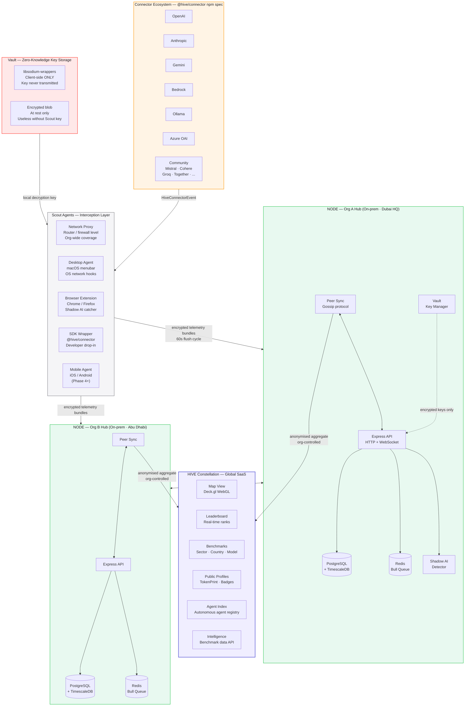
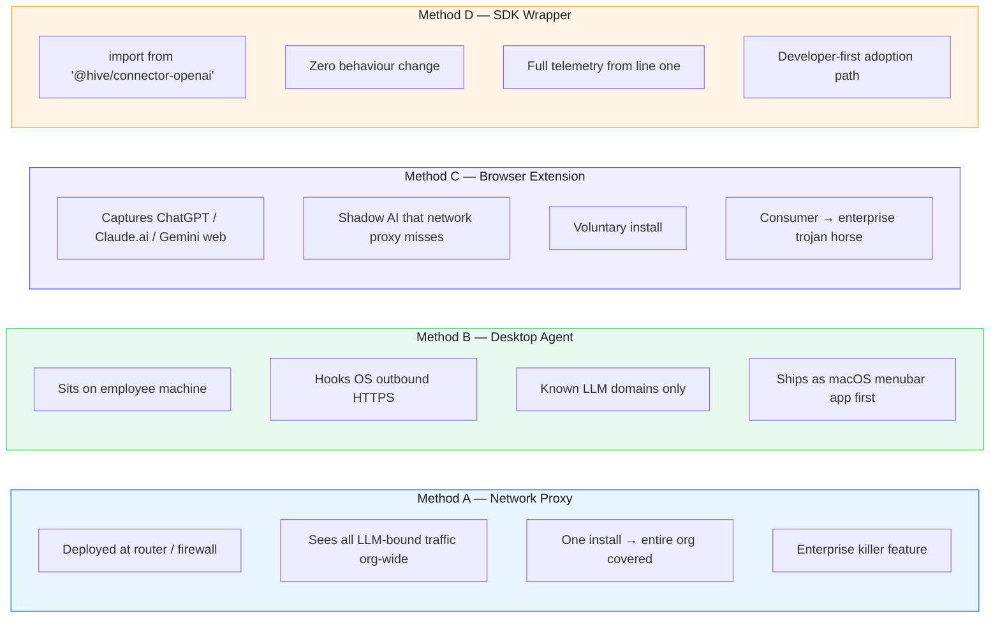
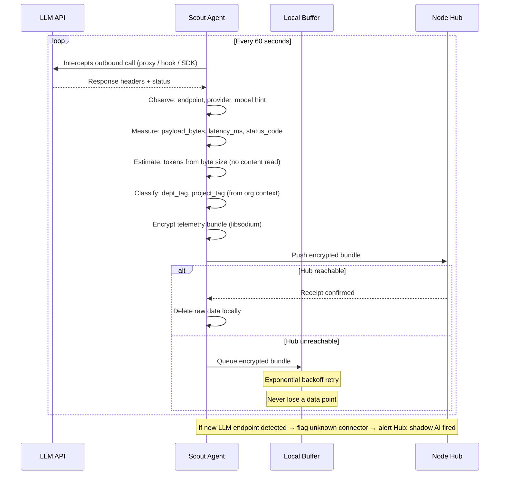
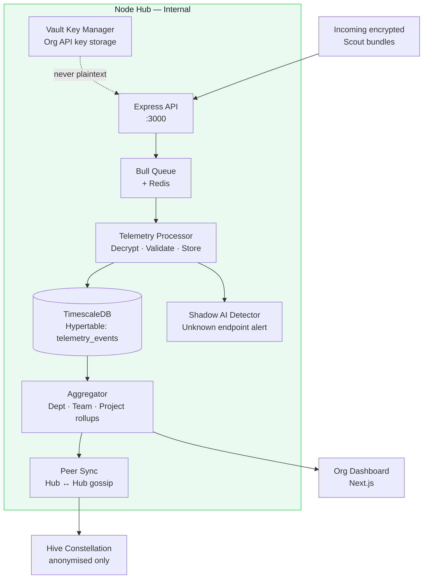
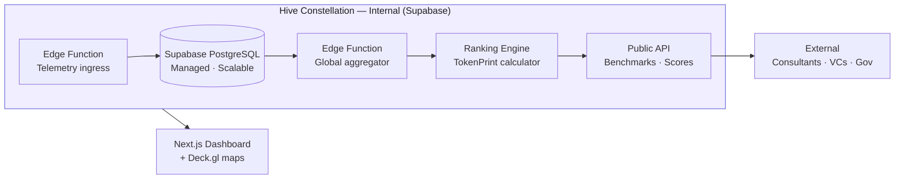
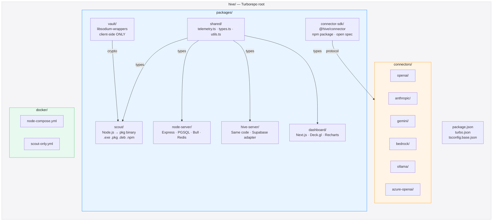

# HIVE — System Architecture
### Scout → Node → Hive · The Global AI Consumption Network

> **Apple Light theme** · Mermaid diagrams · Last updated 2026-04-15

---

## Overview

HIVE is a three-layer distributed telemetry network. Each layer has a single, clear responsibility and communicates with the next layer via an encrypted, minimal, schema-locked payload. **Nothing travels upstream except what the schema permits. Ever.**

```
Scout  →  Node  →  Hive
meter     hub      constellation
```

---

## Full System Architecture



---

## Layer 1 — Scout Agents

Scouts are the edge of the network. They live on machines, in routers, in browsers, and in code. They observe, measure, and report. **They never read content. They never transmit content.**

### Four interception methods



### Scout operation loop



---

## Layer 2 — Node Hubs

Node is the organisation's on-prem hub. It aggregates Scout telemetry, enforces the org's tagging rules, runs the shadow AI detector, and forwards anonymised aggregates upstream to the Hive constellation.

**Critical property: Nodes are peers, not subordinates.** No Hub reports to another Hub in the hierarchy sense. They gossip-sync like blockchain nodes.

### Node internal architecture



### Node deployment — one command

```bash
# Full on-prem stack — postgres + timescale + redis + express + dashboard
docker-compose -f docker/node-compose.yml up -d

# Scout only — join an existing org Node
docker-compose -f docker/scout-only.yml up -d
```

---

## Layer 3 — Hive Constellation

The Hive is the global brain. It receives only anonymised, aggregated telemetry from Nodes (or directly from Scouts in Solo mode). It builds the leaderboard, the benchmark dataset, and the public profiles.



---

## Monorepo Structure



---

## Architectural Principles

| Principle | Implementation | Why |
|-----------|---------------|-----|
| **Schema is the covenant** | `packages/shared/src/telemetry.ts` — open sourced day one | Public audit = trust |
| **Client-side crypto only** | `packages/vault` — zero server logic | Architecturally impossible to leak |
| **One language** | TypeScript everywhere, strict mode | One hire profile, one brain |
| **Config not code for modes** | Environment variables drive mode | No forks, no drift |
| **Nodes are peers** | Gossip sync, no hierarchy below Hive | No SPOF in org layer |
| **Connectors are plugins** | `@hive/connector` npm spec | Community builds the long tail |
| **Time-series native** | TimescaleDB hypertables | Query patterns are always time-bounded |

---

*See also: [Data Model](./data-model.md) · [Deployment Modes](./deployment.md) · [PLAN.md](../PLAN.md)*

---

<sub>HIVE &nbsp;·&nbsp; هايف &nbsp;·&nbsp; הייב &nbsp;·&nbsp; ہائیو &nbsp;·&nbsp; هایو &nbsp;·&nbsp; हाइव &nbsp;·&nbsp; ਹਾਈਵ &nbsp;·&nbsp; হাইভ &nbsp;·&nbsp; ஹைவ் &nbsp;·&nbsp; హైవ్ &nbsp;·&nbsp; හයිව් &nbsp;·&nbsp; ဟိုင်ဗ် &nbsp;·&nbsp; ហ៊ីវ &nbsp;·&nbsp; ไฮฟ์ &nbsp;·&nbsp; 蜂巢 &nbsp;·&nbsp; ハイブ &nbsp;·&nbsp; 하이브 &nbsp;·&nbsp; ჰაივი &nbsp;·&nbsp; Հայվ &nbsp;·&nbsp; Χάιβ &nbsp;·&nbsp; Хайв &nbsp;·&nbsp; ሃይቭ &nbsp;·&nbsp; Colmena &nbsp;·&nbsp; Ruche &nbsp;·&nbsp; Colmeia &nbsp;·&nbsp; Alveare &nbsp;·&nbsp; Kovan &nbsp;·&nbsp; Mzinga &nbsp;·&nbsp; Tổ Ong &nbsp;·&nbsp; Ul</sub>