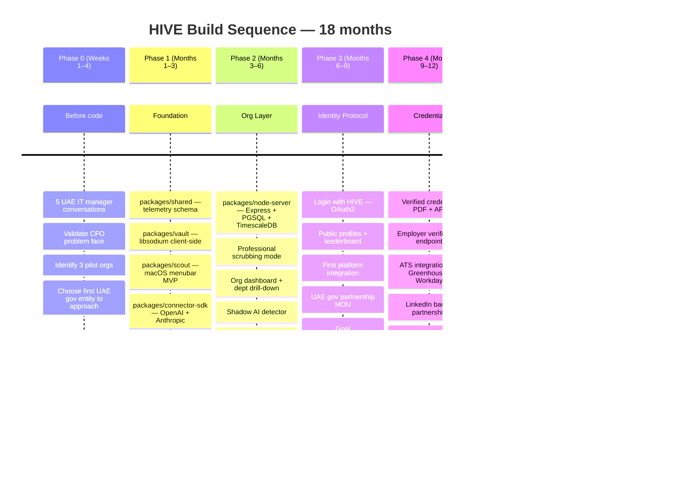
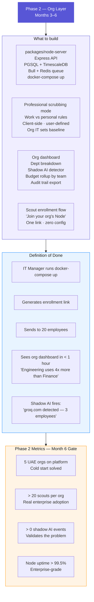
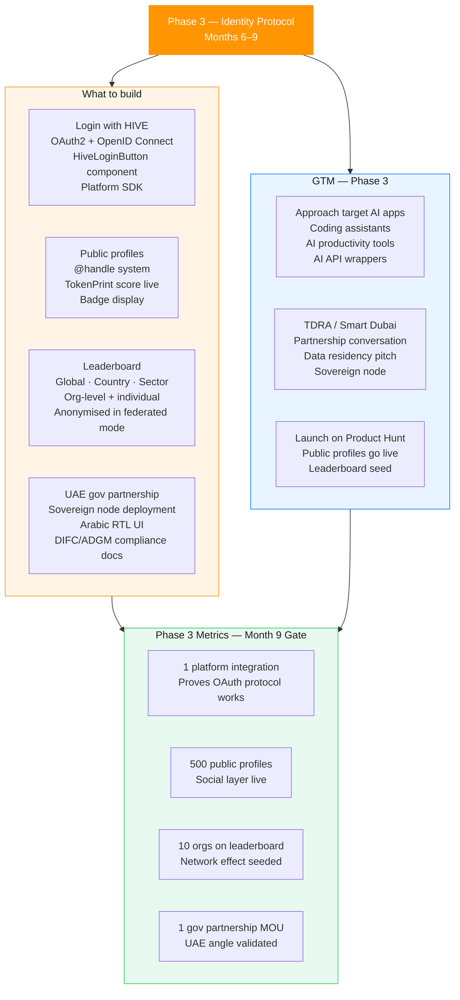
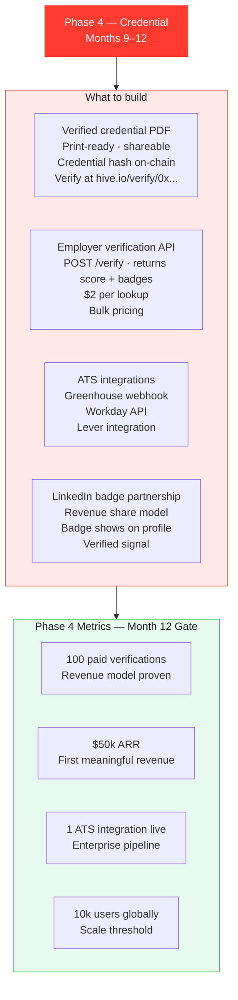
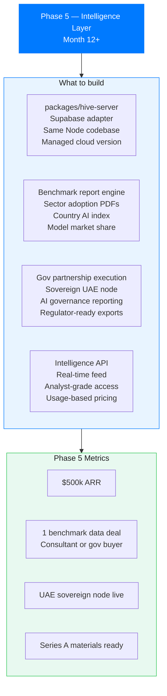
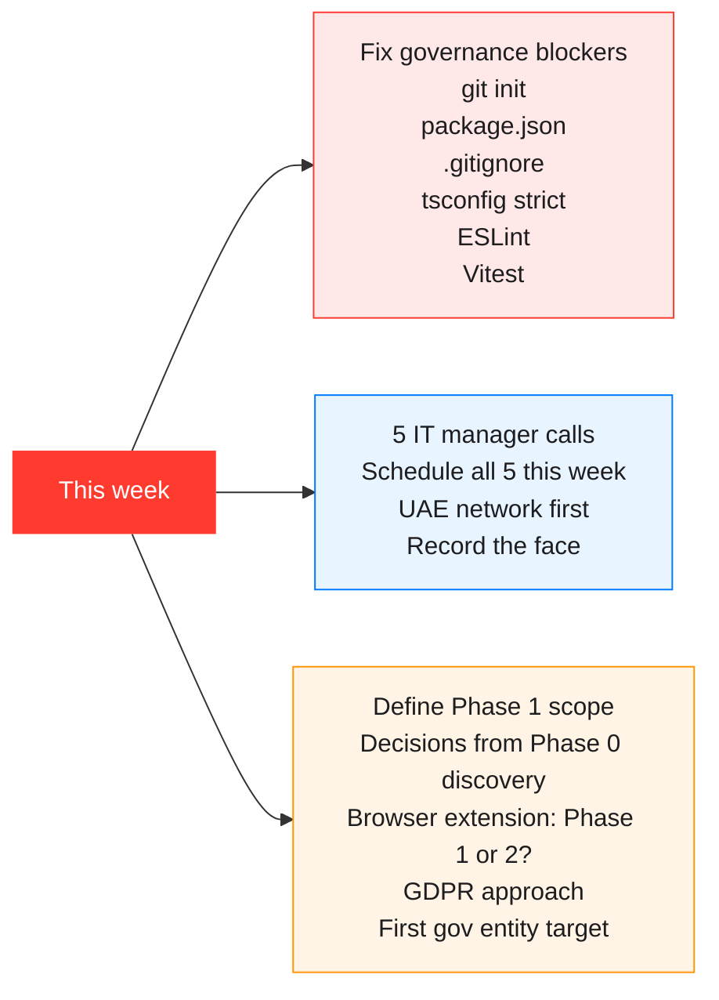
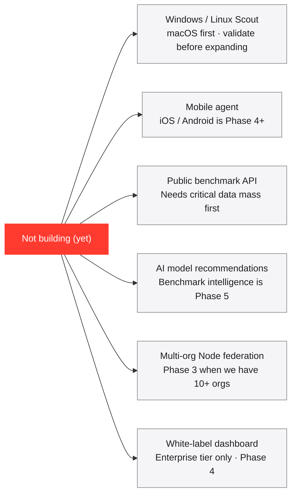

# HIVE — Build Sequence
### Phase 0 through Phase 5 · The Opinionated Path

> **Apple Light theme** · Mermaid diagrams · Last updated 2026-04-15

---

## The Guiding Principle

**Talk to 5 IT managers before writing a single line of code.**

Ask one question: *"Do you know how much your org spends on AI APIs across all tools right now?"* Watch their face. That face is the pitch deck. That face is the product validation. That face is the reason Phase 0 exists.

---

## Full Timeline

---

## Phase 0 — Customer Discovery (Weeks 1–4)

**Do not write code. Talk to people.**

```mermaid
graph TD
    PH0["Phase 0 — Discovery\nWeeks 1–4"]

    subgraph CONV ["5 Conversations — UAE IT Managers"]
        C1["Conversation 1\nLarge enterprise (ADNOC / DEWA scale)"]
        C2["Conversation 2\nMid-size UAE org (100–500 employees)"]
        C3["Conversation 3\nGov entity (MOHRE / Smart Dubai)"]
        C4["Conversation 4\nStartup / SME (budget-conscious)"]
        C5["Conversation 5\nFinancial sector (DIFC / ADGM compliance)"]
    end

    subgraph LEARN ["What You're Learning"]
        L1["Do they know their AI spend?\n(Hypothesis: no)"]
        L2["Who owns the AI budget?\n(CFO vs IT vs dept heads)"]
        L3["What's the compliance anxiety?\n(DIFC? ADGM? Data residency?)"]
        L4["Would they install on-prem?\n(Or does SaaS work?)"]
        L5["Who would champion this internally?\n(IT Manager vs CISO vs CFO)"]
    end

    subgraph DECIDE ["Phase 0 Decision Gate"]
        D1["First UAE gov entity to approach\nTDRA vs Smart Dubai vs DIFC"]
        D2["Browser extension in Phase 1 or 2?\n(Scope decision)"]
        D3["GDPR approach for EU users\n(Legal decision)"]
        D4["On-prem first or SaaS first?\n(GTM decision)"]
    end

    PH0 --> CONV --> LEARN --> DECIDE

    style PH0 fill:#007AFF,color:#fff,stroke:none
    style CONV fill:#E8F4FF,stroke:#007AFF,color:#1D1D1F
    style LEARN fill:#E8F9F0,stroke:#34C759,color:#1D1D1F
    style DECIDE fill:#FFF4E5,stroke:#FF9500,color:#1D1D1F
```

---

## Phase 1 — Foundation (Months 1–3)

**Goal: The "847 calls" moment. 1,000 personal users who love it.**

```mermaid
graph TD
    PH1["Phase 1 — Foundation\nMonths 1–3"]

    subgraph BUILD1 ["What to build"]
        direction LR
        B1_1["packages/shared\ntelemetry.ts — the covenant\nAll types · All schemas\nOpen sourced day one"]
        B1_2["packages/vault\nlibsodium-wrappers\nClient-side ONLY\nZero server logic"]
        B1_3["packages/scout\nmacOS menubar app FIRST\nObserves outbound LLM calls\nFlushes every 60s"]
        B1_4["packages/connector-sdk\n@hive/connector npm spec\nOpenAI connector\nAnthropic connector"]
        B1_5["packages/dashboard\nPersonal view only\nLocalhost:3000\nLocal SQLite in Solo mode"]
    end

    subgraph DONE1 ["Definition of Done"]
        D1_1["User installs Scout macOS menubar"]
        D1_2["Makes 10 ChatGPT calls"]
        D1_3["Opens dashboard"]
        D1_4["Sees: '10 calls · 2 models · $0.84 estimated'"]
        D1_5["Says: 'Wait, I didn't know this'"]
    end

    subgraph METRIC1 ["Phase 1 Metrics — Month 3 Gate"]
        M1_1["1,000 personal users\nvia Product Hunt + Twitter + UAE network"]
        M1_2["NPS > 50\nProduct love before scaling"]
        M1_3["2 connectors live\nOpenAI + Anthropic"]
        M1_4["200 daily active scouts\nRetention signal"]
    end

    PH1 --> BUILD1 --> DONE1 --> METRIC1

    style PH1 fill:#34C759,color:#1D1D1F,stroke:none
    style BUILD1 fill:#E8F9F0,stroke:#34C759,color:#1D1D1F
    style DONE1 fill:#E8F4FF,stroke:#007AFF,color:#1D1D1F
    style METRIC1 fill:#FFF4E5,stroke:#FF9500,color:#1D1D1F
```

### Phase 1 package build order

```mermaid
graph LR
    S1["1. packages/shared\nSchema first\nEverything depends on this"]
    S2["2. packages/vault\nCrypto layer\nScout depends on this"]
    S3["3. packages/connector-sdk\nProtocol spec\nConnectors depend on this"]
    S4["4. connectors/openai\nFirst working connector"]
    S5["5. connectors/anthropic\nSecond connector"]
    S6["6. packages/scout\nWires vault + connectors\nmacOS menubar binary"]
    S7["7. packages/dashboard\nPersonal view\nlocalhost only"]

    S1 --> S2 --> S3 --> S4 --> S5 --> S6 --> S7

    style S1 fill:#007AFF,color:#fff,stroke:none
    style S2 fill:#FF3B30,color:#fff,stroke:none
    style S3 fill:#FF9500,color:#fff,stroke:none
    style S4 fill:#34C759,color:#1D1D1F,stroke:none
    style S5 fill:#34C759,color:#1D1D1F,stroke:none
    style S6 fill:#5856D6,color:#fff,stroke:none
    style S7 fill:#5856D6,color:#fff,stroke:none
```

---

## Phase 2 — Org Layer (Months 3–6)

**Goal: 5 UAE orgs on the platform.**

---

## Phase 3 — Identity Protocol (Months 6–9)

**Goal: Login with HIVE live. 1 major AI app integrates. UAE gov MOU signed.**

---

## Phase 4 — Credential (Months 9–12)

**Goal: First paid verification. $50k ARR.**

---

## Phase 5 — Intelligence Layer (Month 12+)

**Goal: $500k ARR. First benchmark data deal. Series A ready.**

---

## Week 1 Actual Start

**Before any of the above. Right now. This week.**

---

## What We Are Not Building

**Explicitly out of scope until Phase 3 at earliest:**

---

*See also: [Architecture](./architecture.md) · [Deployment](./deployment.md) · [PLAN.md](../PLAN.md)*
