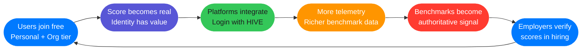
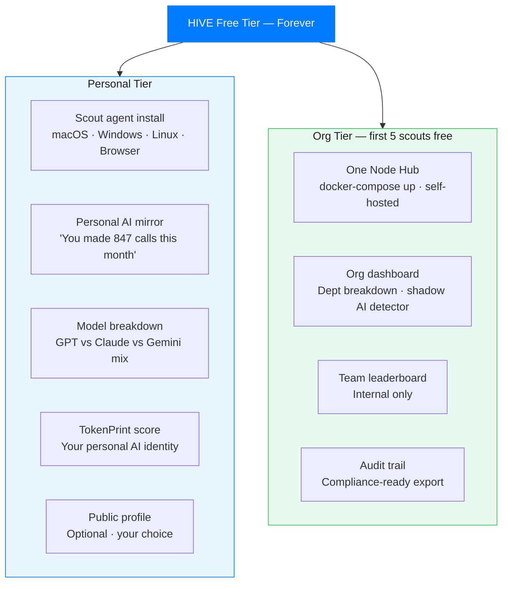
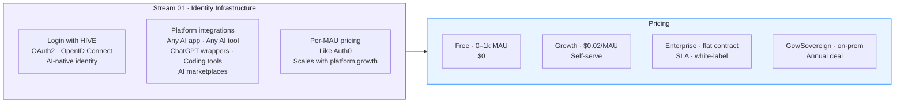
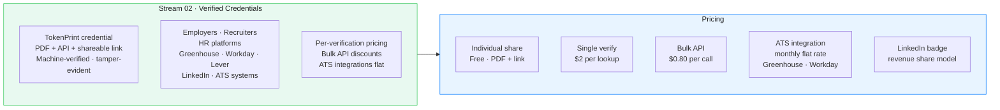
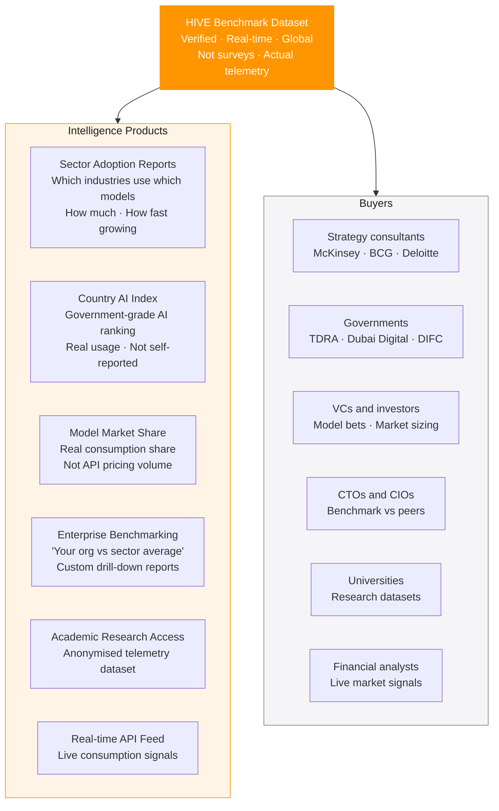
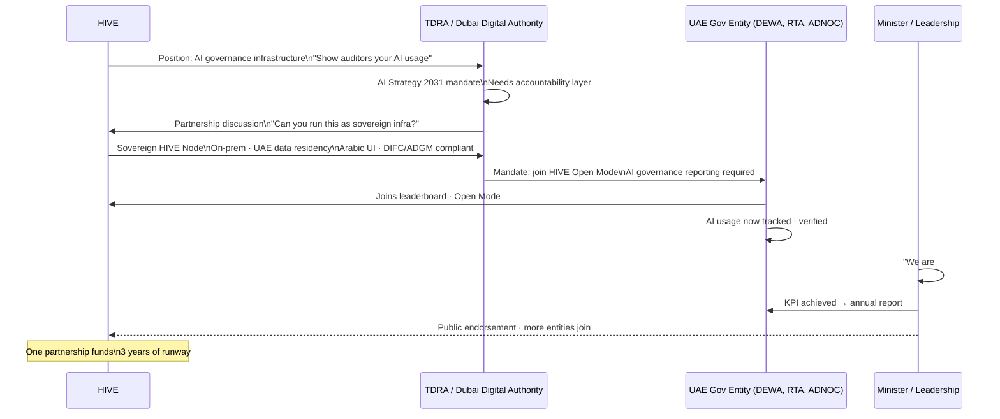
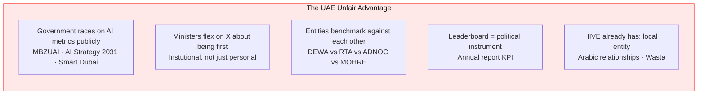
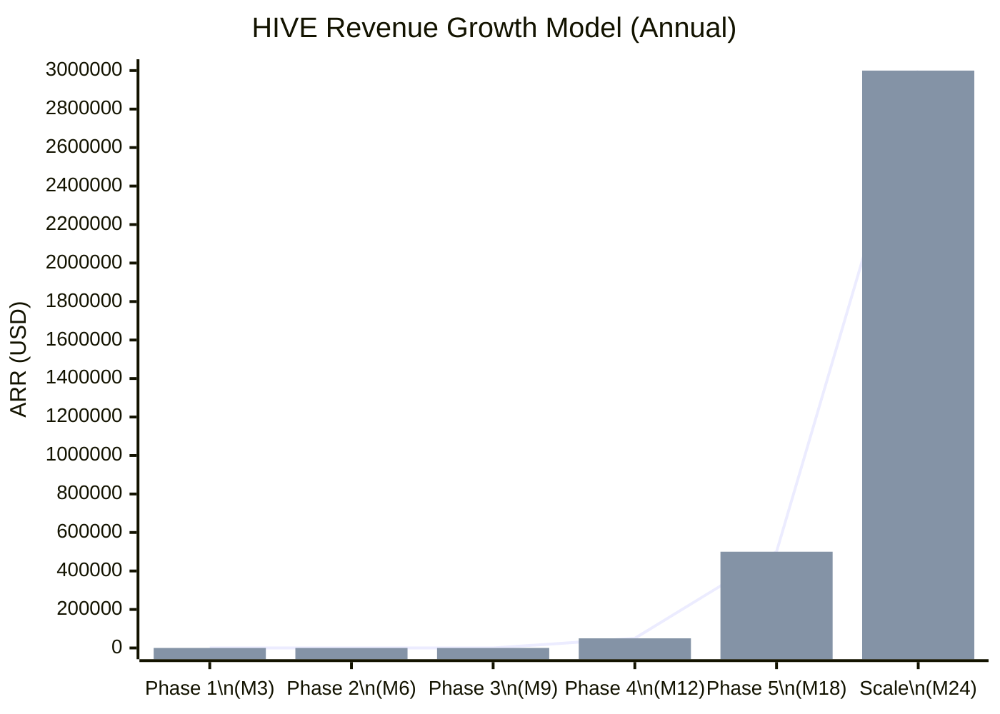
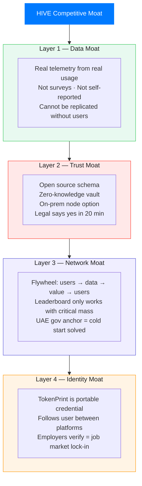

# HIVE — Business Model
### Free Forever · Three Revenue Streams · UAE Gov Play

> **Apple Light theme** · Mermaid diagrams · Last updated 2026-04-15

---

## The Core Principle

**Free is not a weakness. Free is the strategy — if one of four plays is the real business.**

The free tier exists to build the data asset, the social graph, and the brand gravity that makes each revenue stream possible. You cannot sell benchmark intelligence without the data. You cannot sell verifications without the identity. You cannot sell the identity without the users. You cannot get the users without free.

---

## The Flywheel



**This is the LinkedIn flywheel. Except LinkedIn's data is self-reported. HIVE's is machine-verified.**

---

## The Free Product

Everything here is free, forever, with no time limit:



---

## Revenue Stream 01 — Identity Infrastructure

**Model: Auth0 for AI identity**

Platforms integrate "Login with HIVE" in one afternoon. HIVE becomes the identity layer for the AI ecosystem.



**The one-switch integration — any AI app adds this in one afternoon:**

```typescript
<HiveLoginButton
  clientId="your_id"
  mode="professional"     // personal | professional | both
  onSuccess={(profile) => {
    // user's full HIVE identity returned:
    // tokenprint_score, badges[], rank, verified_org
    // telemetry flows automatically from this point
  }}
/>
```

**Why platforms pay:** Their users get a richer identity. The platform gets verified AI usage signals. Both benefit. The friction is near-zero.

---

## Revenue Stream 02 — Verified Credentials

**Model: Background check API for AI fluency**

TokenPrint score is machine-verified, node-attested, tamper-evident. Employers pay to verify it. ATS platforms integrate the API.



**Why this is hard to replicate:** The credential is only worth something if the underlying score is trusted. The score is only trusted because the telemetry is verified. The telemetry is only verified because the Node is on-prem. This chain of trust cannot be faked and cannot be copied by a competitor without the user base.

---

## Revenue Stream 03 — Benchmark Intelligence

**Model: The dataset nobody else has**

Real-time, verified, global AI consumption data. Not surveys. Not estimates. Actual telemetry from real usage, verified by on-prem nodes.



### Pricing

| Product | Buyer | Price Range |
|---------|-------|-------------|
| Sector adoption reports | Consultants | $5k–50k / yr |
| Country AI index | Governments | $100k–1M |
| Model market share data | VCs / investors | $20k–200k / yr |
| Enterprise benchmarking | CTOs / CIOs | $10k–50k / yr |
| Academic research access | Universities | $5k–20k / yr |
| Real-time API feed | Analysts | usage-based |

---

## Revenue Stream 04 — UAE Gov Play (Fastest Path)

**Model: Not selling to them — them funding the infrastructure**

This is not a traditional enterprise sale. Federal UAE entities will **pay to host** this data because it serves their AI governance mandate. The leaderboard is a political instrument. Being #1 in AI consumption is a KPI they put in annual reports.



### Why this works



**Local requirements already met:**
- Local entity registration (already have cards)
- Arabic UI (RTL support in Next.js from Phase 1)
- Wasta-friendly sales motion (have the relationships)
- DIFC/ADGM compliance ready out of the box

---

## Revenue Projection Model



| Phase | Milestone | ARR Target |
|-------|-----------|-----------|
| Phase 1 (M3) | 1k personal users · 0 revenue | $0 |
| Phase 2 (M6) | 5 UAE orgs | $0 (free tier) |
| Phase 3 (M9) | 1 platform integration · Gov MOU | $0–10k |
| Phase 4 (M12) | First paid verifications · 10k users | $50k ARR |
| Phase 5 (M18) | Benchmark data deal · Gov deal | $500k ARR |
| Scale (M24) | Series A · Global expansion | $3M ARR |

---

## Competitive Moat



---

*See also: [Identity](./identity.md) · [Build Sequence](./build-sequence.md) · [PLAN.md](../PLAN.md)*

---

<sub>HIVE &nbsp;·&nbsp; هايف &nbsp;·&nbsp; הייב &nbsp;·&nbsp; ہائیو &nbsp;·&nbsp; هایو &nbsp;·&nbsp; हाइव &nbsp;·&nbsp; ਹਾਈਵ &nbsp;·&nbsp; হাইভ &nbsp;·&nbsp; ஹைவ் &nbsp;·&nbsp; హైవ్ &nbsp;·&nbsp; හයිව් &nbsp;·&nbsp; ဟိုင်ဗ် &nbsp;·&nbsp; ហ៊ីវ &nbsp;·&nbsp; ไฮฟ์ &nbsp;·&nbsp; 蜂巢 &nbsp;·&nbsp; ハイブ &nbsp;·&nbsp; 하이브 &nbsp;·&nbsp; ჰაივი &nbsp;·&nbsp; Հայվ &nbsp;·&nbsp; Χάιβ &nbsp;·&nbsp; Хайв &nbsp;·&nbsp; ሃይቭ &nbsp;·&nbsp; Colmena &nbsp;·&nbsp; Ruche &nbsp;·&nbsp; Colmeia &nbsp;·&nbsp; Alveare &nbsp;·&nbsp; Kovan &nbsp;·&nbsp; Mzinga &nbsp;·&nbsp; Tổ Ong &nbsp;·&nbsp; Ul</sub>