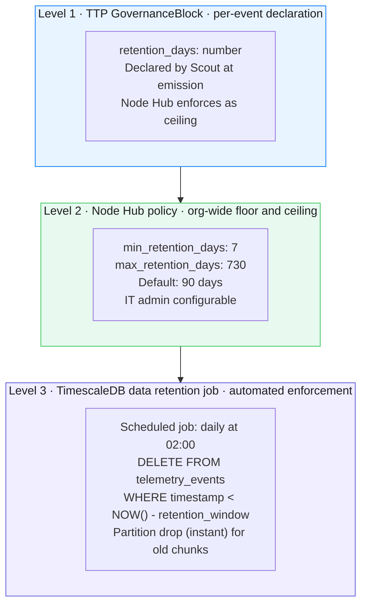
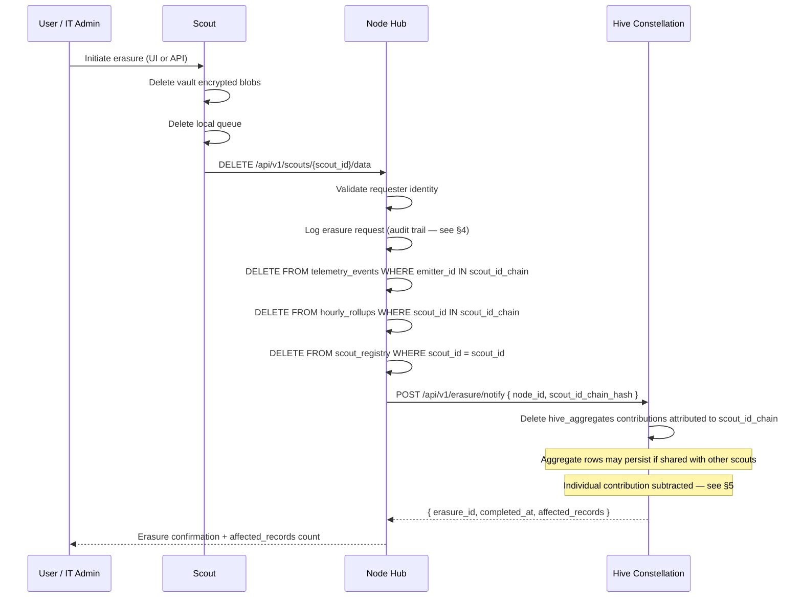

# Data Lifecycle
### Retention · Right to Erasure · GDPR · UAE PDPL · Data Export · Deletion API

> The covenant says "we never collect content." The data lifecycle spec says what we do with what we *do* collect — and how it disappears when asked.

---

## Data Classification

Before specifying lifecycle, classify what exists:

| Data class | Where stored | Sensitivity | Erasable? |
|---|---|---|---|
| TTP telemetry events | Node Hub (TimescaleDB) | Low — no content, hashed IDs | Yes |
| Hourly / daily rollups | Node Hub | Low — aggregate | Yes |
| Hive aggregates | Hive Supabase | Very low — anonymised | Partial (see §5) |
| Scout identity (master_secret) | Device keychain only | High | Device wipe |
| Node Hub scout registry | Node Hub Postgres | Medium — cert chain, dept_tag | Yes |
| Hive public profiles | Hive Supabase | User-controlled | Yes (user-initiated) |
| Vault encrypted blobs | Device + Node backup | Low (encrypted, useless without key) | Yes |
| Node Hub audit logs | Node Hub | Medium — system events, no content | Yes (with delay — see §4) |

---

## Retention Policy Architecture

Retention is enforced at three levels:



### Retention resolution rule

```
effective_retention = min(
  governance_block.retention_days,   // per-event declared
  node_policy.max_retention_days,    // org ceiling
  regulation_floor(regulation_tags)  // regulatory minimum (below)
)
```

### Regulatory minimums

Some regulations require minimum retention (audit trail):

| Regulation | Minimum retention | Notes |
|---|---|---|
| UAE AI Law (draft) | 12 months | For AI-assisting government decisions |
| GDPR | None specified | Principle: not longer than necessary |
| UAE PDPL | 5 years | If used in any formal decision |
| SOC 2 | 12 months | For audit trail continuity |
| HIPAA | 6 years | If healthcare use case |

**Default recommendation:** 90 days for Solo/Org mode. 12 months for orgs with `regulation_tags: ['UAE_AI_LAW', 'SOC2']`.

---

## Right to Erasure — GDPR Article 17 / UAE PDPL Article 24

### Who can request erasure

| Requester | Scope | Mechanism |
|---|---|---|
| Individual user (personal Scout) | All their events on that Scout | `DELETE /api/v1/me` (Scout UI or API) |
| Individual user (professional) | Their personal-bucket events | `DELETE /api/v1/me/personal` |
| Employee (via org IT admin) | All events for that employee's scout_id chain | `DELETE /admin/scouts/{scout_id}/data` |
| Org (full offboarding) | All org data from Node Hub and Hive | `DELETE /admin/nodes/{node_id}` |

### Erasure request flow



### Erasure SLA

- Node Hub data: deleted within **72 hours** of confirmed request (GDPR Article 17 allows 30 days — HIVE targets 72h)
- Hive constellation: deleted within **7 days** (requires propagation across replication)
- Backup media: deleted within **30 days** (next backup rotation cycle)
- Audit log of the erasure request: retained for **5 years** (proof of compliance — erasure metadata, not the erased data)

---

## Partial Erasure — The Aggregate Problem

Hive constellation stores anonymised aggregates, not raw events. When a scout_id is erased, HIVE cannot always fully remove its contribution from a historical aggregate without affecting other users' data.

**Resolution:**

| Situation | Action |
|---|---|
| scout_id is the only contributor to an aggregate bucket | Aggregate bucket deleted |
| scout_id is one of N contributors to an aggregate bucket, bucket value would reveal contribution | Aggregate bucket anonymised (contributor count reduced, value adjusted with ±noise) |
| scout_id contribution to leaderboard | Score withdrawn, rank recalculated |
| scout_id in public profile | Profile deactivated, all public data removed |

This is the standard approach accepted under GDPR Recital 26: if the data is genuinely anonymous (no re-identification possible), erasure of the aggregate is not required. HIVE errs on the side of deletion where technically feasible.

---

## Audit Log of Erasure Requests

**Important: the audit log of compliance actions is itself a compliance requirement.**

```sql
CREATE TABLE erasure_audit_log (
  erasure_id          uuid PRIMARY KEY,
  requested_by        text,         -- 'user_self' | 'it_admin:{admin_id_hash}' | 'org_offboard'
  requested_at        timestamptz,
  scout_id_hash       text,         -- hash of scout_id — not the scout_id itself
  scope               text,         -- 'personal' | 'professional' | 'full'
  records_deleted     integer,
  hive_notified_at    timestamptz,
  hive_confirmed_at   timestamptz,
  completed_at        timestamptz,
  regulation_basis    text          -- 'GDPR_Art17' | 'PDPL_Art24' | 'user_request'
);
```

This log is:
- **Write-once** — no UPDATE or DELETE (immutable by Postgres policy)
- **Retained for 5 years** (overrides shorter retention policies)
- **Exportable** for DPA audits

---

## Data Export — GDPR Article 20 (Portability)

Users can export their own data:

```
GET /api/v1/me/export
Authorization: Bearer <user_token>
Accept: application/json | text/csv | application/x-ndjson

→ Returns all telemetry events attributed to this user's scout_id chain
  in machine-readable format
```

**What the export includes:**

```json
{
  "export_id": "uuid",
  "generated_at": 1744761600000,
  "scout_id_chain": ["hash_jan", "hash_feb", "hash_mar"],
  "events": [
    {
      "timestamp": 1744761600000,
      "provider": "openai",
      "endpoint": "/v1/chat/completions",
      "model_hint": "gpt-4o",
      "payload_bytes": 2840,
      "latency_ms": 1240,
      "estimated_tokens": 710,
      "dept_tag": "engineering",
      "deployment": "node"
    }
  ],
  "total_events": 18420,
  "date_range": { "from": "2026-01-01", "to": "2026-04-15" }
}
```

**What the export never includes:** prompt text, completion text, API keys, personal identifiers beyond what the user knowingly set (dept_tag, project_tag).

---

## Data Processing Agreement (DPA) Templates

For enterprise customers (Org and Federated modes), HIVE provides a standard DPA:

| Document | Coverage | Status |
|---|---|---|
| HIVE DPA — GDPR | EU/EEA data subjects | Phase 2 (before first EU enterprise customer) |
| HIVE DPA — UAE PDPL | UAE data subjects | Phase 2 (before UAE gov pilot) |
| HIVE Sub-processor List | Third parties processing data | Published at hive.io/legal |
| HIVE Privacy Policy | All users | Phase 1 (before public launch) |

### Sub-processors (current)

| Sub-processor | Purpose | Data shared |
|---|---|---|
| Supabase | Hive constellation database | Anonymised aggregates only |
| AWS / cloud provider | Node Hub hosting (if cloud Node used) | Org-controlled — not HIVE's DPA |
| Postmark / SendGrid | Transactional email | Email address only |

---

## Compliance Matrix

| Requirement | Mechanism | Status |
|---|---|---|
| GDPR Art. 5 — purpose limitation | Telemetry covenant — schema enforced | Designed |
| GDPR Art. 5 — data minimisation | `retention_days` enforced by TimescaleDB job | Designed |
| GDPR Art. 17 — erasure | Deletion API with 72h SLA | Designed |
| GDPR Art. 20 — portability | Export API (JSON/CSV) | Designed |
| GDPR Art. 25 — privacy by design | Content-free schema, client-side vault | Implemented in architecture |
| UAE PDPL Art. 24 — erasure | Same deletion API | Designed |
| UAE AI Law — 12 month audit trail | Minimum retention enforcement | Designed |
| SOC 2 Type II — audit log | Immutable erasure_audit_log | Designed |

---

*See also: [Security Model](./security.md) · [Key Lifecycle](./key-lifecycle.md) · [TTP Protocol](./protocol.md)*

---

<sub>HIVE &nbsp;·&nbsp; هايف &nbsp;·&nbsp; הייב &nbsp;·&nbsp; ہائیو &nbsp;·&nbsp; हाइव &nbsp;·&nbsp; হাইভ &nbsp;·&nbsp; ஹைவ் &nbsp;·&nbsp; 蜂巢 &nbsp;·&nbsp; ハイブ &nbsp;·&nbsp; 하이브 &nbsp;·&nbsp; Хайв &nbsp;·&nbsp; Colmena &nbsp;·&nbsp; Ruche &nbsp;·&nbsp; Kovan</sub>
