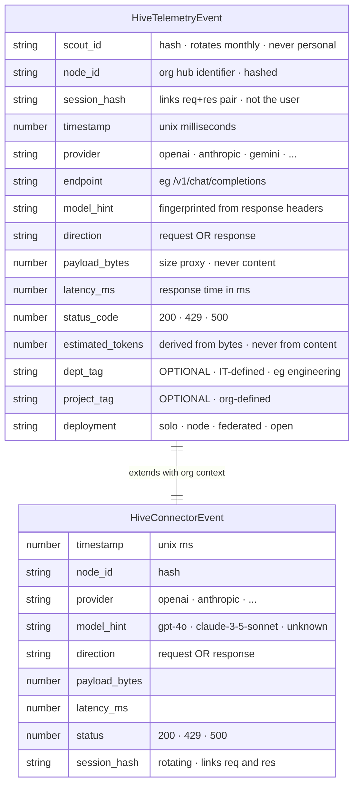
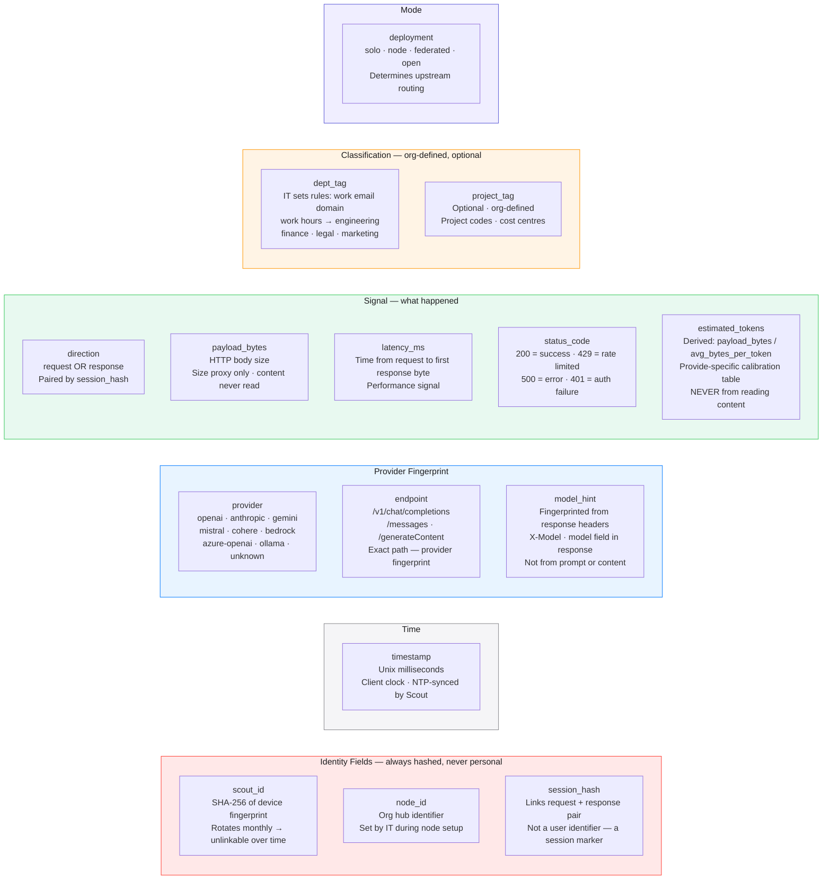
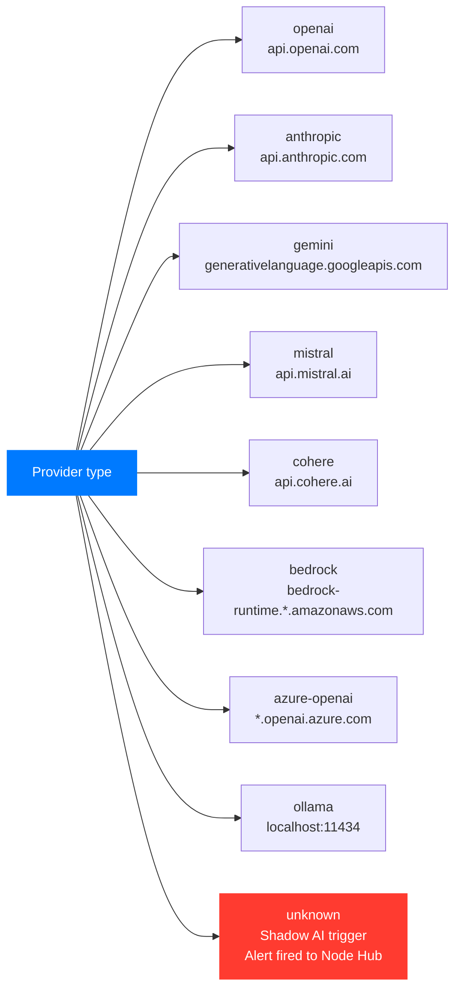
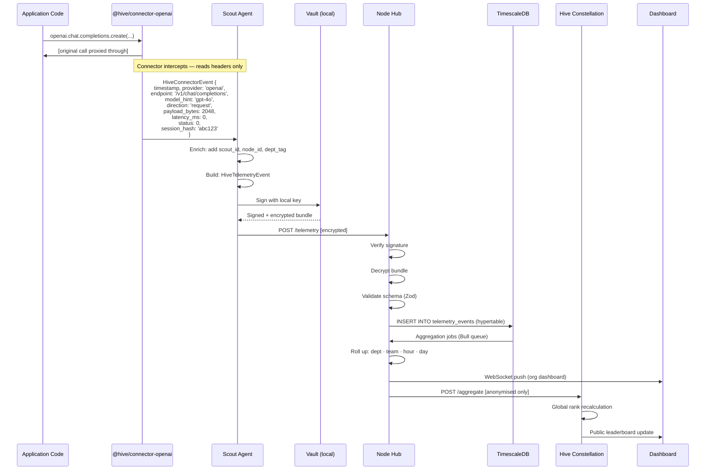
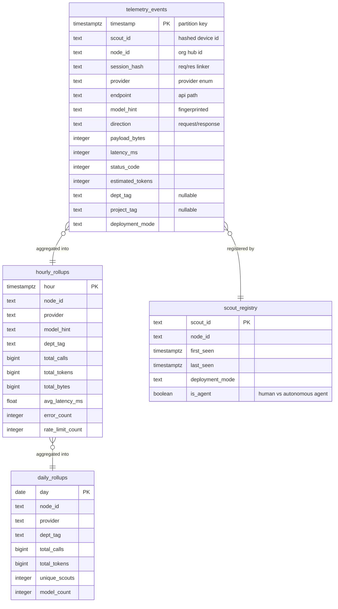
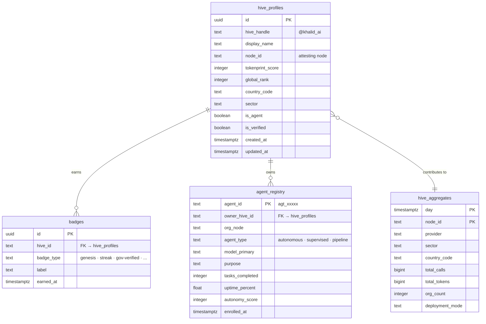
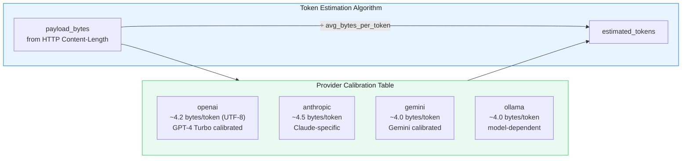
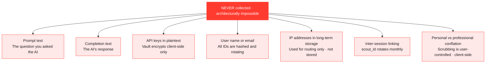

# HIVE — Data Model & Telemetry Schema
### The Covenant · Nothing Outside This. Ever.

> **Apple Light theme** · Mermaid diagrams · Last updated 2026-04-15

---

## The Core Principle

The telemetry schema is not just a data structure. It is a **public legal contract** between HIVE and every user, org, and regulator that trusts the platform. It is open sourced on day one. It is auditable by anyone. The schema IS the trust.

> *"You are not a spy. You are a meter."*

---

## The Telemetry Covenant Schema

---

## Field-by-Field Breakdown

---

## Provider Enum

---

## Data Flow — From API Call to Dashboard

---

## Database Schema

### TimescaleDB — Node Hub

### Supabase — Hive Constellation

---

## Token Estimation — No Content Required

A critical privacy property: HIVE **never reads prompt or completion content** to estimate tokens. Estimation is purely byte-based with provider-specific calibration:

The calibration table is open source. Researchers and auditors can verify it is not reading content.

---

## What HIVE Will Never Collect

---

*See also: [Architecture](./architecture.md) · [Identity](./identity.md) · [PLAN.md](../PLAN.md)*
