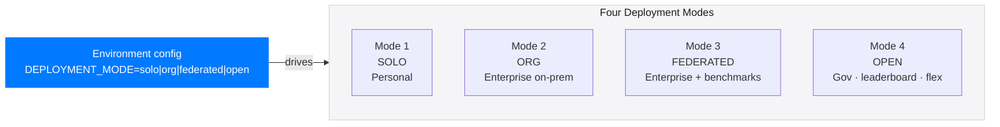
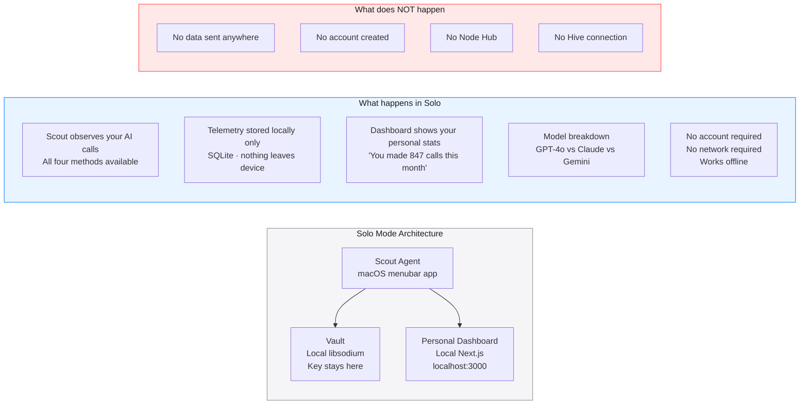
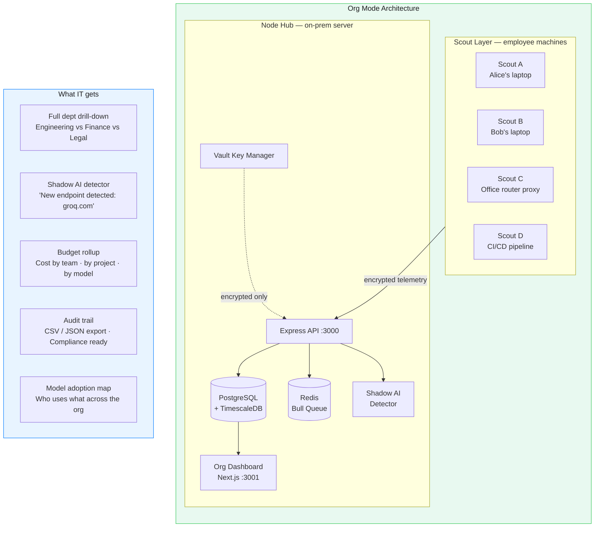
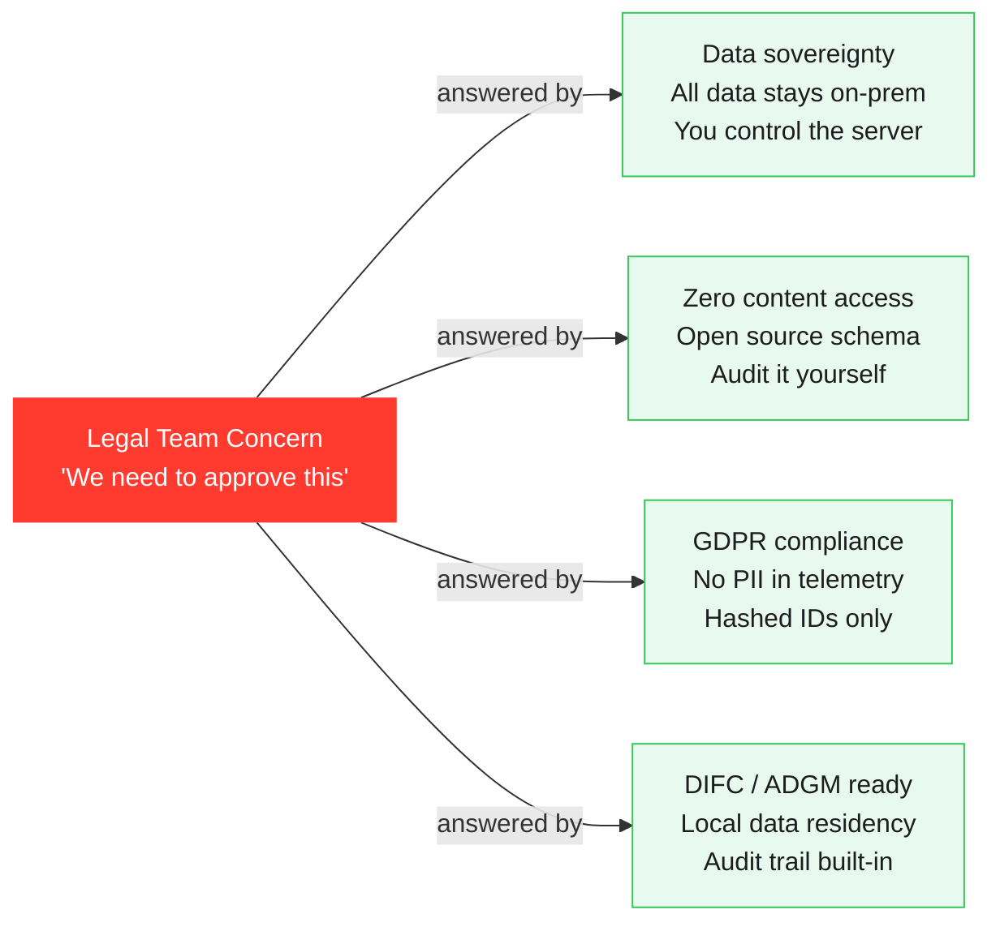
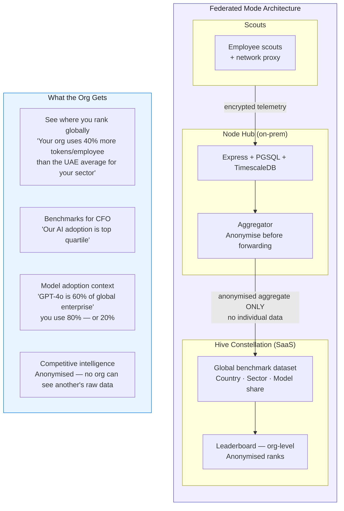
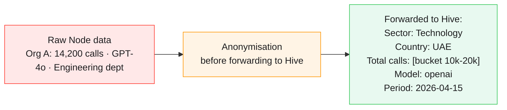
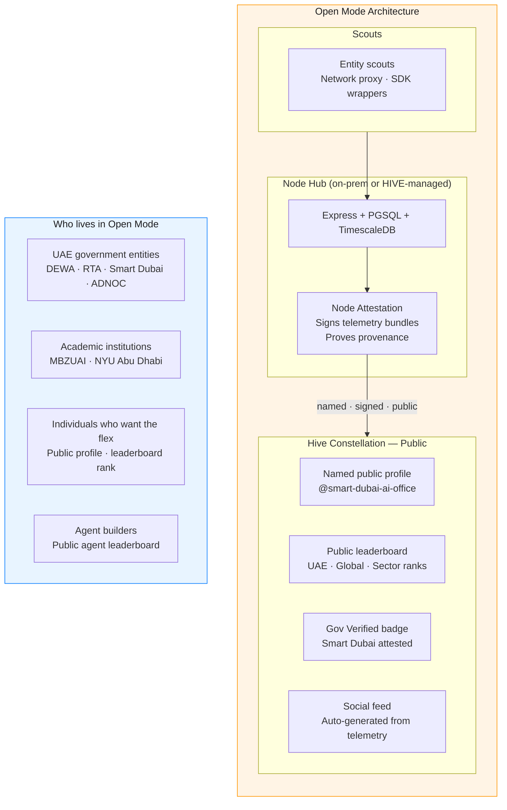
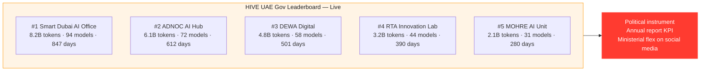
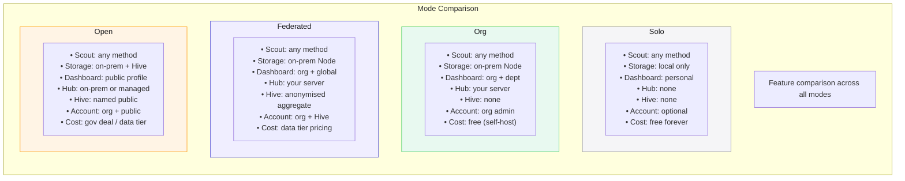
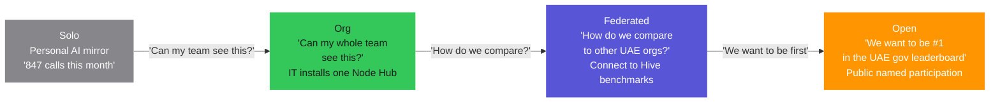

# HIVE — Deployment Modes
### Four Modes · One Codebase · One docker-compose up

> **Apple Light theme** · Mermaid diagrams · Last updated 2026-04-15

---

## Overview

HIVE runs in four modes. **The codebase is identical across all four.** Mode is determined by environment configuration, not code. This means no forks, no drift, no feature divergence between self-hosted and SaaS.



---

## Mode 1 — SOLO (Personal)

**The first moment. The personal AI mirror.**



### The "847 calls" moment

When someone opens the Solo dashboard for the first time and sees *"You've made 847 AI calls this month across 4 models"* — that's the moment. That's the hook. That's what causes them to say *"wait, can my whole team see this?"* — and that's the conversation that converts to Mode 2.

### Install paths — Solo

| Platform | Install method | Binary |
|----------|---------------|--------|
| macOS | `.pkg` installer · Homebrew | Menubar app |
| Windows | `.exe` installer · winget | System tray app |
| Linux | `.deb` / `.rpm` / snap | System service |
| Any | `npm install -g @hive/scout` | CLI daemon |
| Docker | `docker run hive/scout` | Container |
| Browser | Chrome / Firefox extension | Browser-only mode |

---

## Mode 2 — ORG (Enterprise On-Prem)

**Full enterprise visibility. Nothing leaves the building.**



### One-command install — Org Hub

```bash
# Download docker-compose
curl -O https://hive.io/install/node-compose.yml

# Configure
export HIVE_NODE_ID="my-org-hub"
export HIVE_ORG_NAME="ACME Corp"
export HIVE_DEPLOYMENT_MODE="org"
export POSTGRES_PASSWORD="$(openssl rand -hex 32)"

# Launch full stack
docker-compose -f node-compose.yml up -d

# Scout enrollment URL
echo "Share this with employees: http://your-server:3000/enroll"
```

### Why legal says yes in 20 minutes



---

## Mode 3 — FEDERATED (Enterprise + Benchmarks)

**On-prem + global context. The org's anonymised footprint contributes to global benchmarks.**



### What "anonymised aggregate" means



**The Hive cannot reconstruct the org's raw data from the aggregate. This is enforced by the aggregation algorithm, not just policy.**

---

## Mode 4 — OPEN (Government · Leaderboard · Flex)

**Named public participation. The UAE gov play. The leaderboard.**



### The UAE Open Mode leaderboard



---

## Mode Comparison Matrix



---

## Upgrade Path — The Natural Journey



Each upgrade is driven by the user's own desire — not a paywall, not a feature gate. The product's gravity pulls them up the stack.

---

*See also: [Architecture](./architecture.md) · [Build Sequence](./build-sequence.md) · [PLAN.md](../PLAN.md)*

---

<sub>HIVE &nbsp;·&nbsp; هايف &nbsp;·&nbsp; הייב &nbsp;·&nbsp; ہائیو &nbsp;·&nbsp; هایو &nbsp;·&nbsp; हाइव &nbsp;·&nbsp; ਹਾਈਵ &nbsp;·&nbsp; হাইভ &nbsp;·&nbsp; ஹைவ் &nbsp;·&nbsp; హైవ్ &nbsp;·&nbsp; හයිව් &nbsp;·&nbsp; ဟိုင်ဗ် &nbsp;·&nbsp; ហ៊ីវ &nbsp;·&nbsp; ไฮฟ์ &nbsp;·&nbsp; 蜂巢 &nbsp;·&nbsp; ハイブ &nbsp;·&nbsp; 하이브 &nbsp;·&nbsp; ჰაივი &nbsp;·&nbsp; Հայվ &nbsp;·&nbsp; Χάιβ &nbsp;·&nbsp; Хайв &nbsp;·&nbsp; ሃይቭ &nbsp;·&nbsp; Colmena &nbsp;·&nbsp; Ruche &nbsp;·&nbsp; Colmeia &nbsp;·&nbsp; Alveare &nbsp;·&nbsp; Kovan &nbsp;·&nbsp; Mzinga &nbsp;·&nbsp; Tổ Ong &nbsp;·&nbsp; Ul</sub>