# HIVE — Identity Architecture & Social Layer
### CIAM · TokenPrint · The Agent Economy

> **Apple Light theme** · Mermaid diagrams · Last updated 2026-04-15

---

## Overview

HIVE's identity system is the first to unify three distinct identity types — personal, professional, and autonomous agent — under a single cryptographic root. It is simultaneously:

- A **CIAM protocol** (like Auth0, but for AI identity)
- A **verified credential** (like a background check, but for AI fluency)
- A **social graph** (like LinkedIn, but machine-verified and gamified)

Nobody has built this. The space is empty exactly here.

---

## Three Identity Types — One Cryptographic Root

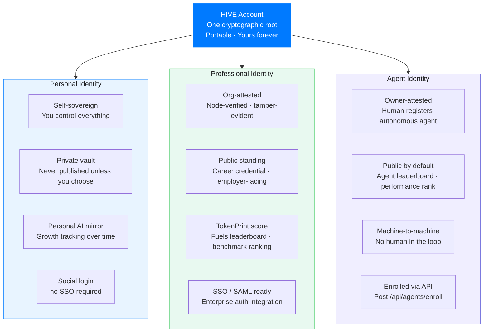

**All three share one cryptographic root. All three are portable. All three are yours.**

---

## Personal vs. Professional Scrubbing

The scrubbing layer is not a privacy feature bolted on — **it is the core product differentiation.** It runs client-side. The user defines rules. The org never sees personal usage. The Hive never conflates them.

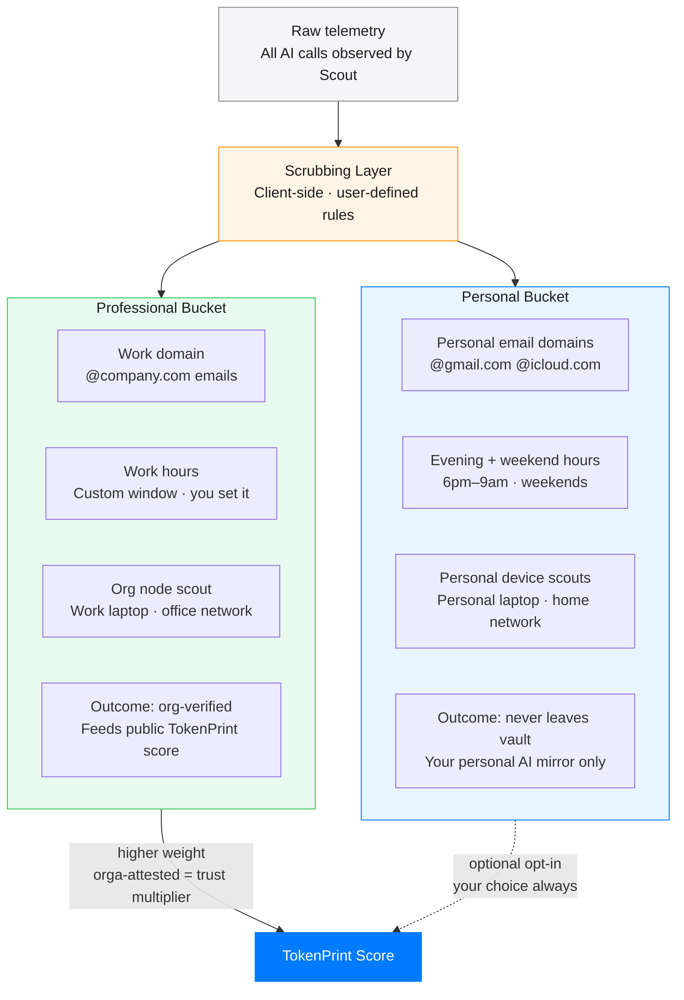

**Professional score is worth more because it's node-attested. That's the incentive to consent.**

---

## TokenPrint Score

The TokenPrint score is HIVE's primary identity signal. It is composite, hard to game, and machine-verified.

### Score composition

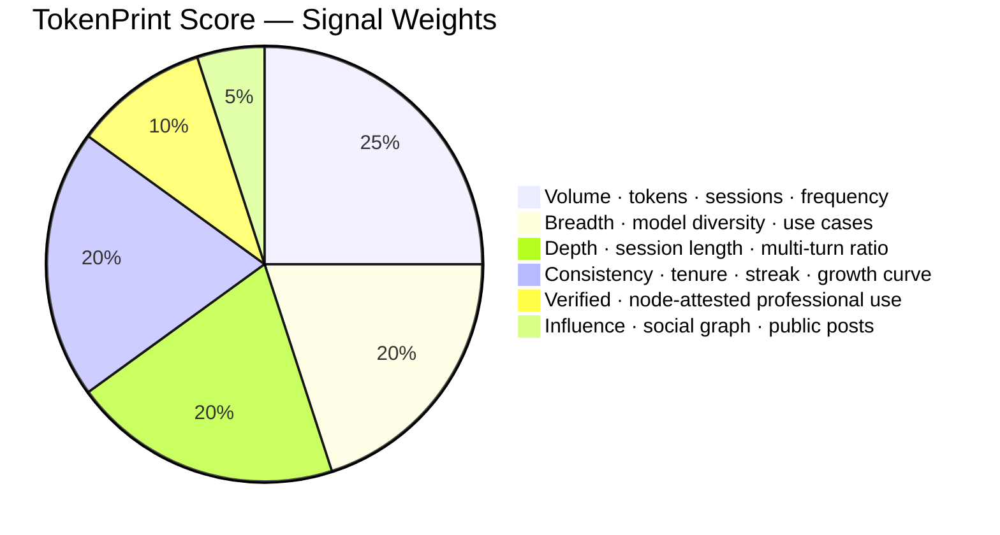

### Anti-gaming design

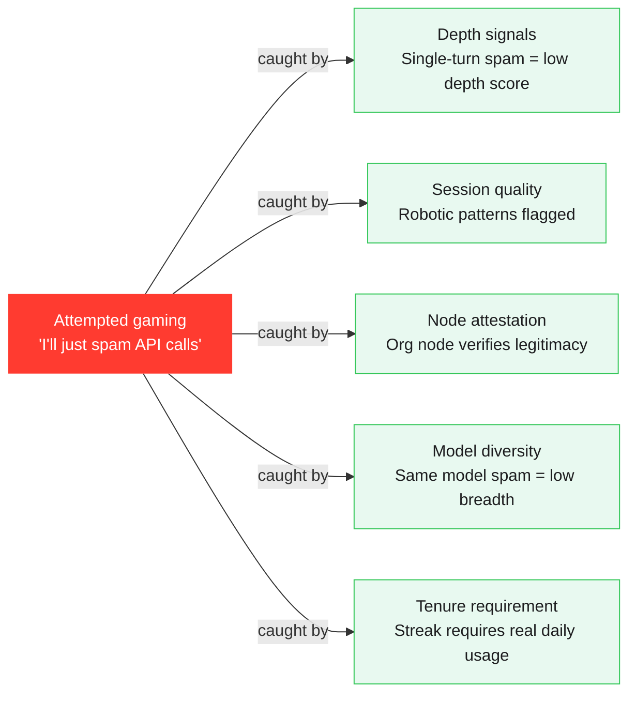

---

## Earned Badges — The Social Tags

Badges are not self-assigned. They are earned automatically by the telemetry data and attached to the identity cryptographically.

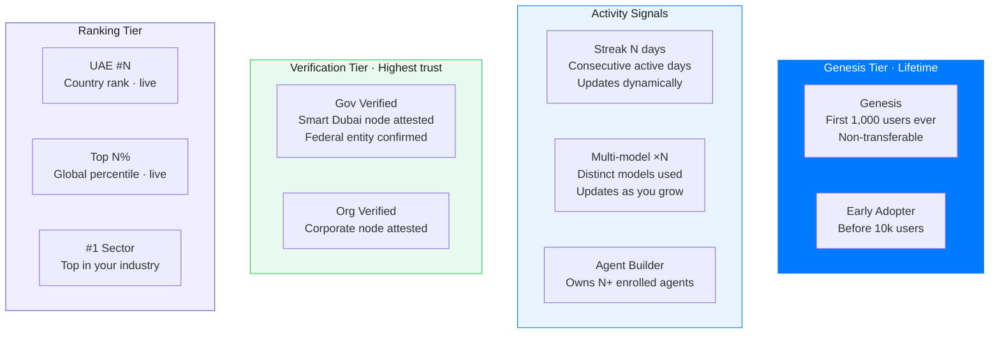

These tags travel with the person everywhere HIVE Login is used. Every integrated app sees them. **This is the flex layer that becomes fashion.**

---

## The Agent Economy

### Two citizens — one graph

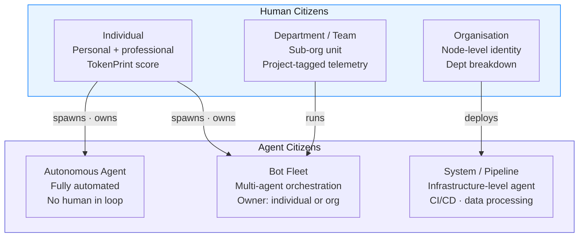

### Agent enrollment API

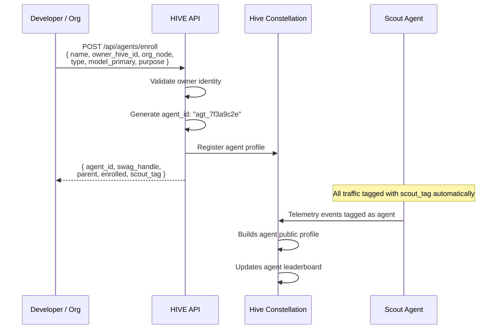

### What each citizen shows off

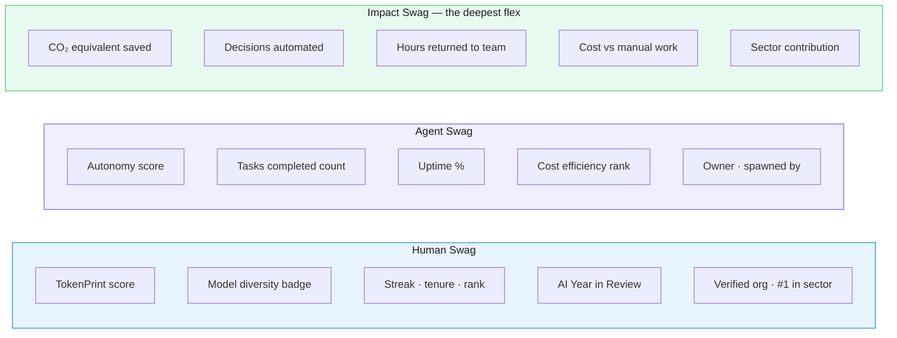

---

## The Social Feed

**The key insight: The feed requires no human content creation. The telemetry IS the content.**

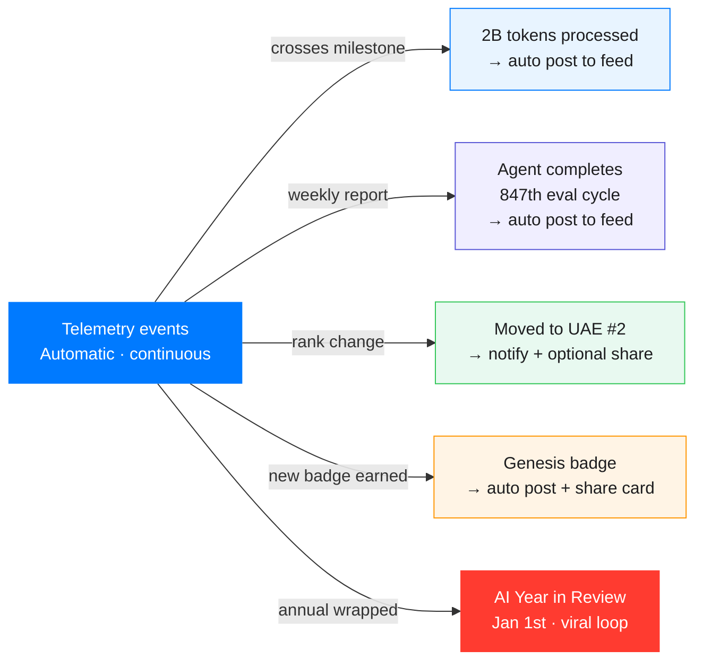

Every other social network requires humans to create content. **HIVE's content is generated by the act of using AI.** The more you use AI, the more you post, automatically.

---

## Login with HIVE — The Integration Protocol

### For platform developers

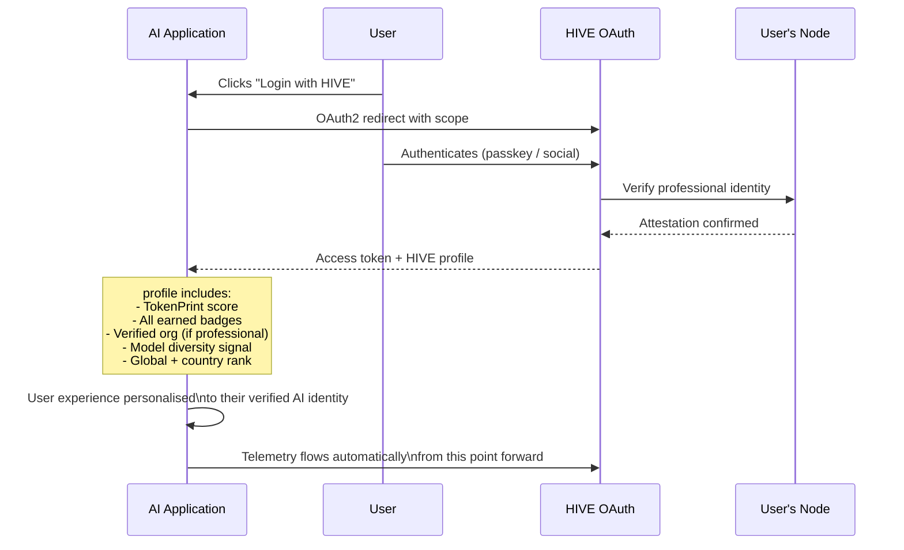

### Pricing — Auth0 model

| Tier | MAU | Price |
|------|-----|-------|
| Free | 0 – 1,000 MAU | $0 |
| Growth | 1,001 – 100k MAU | $0.02 / MAU |
| Enterprise | 100k+ MAU | Flat contract + SLA |
| Gov / Sovereign | On-prem node | Annual deal |

---

## Verified Credential — The AI Resume

A TokenPrint credential is machine-verified, node-attested, and tamper-evident. Employers pay to verify it. ATS platforms integrate the API.

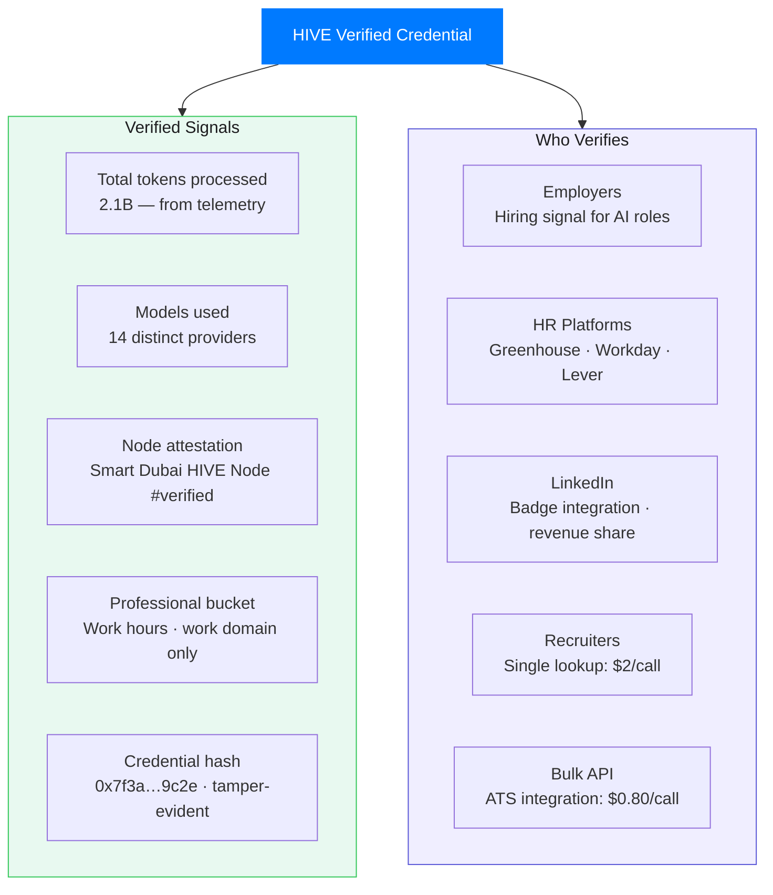

---

## The Wrapped Moment — Annual Viral Loop

Every year, January 1st:

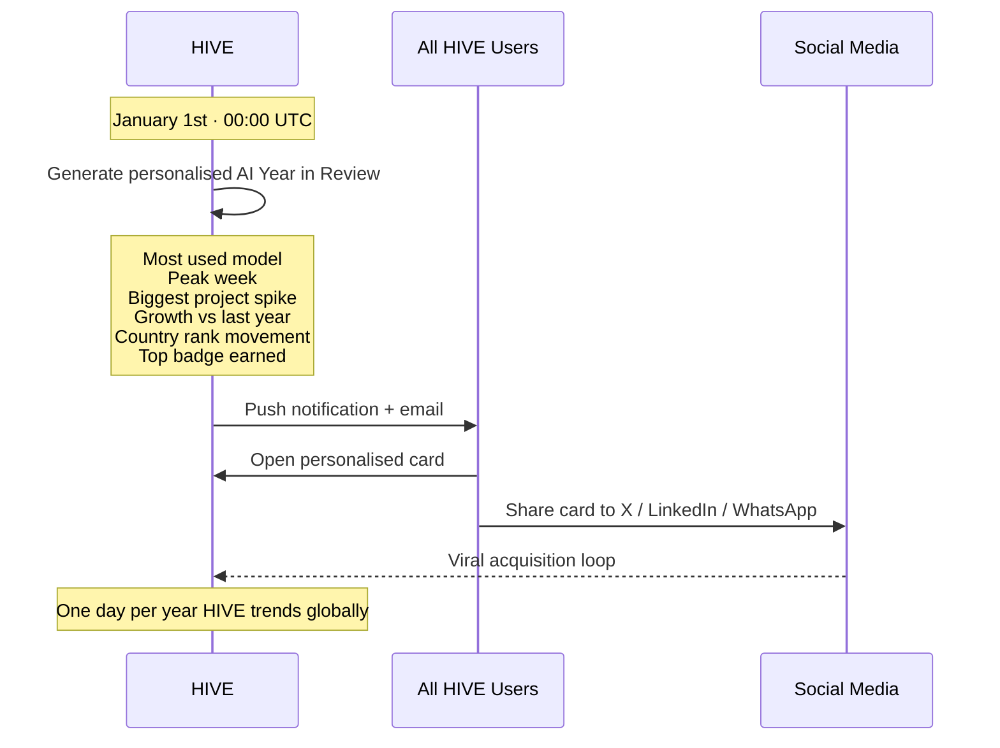

This is not a feature. This is the **annual acquisition event.**

---

*See also: [Architecture](./architecture.md) · [Business Model](./business-model.md) · [PLAN.md](../PLAN.md)*

---

HIVE &nbsp;·&nbsp; هايف &nbsp;·&nbsp; הייב &nbsp;·&nbsp; ہائیو &nbsp;·&nbsp; هایو &nbsp;·&nbsp; हाइव &nbsp;·&nbsp; ਹਾਈਵ &nbsp;·&nbsp; হাইভ &nbsp;·&nbsp; ஹைவ் &nbsp;·&nbsp; హైవ్ &nbsp;·&nbsp; හයිව් &nbsp;·&nbsp; ဟိုင်ဗ် &nbsp;·&nbsp; ហ៊ីវ &nbsp;·&nbsp; ไฮฟ์ &nbsp;·&nbsp; 蜂巢 &nbsp;·&nbsp; ハイブ &nbsp;·&nbsp; 하이브 &nbsp;·&nbsp; ჰაივი &nbsp;·&nbsp; Հայվ &nbsp;·&nbsp; Χάιβ &nbsp;·&nbsp; Хайв &nbsp;·&nbsp; ሃይቭ &nbsp;·&nbsp; Colmena &nbsp;·&nbsp; Ruche &nbsp;·&nbsp; Colmeia &nbsp;·&nbsp; Alveare &nbsp;·&nbsp; Kovan &nbsp;·&nbsp; Mzinga &nbsp;·&nbsp; Tổ Ong &nbsp;·&nbsp; Ul