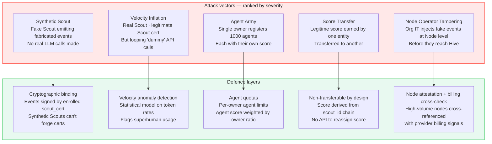

# Integrity
### Anti-Gaming · Sybil Resistance · TokenPrint Protection · Score Validation

> The TokenPrint score is the identity product. If it can be gamed, it is worthless. This document specifies exactly how HIVE detects and prevents score manipulation.

---

## The Attack Surface

The TokenPrint score is a function of telemetry events. Any mechanism that lets someone emit fake telemetry at scale can inflate a score. The attack vectors are:



---

## 1. Synthetic Scout Defence — Cryptographic Binding

Every HATP event from a Scout must carry a valid `scout_cert` issued by a Node Hub CA. The Node Hub CA is issued by the Hive constellation during org enrollment.

**A synthetic Scout cannot emit events because:**
1. It cannot obtain a `scout_cert` without going through Node Hub enrollment
2. Node Hub enrollment requires an `enrollment_token` issued by an IT admin
3. IT admins are authenticated via SSO/SAML (Phase 2+) or bcrypt password
4. Enrollment tokens are single-use and IT-admin-issued

**What this means practically:**
- Fake events require compromising an IT admin account *and* generating a Scout cert *and* keeping the Node Hub none the wiser
- The effort cost is far higher than any TokenPrint score benefit

**Residual gap:**
A malicious IT admin within an org can generate real Scout certs for synthetic Scouts. Defence: billing cross-check (§5).

---

## 2. Velocity Anomaly Detection

Human AI usage follows statistical patterns: daily rhythms, session durations, model switch frequency, inter-request intervals. Automated/synthetic usage looks different.

### Anomaly signals

| Signal | Normal range | Anomaly threshold |
|---|---|---|
| Requests per hour | 2–120 | > 500 sustained for > 2 hours |
| Inter-request interval | > 2 seconds mean | < 200ms mean for > 100 consecutive requests |
| Session duration | 5 min – 8 hours | Continuous 23+ hours without gap |
| Provider switches per hour | 0–10 | > 50 per hour |
| Identical payload_bytes sequences | Rare | Same bytes 3+ times = likely loop |
| tokens_per_day growth rate | ≤ 3x month-over-month | > 10x overnight = flag |

### Anomaly response tiers

```
Tier 1 (soft flag): Anomaly score > 0.5
  → Events still accepted
  → Scout tagged as "under review"
  → TokenPrint score contributions held (not applied)
  → IT admin notified via Node Hub dashboard

Tier 2 (hard flag): Anomaly score > 0.8 OR single-session > 1M tokens
  → Events still accepted (data preserved)
  → TokenPrint contributions suspended for 7 days
  → Hive integrity team alerted
  → IT admin required to acknowledge

Tier 3 (score freeze): Confirmed abuse pattern
  → TokenPrint score frozen at pre-abuse level
  → Requires human review to unfreeze
  → Org node flagged in public leaderboard (if Open mode)
```

### Anomaly scoring model

Initial version: rule-based (thresholds above). Phase 3+: online ML model trained on confirmed legitimate usage. Model runs at Node Hub level (not Hive) to preserve privacy.

---

## 3. Sybil Resistance — Agent Army Defence

**The attack:** Register 1,000 agents, each accumulating their own TokenPrint score, making the owner's aggregate footprint appear massive.

### Agent limits

| Account tier | Max registered agents | Notes |
|---|---|---|
| Personal | 5 | Can request increase with justification |
| Org (free) | 25 | Per Node Hub |
| Org (verified) | 250 | After IT admin verification |
| Gov (Open mode) | 1,000 | For legitimate fleet deployments |

### Agent score weighting

Agent scores are **not simply additive** to the owner's score:

```
owner_score_contribution_from_agents =
  sum(agent.score) × dilution_factor(agent_count)

dilution_factor:
  1–5 agents:    0.8   (80% credit)
  6–25 agents:   0.5   (50% credit)
  26–100 agents: 0.25  (25% credit)
  101+ agents:   0.10  (10% credit)
```

This rewards having productive agents while preventing trivial multiplication. An owner with 1,000 agents gets only 10% of their aggregate score added to their personal TokenPrint.

### Agent legitimacy signals

Genuine agents have characteristic patterns:
- Consistent working-hours activity aligned with their human owner's timezone
- Model specialisation (an agent that does only code reviews uses specific models)
- Predictable request cadence matching the task automation rhythm

Agent accounts that look like inflated humans (erratic patterns, all models, random hours) are flagged for review.

---

## 4. Score Non-Transferability

The TokenPrint score is derived from the `scout_id` lineage, which is anchored to the `master_secret` in the device keychain. There is no score transfer API.

**This is enforced by:**
1. The score computation lives on the Node Hub and Hive, keyed to `scout_id`
2. `scout_id` rotation is deterministic from `master_secret` — only the device can produce the chain
3. There is no `POST /scores/transfer` endpoint — it does not exist

**Edge case: Employee leaves org**
- Their professional score (Node-attested) remains visible on their public profile
- The attestation status changes from "active-attested" to "previously-attested-at-[org]"
- Score is preserved as a historical record — not inflated by the org after departure

---

## 5. Node Operator Tampering — Billing Cross-Check

A malicious IT admin controlling the Node Hub can inject fake events before they reach Hive. This is the hardest attack to prevent technically.

### Defence: Provider billing signal correlation

For organisations in **Open mode** (publicly named on leaderboard):

1. Hive requests voluntary billing verification: "Connect your OpenAI / Anthropic billing account"
2. Hive compares declared token volume (from HATP events) vs billed tokens (from provider billing API)
3. Discrepancy threshold: ±30% is acceptable (token estimation variance)
4. Discrepancy > 3x triggers integrity flag

**This is voluntary.** Orgs that opt in receive a "Billing Verified" badge. Orgs that decline can still participate but their score is visually differentiated.

**For Federated and Solo modes:** billing cross-check is optional and private. Only the org sees the discrepancy report.

### Node Hub attestation chain

Every sync bundle from Node → Hive includes:
- A timestamp signed by the Node's ed25519 key
- A rolling hash of the last 100 events
- The Node's declared software version

If a Node is running modified software (to fabricate events), the software version hash won't match. Hive flags any Node running unknown version strings.

---

## 6. Leaderboard Integrity

Public leaderboards (Open mode) are the most visible integrity surface.

### What makes a leaderboard position legitimate

A score is considered "leaderboard-quality" only when:

```
is_leaderboard_eligible(scout):
  ✓ scout_cert valid and not revoked
  ✓ anomaly_score < 0.4 for trailing 30 days
  ✓ minimum 30 days of continuous activity (not just one burst)
  ✓ diversity_score > 0.2 (not all identical calls)
  ✓ (if Open mode) billing_verified OR manual_review_passed
```

### Score freshness

Leaderboard scores are computed from a trailing 90-day window, not lifetime totals. This:
- Prevents legacy dominance (an entity that was active in 2026 but idle in 2027 fades)
- Makes the leaderboard a current signal, not a historical artifact
- Reduces incentive to burst-inflate early and coast

### Dispute resolution

Any entity can file an integrity challenge against another entity's score:
```
POST /api/v1/integrity/challenge
{ target_node_id, evidence_type, description }
```

The HIVE integrity team (initially: the founders) reviews within 5 business days. Confirmed fraud: score reset + 90-day suspension from leaderboard.

---

## 7. Personal Privacy vs. Integrity Tension

There is a deliberate tension: the stronger the integrity model, the more identifying the data needs to be (to detect fakes). The weaker the identifying data, the easier it is to game.

**HIVE's resolution:**

| Layer | Privacy | Integrity |
|---|---|---|
| Scout → Node | Encrypted telemetry · content-free | Scout cert required · rate limited |
| Node Hub | Full scout_id chain visible (org-controlled) | Anomaly detection runs here |
| Node → Hive | Anonymised aggregate only | Node attestation chain |
| Hive (public) | scout_id never exposed · only aggregate | Billing cross-check for Open mode |

The Node Hub is where privacy and integrity coexist: it knows who is who (for anomaly detection) but that knowledge stays on-prem. Hive never needs to know individual identity to run integrity checks — it runs them at the aggregate level.

---

*See also: [Security Model](./security.md) · [Identity](./identity.md) · [Data Lifecycle](./data-lifecycle.md)*

---

<sub>HIVE &nbsp;·&nbsp; هايف &nbsp;·&nbsp; הייב &nbsp;·&nbsp; ہائیو &nbsp;·&nbsp; हाइव &nbsp;·&nbsp; হাইভ &nbsp;·&nbsp; ஹைவ் &nbsp;·&nbsp; 蜂巢 &nbsp;·&nbsp; ハイブ &nbsp;·&nbsp; 하이브 &nbsp;·&nbsp; Хайв &nbsp;·&nbsp; Colmena &nbsp;·&nbsp; Ruche &nbsp;·&nbsp; Kovan</sub>
