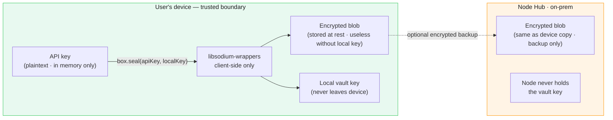
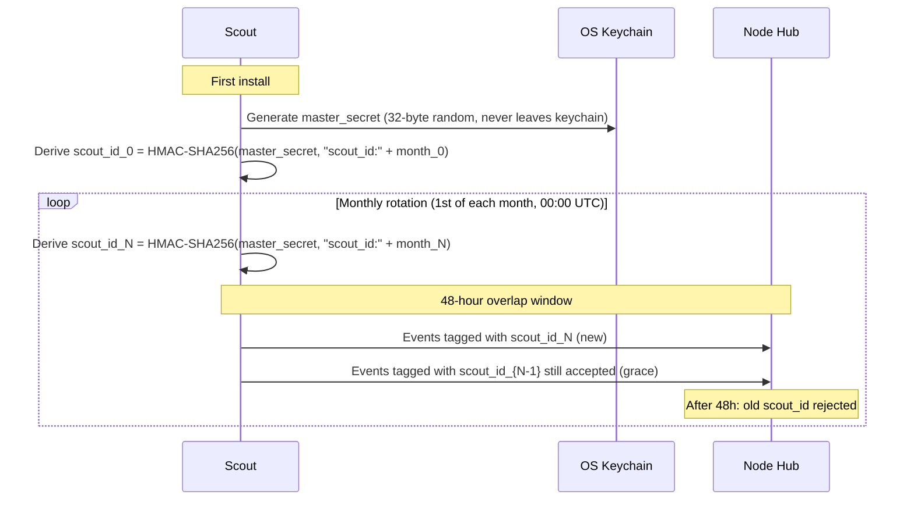

# Key Lifecycle
### Vault Architecture · Rotation · Device Loss · Revocation · Recovery

> The vault is the trust anchor. Everything else in HIVE's privacy model depends on the vault holding. This document specifies exactly how it works, what happens when it breaks, and what is and is not recoverable.

---

## Vault Architecture

The vault is client-side only. This is not a configuration option — it is an architectural constraint.



### What libsodium does

```typescript
// packages/vault/src/vault.ts

import sodium from 'libsodium-wrappers'

interface VaultEntry {
  provider:       string
  encrypted_key:  Uint8Array   // box.seal output
  nonce:          Uint8Array
  created_at:     number
  key_id:         string       // uuid — for rotation tracking
}

async function seal(apiKey: string): Promise<VaultEntry> {
  await sodium.ready
  const nonce  = sodium.randombytes_buf(sodium.crypto_secretbox_NONCEBYTES)
  const key    = getOrCreateLocalKey()     // stored in OS keychain / Keystore
  const cipher = sodium.crypto_secretbox_easy(
    sodium.from_string(apiKey), nonce, key
  )
  return { encrypted_key: cipher, nonce, provider, created_at: Date.now(), key_id: uuid() }
}

async function unseal(entry: VaultEntry): Promise<string> {
  await sodium.ready
  const key   = getLocalKey()
  const plain = sodium.crypto_secretbox_open_easy(entry.encrypted_key, entry.nonce, key)
  return sodium.to_string(plain)
}

// Key NEVER leaves this module. No export. No network call.
```

### Local key storage by platform

| Platform | Storage mechanism |
|---|---|
| macOS | Keychain Services (kSecAttrAccessibleWhenUnlocked) |
| Windows | DPAPI (CryptProtectData) |
| Linux | Secret Service API (libsecret) · fallback: file with 0600 permissions |
| Browser extension | Web Crypto API (non-extractable CryptoKey) |
| Node.js SDK | OS keychain via `keytar` · fallback: encrypted file |

---

## Scout Identity Key — `scout_id` Lifecycle

The `scout_id` in every HATP event is not the real identity — it is a rotating hash. This is the mechanism:



### What monthly rotation achieves

- Historical events at `scout_id_0` cannot be linked to current events at `scout_id_N`
- The Node Hub knows they're the same Scout (it enrolled both IDs) — but the Hive constellation does not
- Even a full Hive database dump cannot link a user's January usage to their March usage

### What monthly rotation does NOT achieve

- It does not prevent the Node Hub from correlating across rotation windows (Node enrolled all IDs)
- It does not anonymise within a month — a subpoena to the Node Hub in month N reveals that month's activity

This is by design. The Node Hub is the org's infrastructure, operated under the org's legal obligations.

---

## Device Loss Scenarios

### Scenario A: Device lost, Scout reinstalled on new device

```
Master secret is on the lost device's keychain.
It is gone. It cannot be recovered.

What this means:
- New install generates a new master_secret → new scout_id lineage
- Historical events in Node Hub are attributed to old scout_id chain
- New events attributed to new scout_id chain
- No data is lost from the Node Hub
- The continuity of the personal AI mirror is broken (no "since Jan 2026" view)

Recovery path:
- IT admin merges old scout_id chain to new in Node Hub (admin API)
- Hive constellation cannot be merged (by design — Hive doesn't link scout_ids)
- TokenPrint score: professional score resets unless IT admin performs merge
```

### Scenario B: Device lost, Scout recovered (iCloud / Time Machine backup)

```
If OS keychain is included in backup (macOS iCloud Keychain):
- Master secret is restored
- Scout reinstalls with same master_secret → same scout_id lineage continues
- Seamless continuity

If OS keychain NOT included in backup:
- Same as Scenario A
```

**Recommendation:** Document for users that iCloud Keychain backup preserves Scout continuity. Present this as a setup option during Scout onboarding.

### Scenario C: Node Hub disaster — complete data loss

```
TimescaleDB backup policy: daily snapshots, 30-day retention (configurable).
Recovery point objective (RPO): 24 hours (default) · 1 hour (with streaming WAL to S3).
Recovery time objective (RTO): < 2 hours (restore from snapshot).

Scout telemetry during Node outage: queued locally (see resilience.md).
Events are re-submitted after Node recovery.
No gap in coverage beyond the RPO window.
```

---

## Key Revocation

### Scout key revocation (IT admin initiated)

```
POST /admin/scouts/{scout_id}/revoke
Authorization: Bearer <admin_token>

{ "reason": "device_lost | employee_offboarded | suspected_compromise" }
```

Effect:
1. `scout_api_key` invalidated immediately (Node Hub rejects ingest)
2. `scout_cert` added to Node's CRL (Certificate Revocation List)
3. Scout on that device gets `401 Scout revoked` on next flush
4. Scout displays "Contact IT — enrollment required" UI state

### What happens to historical data on revocation

Data already ingested remains in Node Hub. Revocation stops *future* ingest. Historical data is subject to the org's retention policy and the user's RTBF rights (see [data-lifecycle.md](./data-lifecycle.md)).

### Mass revocation (org offboarding)

```
DELETE /admin/nodes/{node_id}
Authorization: Bearer <hive_admin_token>
```

Effect:
1. All scouts under that node_id have keys revoked
2. Node Hub sync to Hive stops immediately
3. Node Hub data remains on-prem (org controls it)
4. Hive constellation retains already-synced aggregates (anonymised — cannot be attributed back)

---

## API Key Security (Provider Keys in Vault)

The provider API keys (OpenAI, Anthropic, etc.) stored in the vault deserve specific treatment:

### Storage rule

Provider keys are unsealed in memory only during the active request. They are:
- Never written to disk in plaintext
- Never logged (Scout has a `REDACT_SENSITIVE` log filter on all vault operations)
- Never transmitted (Scout uses the key directly to make the provider call)
- Zeroed in memory after use (`sodium.memzero(key)`)

### What Scout does with a provider key

```
1. User adds key via Scout UI → vault.seal(key) → encrypted blob stored
2. Scout intercepts outbound LLM call
3. vault.unseal(blob) → key in memory (< 1ms)
4. Scout attaches key to the provider request (Authorization header)
5. sodium.memzero(key) → key zeroed
6. Scout records telemetry: bytes, latency, status — not the key, not the payload
```

### What happens if Scout process crashes with key in memory

Linux and macOS: process memory is not accessible to other processes (ASLR + process isolation). Key dies with the process. The encrypted blob remains on disk. No exposure.

---

## Key Management for Node Hub

Node Hub holds:
1. Node CA keypair (signs Scout certs)
2. Node certificate (used for Node → Hive auth)
3. Database encryption key (TimescaleDB at-rest encryption)
4. Redis encryption key (queue at-rest)

These are managed outside Scout's vault, by the IT administrator:

| Key | Storage | Rotation | Backup |
|---|---|---|---|
| Node CA keypair | HSM preferred · file with 0600 fallback | Annual · or on compromise | Offline backup · IT responsibility |
| Node certificate | File | 365-day (auto-renew via ACME) | Derived from CA · re-issuable |
| DB encryption key | Environment variable via Docker secret | Annual · requires DB re-encryption | Org's secret manager (Vault, AWS SM) |
| Redis encryption key | Environment variable via Docker secret | Annual | Org's secret manager |

**Recommendation:** Node Hub deployment guide should include a HashiCorp Vault or AWS Secrets Manager integration example for production deployments.

---

*See also: [Security Model](./security.md) · [Resilience](./resilience.md) · [Data Lifecycle](./data-lifecycle.md)*

---

<sub>HIVE &nbsp;·&nbsp; هايف &nbsp;·&nbsp; הייב &nbsp;·&nbsp; ہائیو &nbsp;·&nbsp; हाइव &nbsp;·&nbsp; হাইভ &nbsp;·&nbsp; ஹைவ் &nbsp;·&nbsp; 蜂巢 &nbsp;·&nbsp; ハイブ &nbsp;·&nbsp; 하이브 &nbsp;·&nbsp; Хайв &nbsp;·&nbsp; Colmena &nbsp;·&nbsp; Ruche &nbsp;·&nbsp; Kovan</sub>
