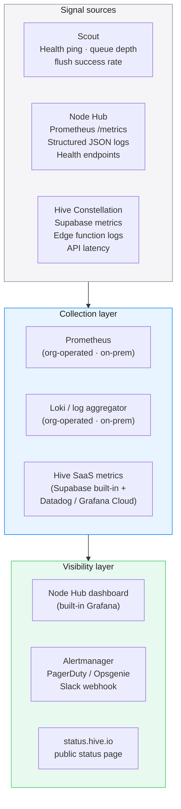

# Observability
### Health Endpoints · Metrics · SLOs · Alerting · Self-Monitoring

> HIVE is an observability product. It must eat its own cooking. This document specifies how HIVE monitors itself — the same rigour it applies to AI consumption, applied to its own infrastructure.

---

## Observability Stack



---

## 1. Health Endpoints

All HIVE components expose standard health endpoints.

### Node Hub

| Endpoint | Returns | Purpose |
|---|---|---|
| `GET /healthz` | `200 OK` / `503` | Liveness — is the process alive? |
| `GET /ready` | `200 OK` / `503` | Readiness — is it ready to serve traffic? |
| `GET /metrics` | Prometheus text format | All metrics (see §2) |
| `GET /admin/status` | JSON status object | Rich admin view (auth required) |

```json
// GET /admin/status — sample response
{
  "status": "healthy",
  "version": "1.2.3",
  "hatp_version": "0.1",
  "uptime_seconds": 864000,
  "scouts": {
    "enrolled": 47,
    "active_last_hour": 39,
    "silent_gt_24h": 3
  },
  "ingest": {
    "events_last_hour": 18420,
    "events_rejected_last_hour": 12,
    "queue_depth": 0,
    "flush_lag_ms": 340
  },
  "database": {
    "connected": true,
    "replication_lag_ms": 0,
    "disk_used_pct": 34,
    "oldest_uncompressed_chunk_days": 3
  },
  "hive_sync": {
    "last_sync_at": 1744761600000,
    "last_sync_status": "ok",
    "sync_lag_minutes": 2,
    "pending_bundles": 0
  }
}
```

### Scout (local health)

Scout exposes a local HTTP endpoint (loopback only — never external):

```
GET http://localhost:7749/healthz
→ { "status": "ok", "queue_depth": 0, "last_flush_ago_ms": 12340, "vault_sealed": false }
```

Used by the macOS menu bar status indicator and the browser extension badge.

### Hive Constellation

| Endpoint | Auth | Returns |
|---|---|---|
| `GET https://hive.io/healthz` | Public | Liveness |
| `GET https://hive.io/api/v1/status` | Node JWT | Sync status for that node |
| `GET https://hive.io/api/v1/metrics` | Admin JWT | Full platform metrics |

---

## 2. Prometheus Metrics — Node Hub

### Ingest metrics

```
# HELP hive_ingest_events_total Total HATP events ingested
# TYPE hive_ingest_events_total counter
hive_ingest_events_total{status="accepted",provider="openai"} 1842340
hive_ingest_events_total{status="rejected",reason="governance_missing"} 12

# HELP hive_ingest_latency_ms HATP ingest endpoint latency
# TYPE hive_ingest_latency_ms histogram
hive_ingest_latency_ms_bucket{le="10"} 98420
hive_ingest_latency_ms_bucket{le="50"} 184200
hive_ingest_latency_ms_bucket{le="200"} 184390
hive_ingest_latency_ms_bucket{le="+Inf"} 184420

# HELP hive_ingest_queue_depth Current Bull queue depth
# TYPE hive_ingest_queue_depth gauge
hive_ingest_queue_depth{state="waiting"} 0
hive_ingest_queue_depth{state="active"} 3
hive_ingest_queue_depth{state="failed"} 0
```

### Scout metrics

```
# HELP hive_scouts_enrolled_total Total enrolled scouts
# TYPE hive_scouts_enrolled_total gauge
hive_scouts_enrolled_total 47

# HELP hive_scouts_silent_total Scouts with no event in > 24h
# TYPE hive_scouts_silent_total gauge
hive_scouts_silent_total 3

# HELP hive_scout_last_seen_seconds Seconds since last event per scout
# TYPE hive_scout_last_seen_seconds gauge
hive_scout_last_seen_seconds{scout_id_prefix="7f3a",dept="engineering"} 340
```

### Database metrics

```
# HELP hive_db_replication_lag_ms TimescaleDB replication lag
# TYPE hive_db_replication_lag_ms gauge
hive_db_replication_lag_ms 0

# HELP hive_db_disk_used_bytes Database disk usage
# TYPE hive_db_disk_used_bytes gauge
hive_db_disk_used_bytes 12884901888

# HELP hive_db_chunks_uncompressed TimescaleDB uncompressed chunks
# TYPE hive_db_chunks_uncompressed gauge
hive_db_chunks_uncompressed 3

# HELP hive_timescale_rollup_lag_minutes Minutes behind on hourly rollups
# TYPE hive_timescale_rollup_lag_minutes gauge
hive_timescale_rollup_lag_minutes 0
```

### Hive sync metrics

```
# HELP hive_sync_last_success_timestamp Unix timestamp of last successful sync
# TYPE hive_sync_last_success_timestamp gauge
hive_sync_last_success_timestamp 1744761600

# HELP hive_sync_bundles_pending Bundles awaiting sync to Hive
# TYPE hive_sync_bundles_pending gauge
hive_sync_bundles_pending 0

# HELP hive_sync_errors_total Sync errors by type
# TYPE hive_sync_errors_total counter
hive_sync_errors_total{reason="network_timeout"} 2
hive_sync_errors_total{reason="auth_expired"} 0
```

---

## 3. SLOs — Service Level Objectives

### Node Hub SLOs

| SLO | Target | Measurement window |
|---|---|---|
| Ingest availability | 99.9% | Rolling 30 days |
| Ingest p99 latency | < 200ms | Rolling 24 hours |
| Event acceptance rate | > 99.9% | Rolling 1 hour |
| Rollup freshness | < 5 min lag | Continuous |
| Hive sync lag | < 15 min | Continuous |

### Scout SLOs (local)

| SLO | Target | Measurement |
|---|---|---|
| Flush success rate | > 99.5% | Rolling 24 hours |
| Local queue depth | < 1000 events | Instantaneous |
| Vault unseal time | < 10ms p99 | Per-operation |

### Hive Constellation SLOs

| SLO | Target | Measurement window |
|---|---|---|
| API availability | 99.95% | Rolling 30 days |
| Leaderboard freshness | < 5 min | Continuous |
| Profile load time | < 500ms p99 | Rolling 1 hour |

---

## 4. Alerting Rules

### Critical (page immediately)

```yaml
# Node Hub ingest down
- alert: HiveIngestDown
  expr: up{job="hive-node"} == 0
  for: 2m
  labels: { severity: critical }
  annotations:
    summary: "Node Hub ingest endpoint unreachable"

# Database disconnected
- alert: HiveDBDisconnected
  expr: hive_db_connected == 0
  for: 1m
  labels: { severity: critical }

# Queue backup — ingest queued events growing
- alert: HiveQueueBacklog
  expr: hive_ingest_queue_depth{state="waiting"} > 5000
  for: 5m
  labels: { severity: critical }
  annotations:
    summary: "Ingest queue > 5000 — data loss risk if Scout buffers fill"
```

### Warning (notify during business hours)

```yaml
# Scouts going silent
- alert: HiveScoutsSilent
  expr: hive_scouts_silent_total / hive_scouts_enrolled_total > 0.2
  for: 30m
  labels: { severity: warning }
  annotations:
    summary: "More than 20% of scouts silent for > 24h"

# Hive sync lagging
- alert: HiveSyncLag
  expr: (time() - hive_sync_last_success_timestamp) / 60 > 30
  for: 5m
  labels: { severity: warning }
  annotations:
    summary: "Node → Hive sync lagging > 30 minutes"

# Disk at 75%
- alert: HiveDBDiskHigh
  expr: hive_db_disk_used_pct > 75
  for: 1h
  labels: { severity: warning }

# Rollup lag
- alert: HiveRollupLag
  expr: hive_timescale_rollup_lag_minutes > 10
  for: 15m
  labels: { severity: warning }
```

---

## 5. Structured Logging

All Node Hub logs are structured JSON. No free-text logs in production paths.

```json
// Ingest event log
{
  "ts": 1744761600123,
  "level": "info",
  "component": "ingest",
  "msg": "events_accepted",
  "scout_id_prefix": "7f3a",
  "batch_id": "uuid",
  "count": 42,
  "latency_ms": 34,
  "hatp_version": "0.1"
}

// Rejected event log
{
  "ts": 1744761600124,
  "level": "warn",
  "component": "ingest",
  "msg": "event_rejected",
  "reason": "governance_missing",
  "event_id": "uuid",
  "scout_id_prefix": "7f3a"
}

// Anomaly detection log
{
  "ts": 1744761600200,
  "level": "warn",
  "component": "integrity",
  "msg": "velocity_anomaly",
  "scout_id_prefix": "7f3a",
  "dept_tag": "engineering",
  "anomaly_score": 0.72,
  "signal": "inter_request_interval_ms_mean_180",
  "threshold": 200
}
```

**What is never logged:** scout_id in full, API keys, prompt text, completion text, user names. All logs go through a `redact()` filter before output.

---

## 6. Built-in Grafana Dashboards

Node Hub ships with four pre-built Grafana dashboards (bundled in the docker-compose):

| Dashboard | Purpose |
|---|---|
| **Node Health** | Ingest rate, latency, queue depth, DB status |
| **Scout Activity** | Per-dept breakdown, silent scouts, enrollment trends |
| **Hive Sync** | Sync lag, bundle queue, sync error history |
| **Integrity** | Anomaly flags, rate limit hits, rejected events |

Access: `http://localhost:3002/grafana` (default, configurable)

---

## 7. Incident Runbook Pointers

| Symptom | Runbook |
|---|---|
| Ingest endpoint returning 503 | Check `docker ps`, check DB connection, check Redis |
| Queue backlog growing | Check DB write throughput, check TimescaleDB chunk status |
| Scouts reporting flush failures | Check Node Hub TLS cert expiry, check Scout cert expiry |
| Hive sync stuck | Check Node certificate expiry, check network egress |
| Dashboard showing stale data | Check rollup job (`SELECT * FROM timescaledb_information.jobs`) |

Runbook document: [deployment.md — Operational Runbook section](./deployment.md) *(to be added in Phase 1)*

---

*See also: [Architecture](./architecture.md) · [Resilience](./resilience.md) · [Security Model](./security.md)*

---

<sub>HIVE &nbsp;·&nbsp; هايف &nbsp;·&nbsp; הייב &nbsp;·&nbsp; ہائیو &nbsp;·&nbsp; हाइव &nbsp;·&nbsp; হাইভ &nbsp;·&nbsp; ஹைவ் &nbsp;·&nbsp; 蜂巢 &nbsp;·&nbsp; ハイブ &nbsp;·&nbsp; 하이브 &nbsp;·&nbsp; Хайв &nbsp;·&nbsp; Colmena &nbsp;·&nbsp; Ruche &nbsp;·&nbsp; Kovan</sub>
