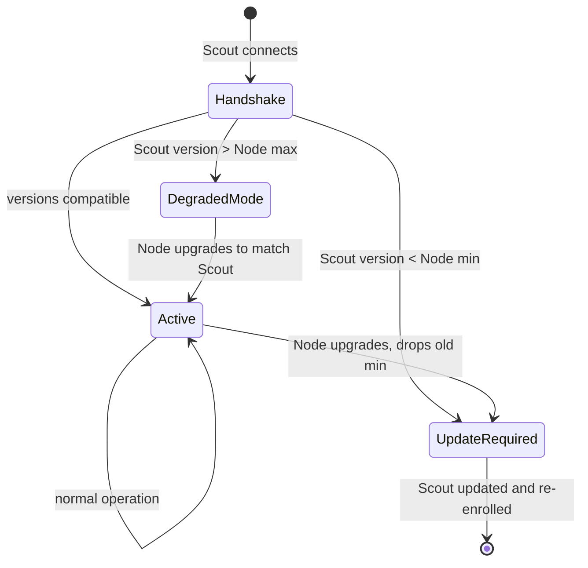
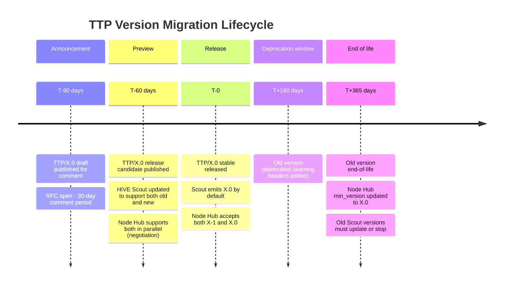

# Protocol Versioning
### TTP Version Negotiation · Breaking Change Policy · Migration · Compatibility Matrix

> A protocol that breaks its implementers is not a protocol — it is a liability. This document specifies exactly what TTP promises, how versions negotiate, and how schema evolution happens without breaking existing deployments.

---

## Version Semantics

TTP uses semantic versioning with specific meanings at each position:

```
TTP / MAJOR . MINOR . PATCH

MAJOR  Incompatible schema change
       Old implementations CANNOT parse new events
       New implementations CANNOT emit events that old Nodes accept
       → Requires negotiation handshake

MINOR  Backward-compatible addition
       New optional fields added
       New providers added to registry
       New regulation_tags added
       → Old implementations ignore unknown fields (must be implemented this way)

PATCH  Non-schema changes
       Documentation fixes, token estimation calibration updates,
       registry typo corrections
       → No code change required
```

**Current version: TTP/0.1**

During `0.x` pre-stable phase: MINOR increments may include breaking changes. This is explicitly communicated as pre-stable behaviour. Stability guarantees begin at `TTP/1.0`.

---

## Version Negotiation Protocol

Every Scout → Node Hub connection begins with a capabilities handshake.

### On first connection (enrollment)

```
Scout includes in enrollment request:
  X-TTP-Version: 0.1
  X-TTP-Capabilities: batch,streaming,msgpack

Node Hub responds:
  X-TTP-Version-Accepted: 0.1
  X-TTP-Capabilities-Accepted: batch,msgpack
  X-TTP-Min-Version: 0.1
  X-TTP-Max-Version: 0.2    (when 0.2 is released)
```

### On each ingest request

```
POST /api/v1/TTP/ingest
X-TTP-Version: 0.1
Content-Type: application/json

Response (version accepted):
  200 OK
  X-TTP-Version: 0.1

Response (version too old — hard reject):
  400 Bad Request
  X-TTP-Min-Version: 0.2
  X-TTP-Upgrade-Guide: https://hive.io/docs/TTP-upgrade/0.1-to-0.2

Response (version too new — soft reject):
  200 OK (events accepted)
  X-TTP-Version-Mismatch: true
  X-TTP-Max-Supported: 0.1
  X-TTP-Unknown-Fields-Ignored: governance.new_field_xyz
```

### Version negotiation state machine



**DegradedMode:** Scout sends events with new fields that Node doesn't understand. Node accepts the events, logs unknown fields, strips them before storage. Scout is notified via `X-TTP-Unknown-Fields-Ignored` header. Data is not lost — it is downgraded.

---

## What Constitutes a Breaking Change

### IS a breaking change (MAJOR increment required)

- Removing a field from `TTPEvent`
- Changing the type of a field (e.g., `timestamp: string` → `timestamp: number`)
- Changing an optional field to required
- Changing validation rules in a stricter direction (e.g., `retention_days` max reduced from 3650 to 730)
- Removing a value from an enum (`direction: 'request' | 'response'` → removing `'request'`)
- Changing the GovernanceBlock structure in any way that invalidates existing events
- Changing the token estimation algorithm in a way that produces different results for the same input

### IS NOT a breaking change (MINOR increment)

- Adding a new optional field
- Adding a new value to an enum (`direction` gaining `'stream_chunk'`)
- Adding a new provider to the registry
- Adding a new `regulation_tag` value
- Adding a new `emitter_type` value
- Relaxing validation (e.g., increasing `retention_days` max)
- Adding a new endpoint to the Node Hub API
- Performance improvements with identical semantics

---

## Schema Migration

When a MAJOR version is released, HIVE provides migration tooling and a documented migration path.

### The migration lifecycle



### Migration tooling

```bash
# Migrate stored events from TTP/0.1 to TTP/1.0 format
npx @TTP/migrate --from 0.1 --to 1.0 \
  --source postgres://node-hub/hive_node \
  --dry-run

# Output: migration plan with affected row count and field mappings
# --dry-run: shows what would change without writing
# Run without --dry-run to execute
```

### Storage format versioning

All stored TTP events retain their `TTP_version` field. The database never silently upgrades stored events. This means:
- Historical data is always queryable with the version context it was created with
- Migration is always opt-in (run the migration tool explicitly)
- Reports can specify which version's semantics to use: `?TTP_version=0.1`

---

## Backward Compatibility Guarantees (post TTP/1.0)

Once `TTP/1.0` is released, the TTP Working Group commits to:

1. **2-major-version support window:** Node Hub supports current and previous MAJOR version simultaneously
2. **12-month deprecation notice:** minimum 12 months between announcing EOL and enforcing it
3. **Migration tooling:** provided and maintained for every MAJOR upgrade
4. **No surprise breaking changes in MINOR/PATCH:** if a MINOR change breaks something, it is re-classified as a MAJOR bump
5. **Working Group vote required:** breaking changes require working group vote, not unilateral HIVE decision

---

## Compatibility Matrix

Current state (pre-1.0):

| Scout version | Node Hub version | Hive version | Status |
|---|---|---|---|
| TTP/0.1 | TTP/0.1 | TTP/0.1 | Fully compatible |
| TTP/0.1 | TTP/0.2 | TTP/0.2 | Scout in DegradedMode — new fields ignored |
| TTP/0.2 | TTP/0.1 | TTP/0.1 | Scout downgraded to 0.1 at handshake |
| TTP/0.1 | TTP/1.0 | TTP/1.0 | Rejected — update required (breaking change) |

Post-1.0 guarantee (2-version window):

| Scout version | Node Hub version | Status |
|---|---|---|
| TTP/1.x | TTP/1.x | Fully compatible |
| TTP/1.x | TTP/2.x | DegradedMode (new fields ignored) |
| TTP/2.x | TTP/1.x | Downgraded at handshake |
| TTP/1.x | TTP/3.x | Rejected — 2 major versions behind |

---

## Unknown Field Handling — Required for All Implementations

Any TTP implementation MUST silently ignore unknown fields in a received `TTPEvent`. This is what allows forward compatibility (older Node reading newer Scout events).

```typescript
// Required behaviour in any compliant parser
function parseTTPEvent(raw: unknown): TTPEvent {
  // Strip unknown fields — do NOT throw on them
  const known = pickKnownFields(raw, TTP_0_1_FIELDS)
  // Validate known fields strictly
  return validate(known)
}
```

A Node Hub that throws `UnknownFieldError` on receiving a newer Scout's event is **not TTP-compliant**.

---

*See also: [TTP Protocol](./protocol.md) · [Architecture](./architecture.md) · [Build Sequence](./build-sequence.md)*

---

<sub>HIVE &nbsp;·&nbsp; هايف &nbsp;·&nbsp; הייב &nbsp;·&nbsp; ہائیو &nbsp;·&nbsp; हाइव &nbsp;·&nbsp; হাইভ &nbsp;·&nbsp; ஹைவ் &nbsp;·&nbsp; 蜂巢 &nbsp;·&nbsp; ハイブ &nbsp;·&nbsp; 하이브 &nbsp;·&nbsp; Хайв &nbsp;·&nbsp; Colmena &nbsp;·&nbsp; Ruche &nbsp;·&nbsp; Kovan</sub>
