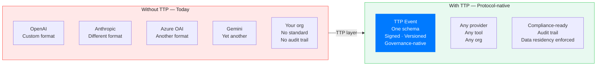
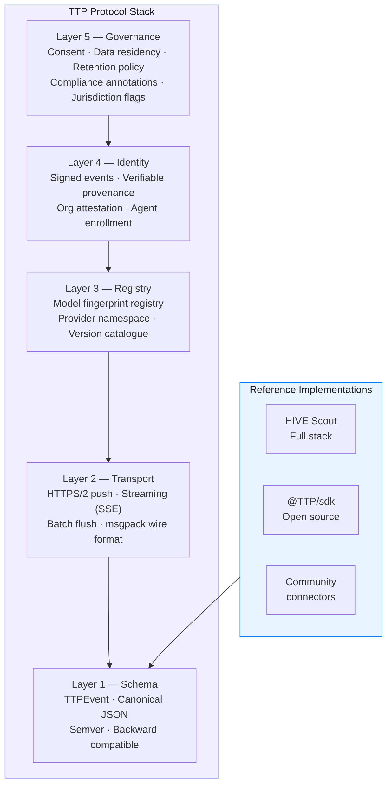
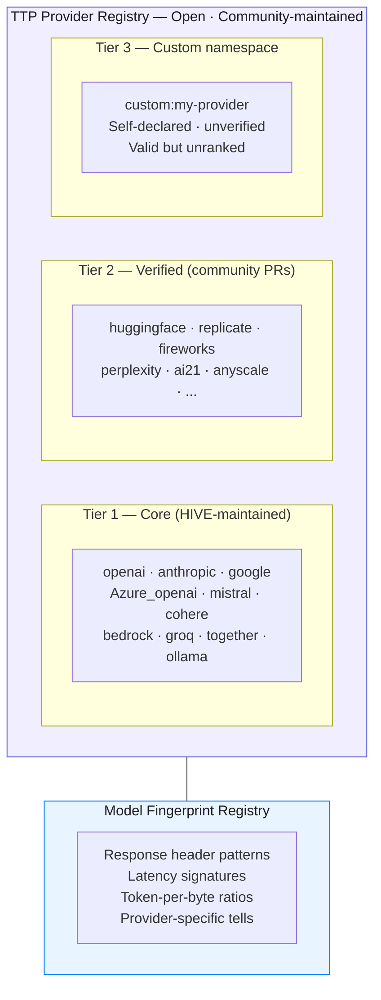
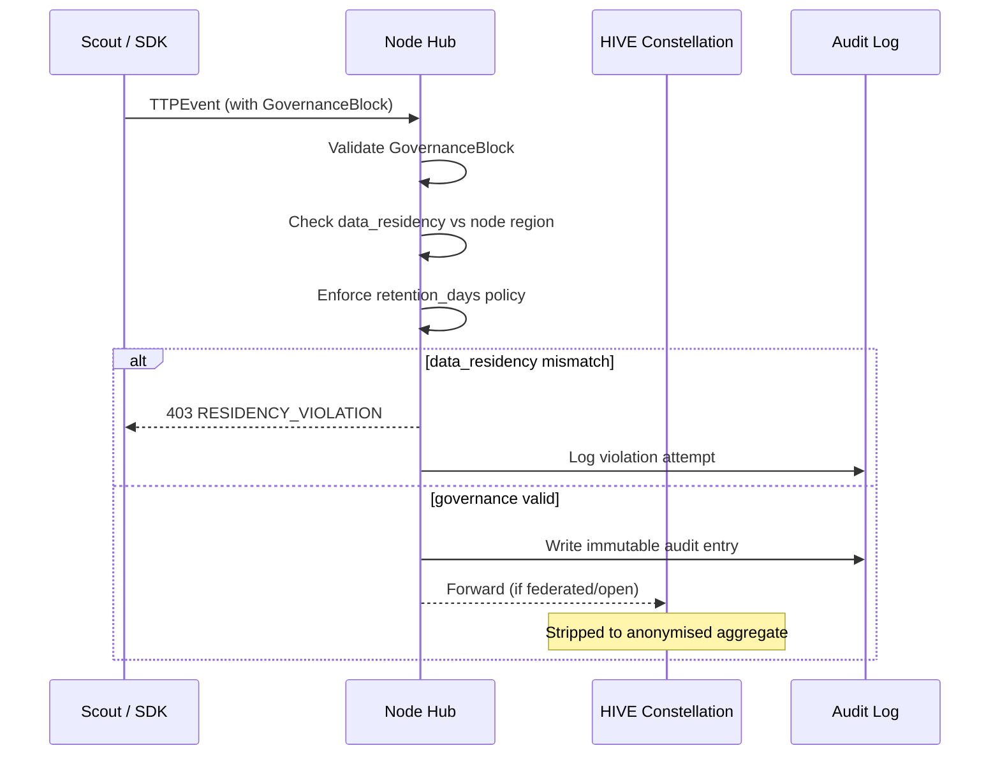
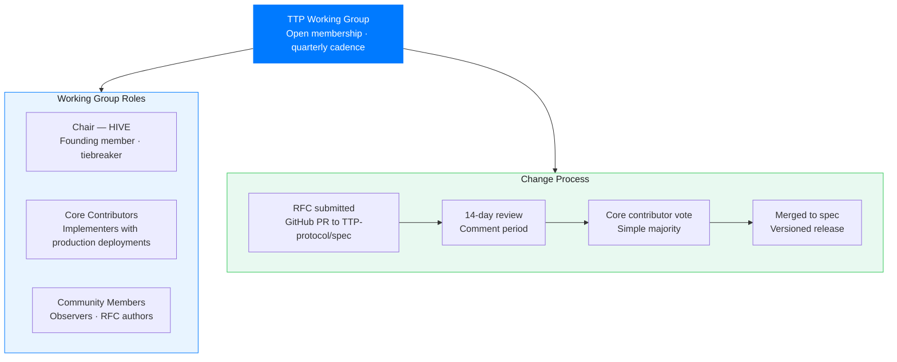
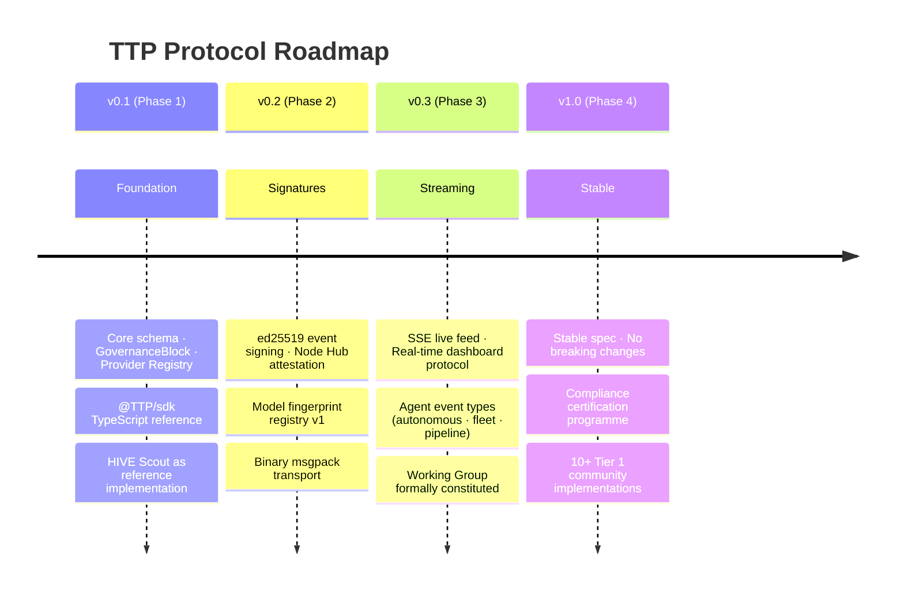

# TTP — AI Industry Telemetry Protocol
### The open standard for AI consumption telemetry · v0.1 · Governed by HIVE

> **TTP is to AI consumption what OpenTelemetry is to infrastructure observability.**
> One schema. Any provider. Any tool. Any org. Governance baked in — not bolted on.

---

## Why TTP Exists

Every AI provider emits different signals in different formats. Every enterprise has a different logging strategy. Every compliance team asks the same questions and gets different answers.

The result is a fragmented, unauditable, incomparable wasteland.

**The root cause:** there is no shared protocol. No common schema. No governance primitive. No way to say "this event came from a verified source and carries these compliance guarantees."

TTP is the fix.



---

## Protocol Architecture



---

## The Canonical Event — `TTPEvent v0.1`

This is the complete, normative schema. Any compliant implementation emits exactly this. Nothing more. Nothing less.

```typescript
/**
 * TTPEvent v0.1
 * The canonical AI consumption telemetry event.
 * Open standard — governed by the TTP Working Group.
 * Reference implementation: HIVE Scout
 *
 * PRIVACY GUARANTEE: Content is architecturally excluded.
 * No prompt. No completion. No API key. Ever.
 */
interface TTPEvent {

  // ── Protocol metadata ─────────────────────────────────────────────────────
  TTP_version:    '0.1'                    // semver · breaking changes increment major
  event_id:        string                   // uuid v4 · globally unique
  schema_hash:     string                   // sha256 of this schema version · self-verifying

  // ── Temporal ──────────────────────────────────────────────────────────────
  timestamp:       number                   // unix ms · UTC
  observed_at:     number                   // unix ms · when scout captured (may differ)

  // ── Origin identity ───────────────────────────────────────────────────────
  emitter_id:      string                   // hashed scout id · rotates monthly
  emitter_type:    EmitterType              // 'scout' | 'sdk' | 'proxy' | 'agent'
  org_node_id?:    string                   // present when routed through a Node Hub
  session_hash:    string                   // links request+response · not the user

  // ── Provider fingerprint ──────────────────────────────────────────────────
  provider:        AIProvider               // see Provider Registry below
  provider_version?: string                 // API version string if detectable
  endpoint:        string                   // '/v1/chat/completions' · normalised
  model_hint:      string                   // fingerprinted from response headers · not user-supplied
  model_family?:   string                   // 'gpt-4' | 'claude-3' | 'gemini-1.5' · normalised

  // ── Signal — zero content, always ────────────────────────────────────────
  direction:       'request' | 'response' | 'stream_chunk' | 'stream_end' | 'error'
  payload_bytes:   number                   // wire size proxy · never content
  latency_ms?:     number                   // absent for request events
  ttfb_ms?:        number                   // time-to-first-byte · streaming only
  status_code:     number                   // HTTP status
  estimated_tokens: number                  // derived from bytes · see Token Estimation §5
  token_breakdown?: TokenBreakdown          // if provider exposes usage headers

  // ── Classification — org-defined, optional ────────────────────────────────
  dept_tag?:       string                   // IT-configured · 'engineering' | 'finance' ...
  project_tag?:    string                   // cost centre · org-defined
  env_tag?:        'production' | 'staging' | 'development' | 'ci'
  use_case_tag?:   string                   // org-defined · 'code-assist' | 'doc-gen' ...

  // ── Deployment context ────────────────────────────────────────────────────
  deployment:      'solo' | 'node' | 'federated' | 'open'
  node_region?:    string                   // ISO 3166-1 alpha-2 · 'AE' | 'US' | 'EU'

  // ── Governance annotations ────────────────────────────────────────────────
  governance:      GovernanceBlock          // see Governance §6 · required

  // ── Cryptographic integrity ───────────────────────────────────────────────
  signature?:      string                   // ed25519 over canonical JSON · optional in v0.1

}

// ── Supporting types ──────────────────────────────────────────────────────────

type EmitterType = 'scout' | 'sdk' | 'proxy' | 'agent' | 'sidecar'

type AIProvider =
  | 'openai' | 'anthropic' | 'google' | 'mistral' | 'cohere'
  | 'bedrock' | 'azure_openai' | 'groq' | 'together' | 'ollama'
  | 'huggingface' | 'replicate' | 'perplexity' | 'fireworks'
  | `custom:${string}`                      // custom:provider-name

interface TokenBreakdown {
  prompt_tokens?:     number
  completion_tokens?: number
  cached_tokens?:     number
  reasoning_tokens?:  number
}

interface GovernanceBlock {
  consent_basis:   'legitimate_interest' | 'org_policy' | 'explicit' | 'not_applicable'
  data_residency:  string                   // ISO 3166-1 · 'AE' | 'EU' | 'US' | 'global'
  retention_days:  number                   // 0 = session only · -1 = indefinite
  regulation_tags: RegulationTag[]          // applicable regulatory frameworks
  pii_asserted:    false                    // always false — protocol guarantee
  content_asserted: false                   // always false — protocol guarantee
}

type RegulationTag =
  | 'GDPR' | 'CCPA' | 'UAE_AI_LAW' | 'EU_AI_ACT'
  | 'PDPL'          // UAE Personal Data Protection Law
  | 'HIPAA'         // US healthcare
  | 'SOC2'
  | 'ISO27001'
  | `custom:${string}`
```

---

## Provider Registry

TTP maintains a canonical registry of provider identifiers. This ensures `provider: 'openai'` means the same thing in every implementation, everywhere.



Registry lives at: `github.com/TTP-protocol/registry` (to be established)

---

## Token Estimation Algorithm

When a provider does not expose token counts in response headers, TTP specifies a deterministic estimation algorithm so all implementations produce comparable numbers.

```
estimated_tokens = floor(payload_bytes / avg_bytes_per_token)

Provider calibration table (v0.1):
  openai     → 3.8 bytes/token  (tiktoken cl100k_base)
  anthropic  → 3.9 bytes/token  (claude tokeniser)
  google     → 4.1 bytes/token  (sentencepiece)
  mistral    → 3.7 bytes/token  (tiktoken-compatible)
  default    → 4.0 bytes/token  (safe fallback)

When provider returns actual token counts in headers:
  estimated_tokens = prompt_tokens + completion_tokens
  token_breakdown.prompt_tokens = <from header>
  token_breakdown.completion_tokens = <from header>
```

This ensures that telemetry aggregated across providers is comparable — a token is a token in TTP, regardless of provider.

---

## Governance Layer

**Governance is not optional in TTP. Every event carries a `GovernanceBlock`.**

This is the design principle that differentiates TTP from generic observability protocols. The GovernanceBlock is validated at ingest — a Node Hub or HIVE constellation will reject events without it.



### What this means for compliance

| Regulation | TTP mechanism |
|---|---|
| GDPR Article 5 | `pii_asserted: false` is protocol-enforced · `retention_days` maps to data minimisation |
| UAE AI Law | `regulation_tags: ['UAE_AI_LAW']` · `node_region: 'AE'` · Gov node attestation |
| EU AI Act | `regulation_tags: ['EU_AI_ACT']` · `data_residency: 'EU'` enforced at Node |
| CCPA | `consent_basis` field · `retention_days` ceiling configurable |
| SOC 2 Type II | Immutable audit log · `event_id` traceability · `schema_hash` integrity |

**Legal says yes in under 20 minutes** — because the answer is structural, not procedural.

---

## Transport Specification

### Push (default)

```
POST https://node.your-org.internal/api/v1/TTP/ingest
Content-Type: application/json          (or application/msgpack for binary)
Authorization: Bearer <scout_token>
X-TTP-Version: 0.1
X-TTP-Batch-ID: <uuid>

Body: TTPEvent[]                       (array · 1–500 events per request)
```

### Response

```json
{
  "accepted": 498,
  "rejected": 2,
  "errors": [
    { "event_id": "...", "code": "GOVERNANCE_MISSING", "field": "governance.consent_basis" },
    { "event_id": "...", "code": "SCHEMA_VERSION_UNSUPPORTED", "version": "0.0" }
  ],
  "batch_id": "...",
  "ingested_at": 1744761600000
}
```

### Flush cycle

- Default: 60-second rolling window, max 500 events per batch
- Minimum: 10 seconds (configurable per deployment)
- On-demand: `POST /api/v1/TTP/flush` forces immediate drain

### Streaming (Phase 3)

```
GET https://hive.io/api/v1/stream/org/{node_id}
Accept: text/event-stream
Authorization: Bearer <node_token>

→ Server-Sent Events, one TTPEvent per line
→ Used for real-time dashboard and leaderboard feeds
```

---

## SDK — Drop-in Implementation

### `@TTP/sdk` (TypeScript reference)

```typescript
import { TTPCollector } from '@TTP/sdk'

const collector = new TTPCollector({
  endpoint: 'https://node.your-org.internal/api/v1/TTP/ingest',
  token: process.env.TTP_TOKEN,
  governance: {
    consent_basis: 'org_policy',
    data_residency: 'AE',
    retention_days: 90,
    regulation_tags: ['UAE_AI_LAW', 'GDPR'],
  },
  flush_interval_ms: 60_000,
})

// Wrap any provider call — zero behaviour change
const response = await collector.wrap(
  openai.chat.completions.create({ model: 'gpt-4o', messages })
)
// TTPEvent emitted automatically. response is unchanged.
```

### Manual emission

```typescript
// For custom providers or existing code
await collector.emit({
  provider: 'custom:my-llm',
  endpoint: '/v1/generate',
  direction: 'response',
  payload_bytes: response.body.length,
  latency_ms: Date.now() - requestStart,
  status_code: 200,
  estimated_tokens: collector.estimateTokens('custom:my-llm', response.body.length),
  model_hint: 'my-model-v2',
  deployment: 'node',
})
```

---

## TTP vs OpenTelemetry

TTP is not a replacement for OpenTelemetry. It is a complement — specifically designed for the AI consumption layer.

| Dimension | OpenTelemetry | TTP |
|---|---|---|
| Scope | General infrastructure observability | AI consumption only |
| Privacy model | Pluggable · opt-in | Content exclusion · protocol enforced |
| Governance | None built-in | GovernanceBlock · required field |
| Identity | Service name · trace ID | Human + Agent identity graph |
| Social layer | None | Public profiles · leaderboard · TokenPrint |
| Compliance | External tooling required | Annotations baked into every event |
| AI-specific fields | None | model_hint · token_breakdown · provider registry |
| Data residency | Not specified | Enforced at Node Hub level |

**You can run both.** OTel for infra. TTP for AI consumption. They are orthogonal.

---

## Governance Structure

TTP is an open standard. HIVE is the founding implementer and convenes the working group.



### Versioning

- `0.x` — pre-stable, breaking changes allowed with minor bump
- `1.0` — stable, breaking changes only with major bump
- Backward compatibility window: 2 major versions

### What HIVE commits to as protocol steward

1. The spec is always open source — MIT licence
2. HIVE cannot unilaterally break backward compatibility
3. Any compliant implementation can talk to any HIVE Node
4. HIVE never requires TTP events to flow through HIVE infrastructure

**This is the governance moat.** The standard is open. The network is HIVE.

---

## Compliance Fast-Track

For any org evaluating TTP + HIVE:

```
Auditor: "Show me your AI usage data."
You:     "Here's the TTP event log. Every event is signed, timestamped,
          governance-annotated, and content-free by protocol design."

Auditor: "How do you guarantee no PII?"
You:     "pii_asserted: false is enforced by the schema validator.
          The field cannot be set to true."

Auditor: "What about data residency?"
You:     "node_region: 'AE' is set at Node Hub level.
          The hub rejects events that don't match."

Auditor: "Can I have an audit trail?"
You:     "Every event has a uuid event_id and schema_hash.
          Immutable log export: POST /api/v1/audit/export"
```

**20 minutes. Done.**

---

## Roadmap



---

## Why TTP Is HIVE's Deepest Moat

The protocol is free and open. The reference network is HIVE.

If TTP becomes the industry standard:
- Every AI tool that implements TTP is, by default, HIVE-compatible
- Every compliance team that requires TTP is, by default, a HIVE lead
- Every government that mandates AI telemetry uses TTP — and HIVE is the platform

**HIVE does not need to own every deployment. HIVE needs to own the protocol.**

This is how standards-based businesses win: TCP/IP → Cisco. HTTP → Apache. OpenTelemetry → Datadog, Grafana, New Relic all integrated. TTP → HIVE.

---

*See also: [Architecture](./architecture.md) · [Data Model](./data-model.md) · [Deployment](./deployment.md) · [PLAN.md](../PLAN.md)*

---

<sub>HIVE &nbsp;·&nbsp; هايف &nbsp;·&nbsp; הייב &nbsp;·&nbsp; ہائیو &nbsp;·&nbsp; هایو &nbsp;·&nbsp; हाइव &nbsp;·&nbsp; ਹਾਈਵ &nbsp;·&nbsp; হাইভ &nbsp;·&nbsp; ஹைவ் &nbsp;·&nbsp; హైవ్ &nbsp;·&nbsp; හයිව් &nbsp;·&nbsp; ဟိုင်ဗ် &nbsp;·&nbsp; ហ៊ីវ &nbsp;·&nbsp; ไฮฟ์ &nbsp;·&nbsp; 蜂巢 &nbsp;·&nbsp; ハイブ &nbsp;·&nbsp; 하이브 &nbsp;·&nbsp; ჰაივი &nbsp;·&nbsp; Հայվ &nbsp;·&nbsp; Χάιβ &nbsp;·&nbsp; Хайв &nbsp;·&nbsp; ሃይቭ &nbsp;·&nbsp; Colmena &nbsp;·&nbsp; Ruche &nbsp;·&nbsp; Colmeia &nbsp;·&nbsp; Alveare &nbsp;·&nbsp; Kovan &nbsp;·&nbsp; Mzinga &nbsp;·&nbsp; Tổ Ong &nbsp;·&nbsp; Ul</sub>
