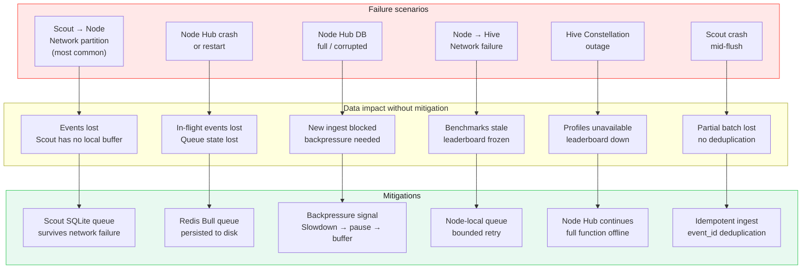
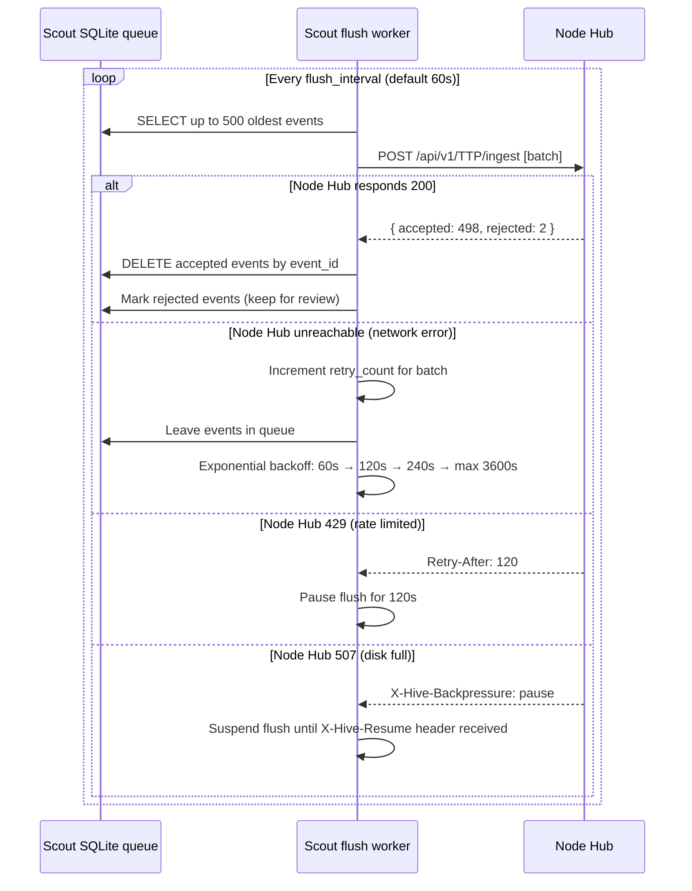
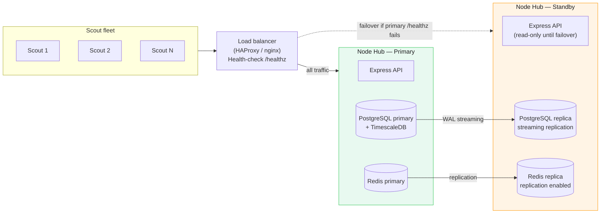

# Resilience
### Scout Buffer · Node Hub HA · Backpressure · Sync Failure · RTO/RPO

> HIVE is a telemetry system. If it loses data under failure conditions, it has failed at its primary job. This document specifies exactly what survives what failure.

---

## Failure Surface Map



---

## 1. Scout Local Buffer

The Scout's first-line defence against network failure is a local SQLite queue.

### Buffer specification

```typescript
interface ScoutBuffer {
  max_events:       10_000        // configurable: 1k–100k
  max_size_bytes:   52_428_800    // 50 MB default
  eviction_policy:  'oldest_first' // when full: drop oldest, not newest
  flush_interval:   60_000        // ms — configurable: 10s–300s
  flush_batch_size: 500           // max events per POST
  max_age_ms:       604_800_000   // 7 days — events older than this are dropped
}
```

### Buffer persistence

```
Platform    Storage         Survives process restart?
─────────── ─────────────── ─────────────────────────
macOS app   SQLite file     Yes (~/Library/Application Support/HIVE/queue.db)
Browser ext IndexedDB       Yes (browser profile survives restart)
Node SDK    SQLite file     Yes (configurable path, default: ~/.hive/queue.db)
Network     SQLite file     Yes (same as Node SDK)
proxy
```

### Flush cycle with retry



### What survives what

| Failure | Events lost? | Recovery |
|---|---|---|
| Network outage < 7 days | None | Automatic on reconnect |
| Scout process crash during flush | None (events remain in SQLite) | Auto-retry on restart |
| Scout machine powered off for < 7 days | None | Auto-retry on power-on |
| Scout SQLite file corrupted | Events in queue at time of corruption | New queue created, historical events unrecoverable |
| Network outage > 7 days | Events older than 7 days dropped (max_age_ms) | By design — stale telemetry has no value |

---

## 2. Node Hub Redis Bull Queue

Between Scout ingest and TimescaleDB write, events pass through a Bull (Redis) queue. This decouples ingest throughput from DB write throughput.

### Queue configuration

```typescript
const ingestQueue = new Bull('TTP-ingest', {
  redis: { host: 'localhost', port: 6379 },
  defaultJobOptions: {
    attempts: 5,
    backoff: { type: 'exponential', delay: 2000 },
    removeOnComplete: { count: 1000 },   // keep last 1000 completed for audit
    removeOnFail: false,                 // keep failed jobs for manual review
  }
})
```

### Redis persistence configuration (required for production)

```
# redis.conf — production settings
appendonly yes              # AOF persistence
appendfsync everysec        # fsync every second (balance perf/durability)
save 900 1                  # RDB snapshot: 900s if >= 1 change
save 300 10                 # RDB snapshot: 300s if >= 10 changes
maxmemory 2gb               # configurable
maxmemory-policy allkeys-lru # evict least recently used when full
```

**What this means for durability:** with `appendonly yes`, Redis survives a crash with at most 1 second of queue state lost. Bull jobs in the queue at crash time are re-queued on restart.

### Queue depth alerting

See [observability.md](./observability.md) — alert fires at `queue_depth > 5000`. At 5,000 unprocessed events with Scout buffers continuing to arrive, there are approximately 10–20 minutes before Scout buffers start filling.

---

## 3. Backpressure — Node Hub Disk Full

When Node Hub disk usage exceeds 85%, the ingest endpoint sends a backpressure signal:

```
HTTP 200 OK
X-Hive-Backpressure: slowdown
X-Hive-Backpressure-Reason: disk_85pct

At 90%:
HTTP 200 OK
X-Hive-Backpressure: pause
X-Hive-Backpressure-Pause-Seconds: 300

At 95%:
HTTP 507 Insufficient Storage
X-Hive-Backpressure: hard-stop
```

Scout responses to backpressure signals:

| Signal | Scout behaviour |
|---|---|
| `slowdown` | Extend flush interval to 5× normal (5 minutes) |
| `pause` | Suspend flush for `Pause-Seconds`, buffer locally |
| `hard-stop` | Suspend flush indefinitely, alert user/IT admin via UI |

This gives IT admins time to expand disk before data loss occurs. The chain is: IT admin gets dashboard alert at 75% → backpressure starts at 85% → hard stop at 95% → IT admin has had 20% headroom notice.

### TimescaleDB compression (prevents disk fill under normal operation)

TimescaleDB automatically compresses chunks older than 7 days (default):

```sql
ALTER TABLE telemetry_events SET (
  timescaledb.compress,
  timescaledb.compress_orderby = 'timestamp DESC',
  timescaledb.compress_segmentby = 'provider, deployment'
);

SELECT add_compression_policy('telemetry_events', INTERVAL '7 days');
```

Typical compression ratio: 10–20x for telemetry data. A 100GB uncompressed dataset becomes 5–10GB compressed. This means disk fill under normal operation requires months of data accumulation.

---

## 4. Node → Hive Sync Failure Resilience

Hive constellation is optional for Solo and Org modes. The Node Hub must be fully functional whether or not it can reach Hive.

### Sync queue

Bundles destined for Hive are queued in a separate Bull queue (`hive-sync-queue`). This queue:
- Persists through Node Hub restarts (Redis AOF)
- Retries with exponential backoff: 5m → 10m → 20m → 40m → max 4h
- Retains bundles for up to **30 days** before dropping (configurable)
- Has a maximum depth of **10,000 bundles** (approximately 30 days at 5-minute sync intervals)

### What happens during extended Hive outage

```
Hour 0:    Hive unreachable. Node Hub continues ingest normally.
           Sync bundles queue locally.

Hour 1-24: Node Hub fully operational.
           Dashboard shows local data.
           Leaderboard and public profiles: stale but accessible (last known state).

Day 2-30:  Sync bundles accumulate.
           IT admin sees "Hive sync lagging" alert.
           All org-level functionality unaffected.

Day 30+:   Oldest sync bundles dropped if queue > 10,000.
           Data loss begins if Hive still unreachable.
           IT admin should have escalated long before this point.

On recovery: Hive sync resumes automatically.
             Backlogged bundles delivered in order.
             Hive processes idempotently (node_id + bundle_timestamp deduplication).
```

### Hive outage → what's affected

| Feature | Affected during Hive outage? |
|---|---|
| Scout telemetry collection | No |
| Node Hub ingest | No |
| Org internal dashboard | No |
| Shadow AI detection | No |
| Local team leaderboard | No |
| Public global leaderboard | Yes — stale |
| Public profiles | Yes — stale |
| Login with HIVE (OAuth) | Yes — degraded (local session cache for 24h) |
| TokenPrint score | Stale — last computed value shown |

This is the intended resilience model: **orgs never depend on Hive for their internal operations.**

---

## 5. RTO / RPO Targets

| Scenario | RPO | RTO |
|---|---|---|
| Node Hub process crash | 0 (Redis AOF) | < 2 minutes |
| Node Hub VM/container crash | 0 (Redis AOF) | < 5 minutes |
| Node Hub disk failure (with RAID/replica) | 0 | < 30 minutes |
| Node Hub total loss (restore from backup) | 24 hours (daily backup) | < 2 hours |
| Node Hub total loss (WAL streaming to S3) | 1 hour | < 2 hours |
| Hive constellation outage | N/A (Node Hub independent) | < 30 minutes (for Hive SaaS) |

### Backup strategy for Node Hub

```bash
# Daily backup script (cron 02:00 UTC)
pg_dump -Fc hive_node > /backups/hive_node_$(date +%Y%m%d).pgdump

# Retention: 30 days local, 365 days S3
aws s3 cp /backups/hive_node_$(date +%Y%m%d).pgdump s3://org-hive-backups/
find /backups -name "*.pgdump" -mtime +30 -delete
```

---

## 6. High Availability — Node Hub Active-Passive

For enterprises requiring HA (Phase 2+):



Failover is manual (recommended) or automatic via keepalived. Automatic failover requires careful configuration to avoid split-brain.

---

*See also: [Observability](./observability.md) · [Architecture](./architecture.md) · [Deployment](./deployment.md)*

---

<sub>HIVE &nbsp;·&nbsp; هايف &nbsp;·&nbsp; הייב &nbsp;·&nbsp; ہائیو &nbsp;·&nbsp; हाइव &nbsp;·&nbsp; হাইভ &nbsp;·&nbsp; ஹைவ் &nbsp;·&nbsp; 蜂巢 &nbsp;·&nbsp; ハイブ &nbsp;·&nbsp; 하이브 &nbsp;·&nbsp; Хайв &nbsp;·&nbsp; Colmena &nbsp;·&nbsp; Ruche &nbsp;·&nbsp; Kovan</sub>
