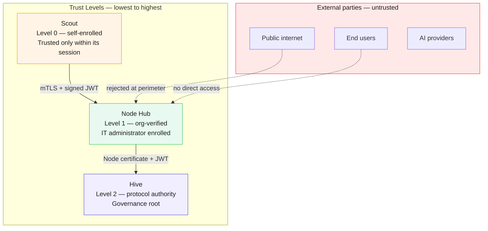
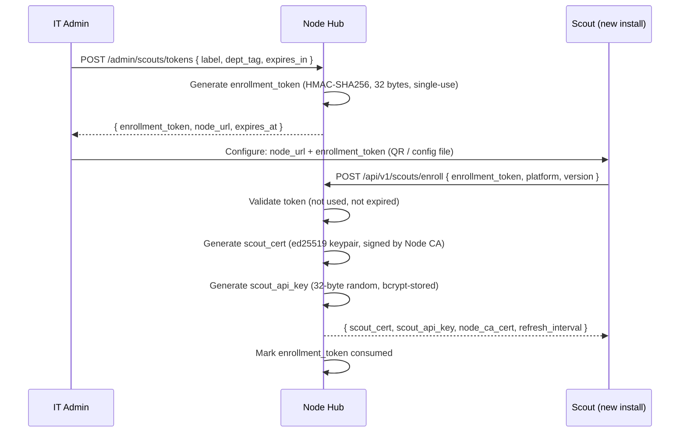
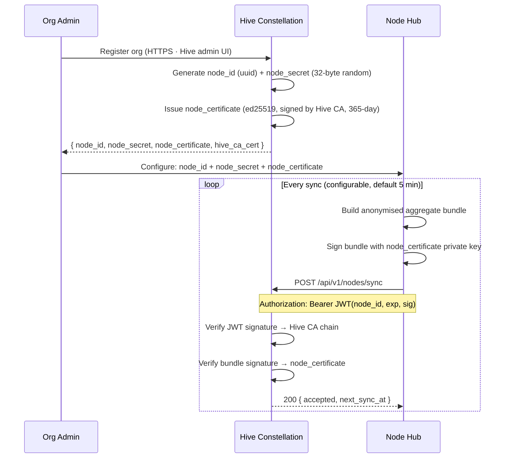
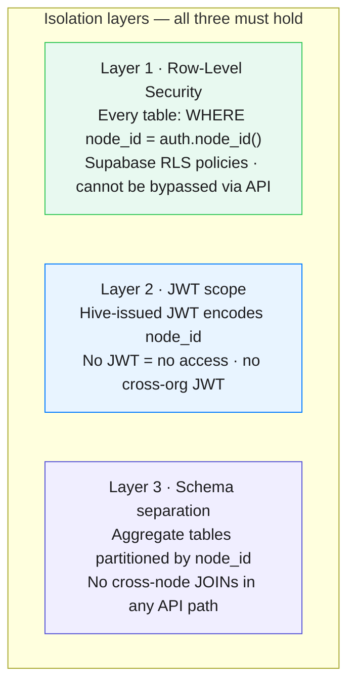

# Security Model
### Authentication · Authorisation · Threat Model · Supply Chain · Multi-Tenancy

> The trust covenant says "keys never transmitted." This document specifies *what is* transmitted, between which components, and what an attacker gets if they intercept it.

---

## Component Trust Hierarchy



---

## 1. Scout → Node Hub Authentication

### Enrollment flow



### Per-request auth (TTP ingest)

Every Scout → Node request carries:

```
POST /api/v1/TTP/ingest
Authorization: Bearer <scout_api_key>
X-Scout-Cert: <base64(scout_cert)>
X-Scout-Sig: <ed25519_signature_over_request_body>
```

Node Hub validates:
1. `scout_api_key` → bcrypt comparison against stored hash
2. `scout_cert` signature chain → Node CA
3. `X-Scout-Sig` → ed25519 verify with scout's public key from cert
4. cert expiry (certs are 90-day rolling, auto-renewed)

**What an attacker gets if they intercept a TTP bundle:** encrypted telemetry with no API keys, no content, and a cert they cannot forge. Useless.

### API key rotation

- Default: 90-day rotation, Scout handles silently
- Triggered by: IT admin forced rotation, suspicious activity flag
- Grace period: 24-hour overlap window (both old and new keys valid)
- Scout auto-rotates when node returns `X-Scout-Rotate: true` header

---

## 2. Node Hub → Hive Authentication



**What Hive receives:** anonymised aggregates. Never raw events. The signing chain proves provenance without revealing anything beyond the aggregate schema.

---

## 3. Threat Model

| Threat | Attack surface | Mitigation | Residual risk |
|---|---|---|---|
| Rogue Scout flooding Node | Scout ingest endpoint | Rate limit per scout_id (500 events/min), velocity anomaly detection, cert required | Low |
| Stolen scout_api_key | Scout machine compromise | Key bound to scout_cert (ed25519 sig required) · auto-rotation · IT can revoke | Medium — requires cert theft too |
| Man-in-the-middle Scout→Node | Network | TLS 1.3 minimum · Node CA cert pinned in Scout config | Low |
| Node operator reads telemetry | On-prem Node | Telemetry is content-free by schema (see covenant) · node operator sees: provider, bytes, latency | Accepted by design — org consents |
| Hive breach | Hive Supabase | Only aggregates stored at Hive level · no raw events · no PII | Low impact — aggregates not sensitive |
| Fake Node claiming to be real org | Node → Hive sync | node_certificate signed by Hive CA · only org admin can enroll a Node | Low |
| Content exfiltration via connector | @TTP/sdk in app | Schema validator rejects non-schema fields · content_asserted: false enforced · see §6 | Medium — requires connector compromise |
| Prompt injection via telemetry | Telemetry labels (dept_tag) | All string fields HTML-escaped at ingest · no eval path in dashboard | Low |
| Replay attack (reuse old bundle) | Node → Hive sync | JWT has 5-min exp · bundle has nonce · Hive deduplicates by (node_id, bundle_hash) | Low |

---

## 4. Transport Security

**Minimum requirements:**

| Leg | Protocol | TLS version | Certificate |
|---|---|---|---|
| Scout → Node | HTTPS | TLS 1.3 (1.2 fallback for legacy infra) | Node CA cert pinned |
| Node → Hive | HTTPS | TLS 1.3 | Hive CA cert pinned |
| Dashboard → Node | HTTPS | TLS 1.3 | Node's public TLS cert |
| Dashboard → Hive | HTTPS | TLS 1.3 | Public CA (standard browser trust) |

**Cipher suites (TLS 1.3):** `TLS_AES_256_GCM_SHA384`, `TLS_CHACHA20_POLY1305_SHA256` only.

**HSTS:** All HIVE endpoints set `Strict-Transport-Security: max-age=63072000; includeSubDomains; preload`.

---

## 5. Multi-Tenancy Isolation

### Node Hub (on-prem — single tenant by design)

Node Hub is single-org. No multi-tenancy isolation needed — the org controls the infrastructure.

### Hive Constellation (Supabase — multi-tenant)

Isolation is enforced at three layers:



**RLS policy template (all tables):**

```sql
CREATE POLICY "node_isolation" ON hive_aggregates
  USING (node_id = (SELECT node_id FROM node_sessions WHERE jwt_sub = auth.uid()));
```

**Public leaderboard tables** (Open mode) are read-only views over anonymised aggregates — no join path to raw node data.

---

## 6. Connector Supply Chain Security

The `@TTP/sdk` and all `@hive/connector-*` packages sit between user applications and AI providers. This is a privileged position.

### What a malicious connector could theoretically do

- Read the prompt/completion before passing through
- Exfiltrate content to a third endpoint
- Tamper with telemetry (inflate token counts, fake provider)

### Defences

| Control | Mechanism |
|---|---|
| **Dependency pinning** | All HIVE-published packages pin transitive deps with exact versions in `package-lock.json`. Renovate bot for security updates only. |
| **Package signing** | `@hive/*` packages signed with npm provenance (GitHub Actions OIDC). `npm audit signatures` verifiable. |
| **Content-free assertion** | `TTPEvent.content_asserted: false` is a schema constant. Node Hub rejects any event with unexpected fields. A compromised connector cannot *store* content in TTP — it can only exfiltrate externally. |
| **Open source audit** | All HIVE connectors are 100% open source. The interception point is visible in < 30 lines of code. Community audit is the primary control. |
| **Community connector policy** | Tier 2/3 connectors must pass TTP compliance test suite. Schema compliance verified by `@TTP/validator`. Non-compliant connectors rejected from registry. |
| **Runtime content assertion** | Node Hub runs a payload heuristic: if `payload_bytes` is implausibly large for the declared `direction`, flag for manual review. |
| **Sub-resource integrity** | Dashboard loads no external scripts. Zero CDN dependencies. All assets are local to the Node Hub. |

### What we accept as residual risk

A compromised connector running inside the user's application could exfiltrate content to a third party outside the HIVE network. **This is outside HIVE's trust boundary.** It is the same risk as any npm package. The mitigation is open source and audit, not technical control.

---

## 7. Rate Limiting

| Endpoint | Limit | Window | Response on breach |
|---|---|---|---|
| `/api/v1/TTP/ingest` | 500 events / scout | 60 seconds | `429 Too Many Requests` + `Retry-After` header |
| `/api/v1/TTP/ingest` | 10,000 events / node | 60 seconds | `429` to all scouts on that node |
| `/api/v1/scouts/enroll` | 10 enrollments | 1 hour / IP | `429` |
| `/api/v1/nodes/sync` | 1 sync / 30 seconds / node | — | `429` + `next_allowed_at` |
| Hive public API | 100 req / min / JWT | — | `429` |

Rate limit state stored in Redis. Sliding window algorithm. Headers: `X-RateLimit-Limit`, `X-RateLimit-Remaining`, `X-RateLimit-Reset`.

---

*See also: [Key Lifecycle](./key-lifecycle.md) · [Integrity](./integrity.md) · [TTP Protocol](./protocol.md) · [Architecture](./architecture.md)*

---

<sub>HIVE &nbsp;·&nbsp; هايف &nbsp;·&nbsp; הייב &nbsp;·&nbsp; ہائیو &nbsp;·&nbsp; हाइव &nbsp;·&nbsp; হাইভ &nbsp;·&nbsp; ஹைவ் &nbsp;·&nbsp; 蜂巢 &nbsp;·&nbsp; ハイブ &nbsp;·&nbsp; 하이브 &nbsp;·&nbsp; Хайв &nbsp;·&nbsp; Colmena &nbsp;·&nbsp; Ruche &nbsp;·&nbsp; Kovan</sub>
