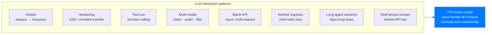

# Telemetry Edge Cases
### Streaming · Tool Use · Multi-Modal · Batch API · Retries · Long Sessions · Deduplication

> The canonical `TTPEvent` covers the simple case: one request, one response. Reality is messier. This document specifies exactly how TTP handles every non-trivial LLM interaction pattern.

---

## Overview



---

## 1. Streaming Responses (SSE / Chunked Transfer)

### The problem

A streaming response is not one event — it is N chunks followed by a final `data: [DONE]`. Recording each chunk as a separate event would create:
- N × per-chunk events with tiny `payload_bytes` and `latency_ms: 0`
- Misleading token estimates (chunks don't have reliable boundaries)
- Enormous event volume for long generations

### The solution: aggregated stream event

Scout aggregates the stream and emits **two events** per streaming call:

```typescript
// Event 1: emitted immediately when stream begins
{
  direction: 'request',
  payload_bytes: request_body_bytes,    // the prompt payload size
  latency_ms: undefined,                // not known yet
  status_code: 200,
  estimated_tokens: estimate(request_body_bytes),
  stream_id: 'uuid',                    // links the pair
}

// Event 2: emitted when stream ends (data: [DONE] or connection closed)
{
  direction: 'response',
  payload_bytes: total_response_bytes,  // SUM of all chunk payloads
  latency_ms: end_time - request_start, // wall clock for full stream
  ttfb_ms: first_chunk_time - request_start,  // time to first byte
  status_code: 200,
  estimated_tokens: estimate(total_response_bytes),
  stream_id: 'uuid',                    // links to request event
  token_breakdown: usage_if_provided,   // from final chunk if provider includes it
}
```

### Special case: stream cancelled mid-way

If the user cancels the stream before completion:
```typescript
// Event 2 with partial data
{
  direction: 'response',
  payload_bytes: bytes_received_before_cancel,
  status_code: 200,
  stream_cancelled: true,               // optional TTP extension field in v0.2
  estimated_tokens: estimate(bytes_received_before_cancel),
}
```

In v0.1, `stream_cancelled` is not in the schema — use `direction: 'error'` with `status_code: 499` (client cancelled).

### Token estimation for streaming

When the provider includes usage data in the final chunk (OpenAI `stream_options: {include_usage: true}`, Anthropic stream final message):
- Use actual token counts from the final event
- Set `token_breakdown.prompt_tokens` and `token_breakdown.completion_tokens`

When the provider does not include usage data:
- Apply the standard byte-based estimation to `total_response_bytes`
- Flag: `estimated_tokens_method: 'bytes'` (v0.2 addition — v0.1: standard estimation)

---

## 2. Tool Use / Function Calling

### The problem

A tool use sequence is a multi-turn interaction within a single "session":

```
1. User message → LLM → tool_call (not the final answer)
2. Tool execution (outside LLM)
3. Tool result → LLM → final answer
```

Each leg is a separate HTTP call. They should be linkable but individually measurable.

### The solution: session_hash linking + tool event type

```typescript
// Turn 1: initial call that returns a tool_call
{
  direction: 'response',
  session_hash: 'abc123',             // links all turns in this session
  model_hint: 'gpt-4o',
  payload_bytes: 840,                 // small — just the tool_call JSON, not full text
  estimated_tokens: 210,
  tool_use: true,                     // v0.2 addition — v0.1: omit
  tool_count: 1,                      // number of tools called
}

// Turn 2: tool result submission + final response
{
  direction: 'request',
  session_hash: 'abc123',             // same session_hash
  tool_result: true,                  // v0.2 addition
  payload_bytes: 1240,                // tool result included in request
  estimated_tokens: 310,
}
{
  direction: 'response',
  session_hash: 'abc123',             // still same session
  payload_bytes: 2840,
  estimated_tokens: 710,
  tool_use: false,                    // final answer, not another tool call
}
```

**In TTP/0.1:** `tool_use`, `tool_count`, `tool_result` are not in the schema. They are captured as follows:
- The session_hash links all turns — the Node Hub can reconstruct the sequence
- `payload_bytes` accurately reflects the actual bytes of each request/response
- Token estimation is correct per-turn

The semantic "this was a tool call" is deferred to TTP/0.2. v0.1 captures the data accurately, just without the semantic flag.

---

## 3. Multi-Modal Inputs (Vision · Audio · Files)

### The problem

A vision request sends an image. An audio request sends a WAV file. These inflate `payload_bytes` dramatically — not because of more "intelligence," but because of media encoding overhead.

Raw `payload_bytes` for a vision request would be 100–500x a text request. Token estimates derived from bytes would be wildly wrong.

### The solution: payload normalisation

Scout detects multi-modal content in the request body and applies normalisation:

```typescript
function normalisePayload(request: RequestBody): NormalisedPayload {
  const textBytes = extractTextComponents(request)    // only text fields
  const imageCount = countImages(request)
  const audioSeconds = detectAudioDuration(request)   // if detectable

  return {
    payload_bytes: textBytes,                          // text bytes only
    modality: detectModality(request),                 // 'text' | 'vision' | 'audio' | 'multimodal'
    image_count: imageCount,                           // count, not bytes
    audio_duration_seconds: audioSeconds,              // duration, not bytes
  }
}
```

**In TTP/0.1 schema:**
- `payload_bytes` = text-only bytes (images excluded)
- `modality`, `image_count`, `audio_duration_seconds` are extension fields (v0.2+)

**In TTP/0.1 practice:**
- Scout logs the full raw `payload_bytes` as a secondary metric (local only, not in TTP event)
- TTP event `payload_bytes` is the normalised text-only size
- Token estimate is therefore an estimate of the text tokens, not the image tokens

This is a known limitation of v0.1. Image tokens require provider-specific API response parsing.

### Token estimation for multi-modal

Providers typically return `prompt_tokens` in the response that include image tokens at their pricing rate. When available:
- Use `token_breakdown.prompt_tokens` from the response
- This accurately captures image tokens at the provider's counting methodology

When not available:
- Estimate text tokens from text bytes (standard algorithm)
- Add image token estimate: `image_count × 85` (approximate for standard 512×512 tile, configurable)

---

## 4. Batch API (OpenAI Batch, Anthropic Message Batches)

Batch APIs accept multiple prompts in a single request and return responses asynchronously.

### The problem

A batch request is one HTTP call that contains N logical LLM calls. Processing happens asynchronously — the response is a JSONL file returned later.

### The solution: one event per logical call

Scout (or `@TTP/sdk`) unwraps batch requests and emits individual TTPEvents per logical call:

```typescript
// Before batch submission:
for (const item of batchRequest.requests) {
  collector.emit({
    direction: 'request',
    batch_id: batchRequest.id,         // v0.2 field — links batch items
    payload_bytes: JSON.stringify(item.body).length,
    session_hash: item.custom_id,      // use custom_id as session_hash
    ...defaults
  })
}

// When batch results available:
for (const result of batchResults.responses) {
  collector.emit({
    direction: 'response',
    batch_id: batchRequest.id,
    session_hash: result.custom_id,    // links to the request
    payload_bytes: JSON.stringify(result.response.body).length,
    latency_ms: result.response.created - batchRequest.created,
    token_breakdown: result.response.body.usage,
    ...defaults
  })
}
```

**In TTP/0.1:** `batch_id` is not a schema field. Use `project_tag` or `dept_tag` to annotate batch jobs. The session_hash links request and response correctly.

---

## 5. Retried Requests — Deduplication

Client-side retry (e.g., automatic retry on 429 or 500) creates duplicate HTTP calls for the same logical intent. Without deduplication, HIVE would count 3 retries of one request as 3 separate token usage events.

### The solution: `event_id` deduplication + client-side idempotency key

```typescript
// @TTP/sdk assigns event_id at the time the original request is made
// Retries reuse the same event_id for the request event

const event_id = uuid()   // generated once per logical call

// Original attempt:
collector.emit({ direction: 'request', event_id, ... })

// On retry (429 or 5xx):
collector.emit({ direction: 'request', event_id, retry_count: 1, ... })
// Node Hub deduplicates: same event_id in same direction = update, not insert

// Final successful response:
collector.emit({ direction: 'response', event_id, ... })
```

**Node Hub deduplication logic:**

```sql
INSERT INTO telemetry_events (event_id, direction, ...) VALUES (...)
ON CONFLICT (event_id, direction) DO UPDATE
  SET retry_count = EXCLUDED.retry_count,
      payload_bytes = EXCLUDED.payload_bytes,
      updated_at = NOW()
```

**Implication:** HIVE counts one logical call as one call, regardless of how many retries the client made. The retry_count is preserved for debugging but not counted toward token usage.

---

## 6. Long-Running Agent Sessions

Agents can run for days, making thousands of LLM calls within a single "session." The session_hash must link them without creating an unbounded grouping.

### Session boundaries

```typescript
interface SessionPolicy {
  max_session_duration_ms: 86_400_000    // 24 hours — new session_hash after 24h
  max_session_events: 10_000             // new session_hash after 10k events
  idle_timeout_ms: 3_600_000             // new session_hash after 1h of silence
}
```

When a session boundary is crossed:
- Scout generates a new `session_hash`
- The old and new session_hashes are linked via `parent_session_hash` (v0.2 field)
- In v0.1: sessions are independent; linking must be done via `project_tag` or `dept_tag`

**Why this matters:** a single agent session of 10,000 events is functionally indistinguishable from 10,000 separate users at the analytics layer. Breaking into bounded sessions enables meaningful per-session analytics.

---

## 7. Multi-Tenant Proxy (Shared API Key)

Some orgs route all LLM calls through a central proxy that uses a shared org API key. The individual user making the call is unknown to the proxy.

### The problem

Scout is typically per-user (personal machine). In a proxy deployment:
- One Scout (on the proxy) sees all traffic
- Individual users cannot be distinguished at the network level
- `emitter_id` would be the same for all users

### The solution: header injection

The proxy can inject a user context header that Scout reads:

```
X-HIVE-User-Tag: dept_engineering_user_42   (hashed, not plaintext user ID)
```

Scout treats this as the `dept_tag` for the event.

**What HIVE guarantees:** even in proxy mode, no user-identifiable information is in the TTP event. The `X-HIVE-User-Tag` must be a hash or opaque token — the org's responsibility to ensure.

**Phase 2 addition:** dedicated Proxy Scout mode that reads existing Kubernetes/NGINX auth headers and maps to TTP classification fields.

---

## 8. Summary: What Each Pattern Emits

| Pattern | Events emitted | session_hash | Key fields |
|---|---|---|---|
| Simple request | 2 (request + response) | New per call | standard |
| Streaming | 2 (request + stream-end) | New per call | `ttfb_ms` on response |
| Cancelled stream | 2 (request + error) | New per call | `status_code: 499` |
| Tool use (2 turns) | 4 (req+res per turn) | Shared across turns | same `session_hash` |
| Batch (N items) | 2N (request+response each) | `custom_id` per item | v0.1: use project_tag |
| Retry (3 attempts) | 2 (deduplicated) | New per call | `retry_count` on request |
| Agent (long session) | 2 per call, session bounded | New every 24h/10k | `parent_session_hash` (v0.2) |
| Proxy (shared key) | 2 per call | New per call | `dept_tag` from header |

---

*See also: [TTP Protocol](./protocol.md) · [Protocol Versioning](./protocol-versioning.md) · [Data Model](./data-model.md)*

---

<sub>HIVE &nbsp;·&nbsp; هايف &nbsp;·&nbsp; הייב &nbsp;·&nbsp; ہائیو &nbsp;·&nbsp; हाइव &nbsp;·&nbsp; হাইভ &nbsp;·&nbsp; ஹைவ் &nbsp;·&nbsp; 蜂巢 &nbsp;·&nbsp; ハイブ &nbsp;·&nbsp; 하이브 &nbsp;·&nbsp; Хайв &nbsp;·&nbsp; Colmena &nbsp;·&nbsp; Ruche &nbsp;·&nbsp; Kovan</sub>
